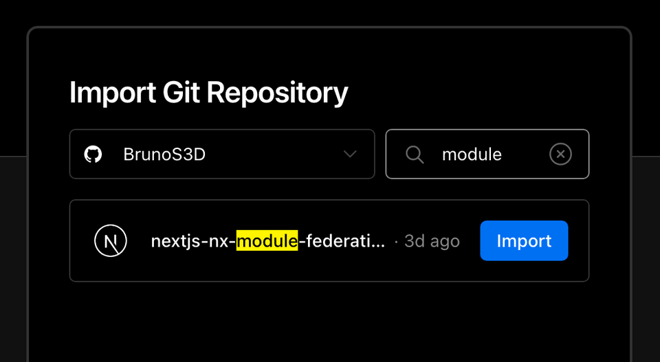

== Nx, Next.js, and Module Federation

=== Table of Contents

= Micro Frontends
:toc: ①

* https://www.notion.so/Nx-and-monorepos-f43e5aa2d4894b8485421351ea44c620[Nx and monorepos]
** https://www.notion.so/Pros-c1502a091a9a4eff8622f3360146ee07[Pros]
** https://www.notion.so/Cons-a8338b4d5fba478e8b911c112dc1be8e[Cons]
* https://www.notion.so/Next-js-90a18097ddaa42d9a7f1491a212d96f1[Next.js]
* https://www.notion.so/Nx-Next-js-6d9c2e5cb0644849a76eee7e52d1b409[Nx + Next.js]
* https://www.notion.so/Module-Federation-44f3a7479add4c6ab4c6a9b046936810[Module Federation]
* https://www.notion.so/Next-js-Module-Federation-a1ecf2e749a249aa8c0a077227733c3b[Next.js + Module Federation]
* https://www.notion.so/About-the-project-899c9a31f6244b728fa5575144ba828a[About the project]
* https://www.notion.so/Starting-the-project-ee207b3206714a91aba495f2aeba1fe9[Starting the project]
* https://www.notion.so/Generating-new-pages-9fe3266daa6d419b9b15dfdd4f6341e7[Generating new pages]
* https://www.notion.so/Generating-new-applications-5e43bc9a6a084bf8b02fddb6f388c253[Generating new applications]
* https://www.notion.so/Running-in-the-development-environment-6e2812ff85e54ba49bfc670eb9e8cfdf[*Running in the development environment]*
* https://www.notion.so/Generating-new-components-6b5f2928619448bea247979a8b562186[Generating new components]
* https://www.notion.so/Installing-nextjs-mf-c3ae3763ddbc45a0ae8997741a254b0e[Installing nextjs-mf]
* https://www.notion.so/Creating-hooks-1b1dce103764422a869dad7a3daaffbe[Creating hooks]
* https://www.notion.so/Deploying-projects-on-Vercel-6656bc3152624fd1a4125c8542e32fa5[Deploying projects on Vercel]
* https://www.notion.so/Private-dependencies-with-Vercel-42c6e1b46c8545aeb4324a311e98c696[https://www.notion.so/Private-dependencies-with-Vercel-42c6e1b46c8545aeb4324a311e98c696[P]]https://www.notion.so/Private-dependencies-with-Vercel-42c6e1b46c8545aeb4324a311e98c696[*rivate dependencies with Vercel]*

=== Micro Frontends
:toc: ①

You've probably heard about microservices and the number of benefits they bring to both the scalability of a backend application and the team that develops it. Now imagine if these same advantages could be brought to the frontend. Well, that's what we're going to talk about today. +
First, let's talk about what a micro frontend is and what are its benefits. Micro frontends are a way to organize both an application and the team that develops it. Think about the following: a web application is usually composed of several resources, and depending on the size of the application it depends on certain synchrony between the teams that develop it so that new versions are released for production. Let's take an example: Imagine that we have an online course sales website and that website has the following features:

* Institutional page (landing page/marketing)
* Catalog / advanced search
* Checkout
* Courses player page
* Upload page
* Forum (for students to interact with tutors)
* Account Settings pages (for students and tutors)

Imagine that each of these features can be easily split into microservices when it comes to the backend, but most of the time the frontend ends up being a kind of “monolith” containing a single stack and forcing the entire team to stay in sync at all times. that a new feature goes into production. Can you see this? Clearly, we could split each part of this eCommerce into distinct applications for smaller teams with unique responsibilities and possibly different stacks. Think about it, the team responsible for the checkout could work *100% focused* on improving the user's shopping experience flow, reducing noise that made them give up on the purchase, or for example the catalog and institutional team (landing page) that could work on different marketing fronts, as well as the team responsible for the video area of the platform, which would be focused on ensuring speed / high quality in the delivery of classes to students. +
Anyway, there are many examples that we could cite about the use of micro frontends, but as the purpose of this article is to be a little more practical, let's skip this part and if you are more interested in understanding the advantages of using micro frontends, I suggest you read more about it in https://micro-frontends.org/[this article^].

=== Nx and monorepos

Well, as we saw earlier it is possible to divide some web applications into microfrontends which, initially, may bring you some questions such as: “But then I need to divide all applications into separate repositories? Imagine the headache it will be to test all this!” and that's where we'll talk about mono repositories. Mono repository or Monorepo is a single git repository that seeks to manage all the source code of an application, this brings us a series of advantages and some disadvantages, here are some of them:

==== Pros

* Standardization (lint) of the code for the entire team
* Test management in one place
* Centralization of dependency management
* Code reuse between applications due to dependency centralization
* Transparency as we can see all code from a single workspace

==== Cons

* .git folder can end up getting big due to a high number of contributions, because the whole team is contributing commits in the same project
* Increase of build time of some applications depending on the dependency level and size of shared files/data
* No permission granularity, since the entire team needs to have access to the monorepo, the power to restrict the access of certain users to certain parts of the application is lost
Looking at the benefits and the context, I saw that it would be an excellent opportunity to use https://nx.dev/[Nx^] as a manager for our project. Nx is a monorepo manager with a huge range of https://nx.dev/community#create-nx-plugin[plugins^] to facilitate the creation of new applications, libraries, tests, build execution, lint standardization, centralization, dependency management, and many other features.

=== Next.js

It is indisputable that currently https://nextjs.org/[Next.js^] is one of the web frameworks that has been gaining more and more adoption in recent times and all this is due to the range of features such as server-side rendering, static optimization, file-system routing, API routes and https://nextjs.org/docs/basic-features/data-fetching/overview[data-fetching^] strategies he proposes. Next.js is an awesome tool, but we'll assume you already know it and skip to the next part.

=== Nx + Next.js

According to the Nx team, their development philosophy is very similar to Visual Studio Code’s, in which they focus on maintaining a powerful and generic tool, while extensions, or plugins, are fundamental for increasing your productivity with it. As such, https://nx.dev/packages/next[@nrwl/next^] is the plugin that we will use to create and manage our applications with Next.js within our Nx workspace.

=== Module Federation

Module Federation is a https://webpack.js.org/concepts/module-federation[Webpack 5^] feature that has arrived to make it possible to share parts of an application to another at runtime. This makes it possible for multiple applications compiled with webpack to repurpose parts of their code as the user interacts with them, which takes us to the next step.

=== Next.js + Module Federation

Let's start with our first example of this article where we talk about an eCommerce application, now imagine that our marketing team decides to create a mega Black Friday campaign and decides to change several parts of our application by inserting different components with dynamic banners, carousels, countdowns, themed offers, etc… this would probably be a headache for all teams responsible for our microfrontend applications since each one would have to implement the new requirements of the marketing team in their projects and that would have to be very well tested and synchronized so that everything went right and nothing could be released ahead of time… Anyway, all this could easily generate a lot of work and a lot of headache for the team, but that's where the very powerful Module Federation comes in.

Thanks to it, only one team would be in responsible for developing the new components along with their respective logic, and the rest of the team would only be responsible for implementing the use of these new complements, which could bring with them, hooks, components in React, among others.

Unfortunately, implementing and using the Module Federation features of Webpack with Next.js is not that easy, as you would need to deeply understand how both tools work to be able to create a solution that facilitates the integration between the two. Fortunately, there is already a solution and has several features including support for SSR (server-side rendering), these tools are called https://app.privjs.com/package?pkg=@module-federation/nextjs-mf[nextjs-mf^] and https://app.privjs.com/package?pkg=@module-federation/nextjs-ssr[nextjs-ssr^] and together we are going to explore a proof-of-concept application that I created to show you the power of these tools together.

*⚠️ Attention: for the application to work with Module Federation features you need to have access to the https://app.privjs.com/package?pkg=@module-federation/nextjs-mf[nextjs-mf^] or https://app.privjs.com/package?pkg=@module-federation/nextjs-ssr[nextjs-ssr^] plugin which currently requires a paid license! 

=== About the project

This project will show, how to create the basis for a fully scalable application both in production and in development. In it, we will see some small examples of how the tools mentioned above can be used.

=== Starting the project

Initially, we will need to install Nx in our environment to handle the commands needed to manage our monorepo. To do this, open a terminal and run: 
----
npm i -g nx
----

Once this is done, navigate to a directory where you want to create the project and run the command below, this command will use https://nx.dev/packages/next[@nrwl/next^] to create our workspace (monorepo) and our first application: 
----
npx create-nx-workspace@latest --preset=next
----

An interactive terminal will guide you through the creation process, you can follow as I did below:

image::terminal-guide.png[]

Once this is done, you must wait for the workspace (monorepo) to be created and the project's dependencies to be downloaded after that you can open vscode in the workspace root, in my case: 
----
code ./nextjs-nx-module-federation
----

Looking at the file explorer you can see that the project has a structure similar to this: 
----
├── apps 
│   ├── store (...) 
│   └── store-e2e (...) 
├── babel.config.json 
├── jest.config.ts 
├── jest.preset.js 
├── libs 
├── nx.json 
├── package.json 
├── package-lock.json 
├── README.md 
├── tools 
│   ├── generators (...) 
│   └── tsconfig.tools.json 
├── tsconfig.base.json 
└── workspace.json
----

Note that our application in Next.js is inside the "apps" folder, this folder will contain all the other applications you are going to create, we can also see other configuration files of our workspace. It is important to note that there is only one "node_modules" folder in the entire project, this happens because all dependencies will be in one place, at the root of the repository.

=== Generating new pages

The https://nx.dev/packages/next[@nrwl/next^] plugin has several https://nx.dev/packages/next#generators[generators^], and commands that serve to automate the creation of pages, components, and other common structures in the project.

Knowing this we will create our first page using a generator called "page" for this run the following command in the terminal 
----
nx g @nrwl/next:page home --project=store
----

----
ℹ️ Note that we use the --project flag to indicate to the generator in which project the new page should be created. 
----

This will generate a page called "home" which will be located at 
----
apps/store/pages/home/index.tsx
----

=== Generating new applications

Now we will need to create another application, which we will call "checkout". Unlike the first application we created together with the workspace, we will need to use the following command to create a new Next.js application in the current workspace: 
----
nx g @nrwl/next:app checkout
----

Your "apps" folder should look like this: 
----
├── apps 
│   ├── checkout (...) 
│   ├── checkout-e2e (...) 
│   ├── store (...) 
│   └── store-e2e (...) 
...
----

=== Running in the development environment

To see our changes running, we will need to run the following command in the terminal: 
----
nx serve store
----

----
ℹ️ serve is an https://nx.dev/packages/next#executors[executor^] command
----

Also, we can run all applications at the same time using:
----
nx run-many --target=serve --all
----

----
ℹ️ Note that we use the --target flag to indicate to nx which executor we want to run on all projects. 
----

=== Generating new components

As we saw earlier, we have the possibility to create structures in our application using the Nx CLI tool, now we are going to create a simple button component in the "checkout" project, that execute the following command: 
----
nx g @nrwl/next:component buy-button --project=checkout
----

Now let's edit the component in the directory below so that it looks like https://github.com/BrunoS3D/nextjs-nx-module-federation/blob/main/apps/checkout/components/buy-button/buy-button.tsx[this^] 
----
apps/checkout/components/buy-button/buy-button.tsx
----

We'll use this simple app "checkout" component in the app "store" to exemplify code sharing with Module Federation and that takes us to the next step.

=== Installing nextjs-mf

----
⚠️ Attention: for the application to work with Module Federation features you need to have access to the https://app.privjs.com/package?pkg=@module-federation/nextjs-mf[[nextjs-ssr^] plugin which currently requires a paid license! 
----
To install the tool, we need to login to https://privjs.com/[PrivJs^] using npm, to do so, run the following command:
----
npm login --registry <https://r.privjs.com>
----

Once this is done a file containing your credentials will be saved in ~/.npmrc. Now you can install nextjs-mf using the command below: +
npm install @module-federation/nextjs-mf --registry <https://r.privjs.com>

Now we will need to modify our "next.config.js" file in both projects so that the installed plugin can work, for that open the following files:

* apps/store/next.config.js
* apps/checkout/next.config.js
You will see that in them we have an Nx plugin being used, we will need to maintain it, for that, make the files of each project similar to these:

* https://github.com/BrunoS3D/nextjs-nx-module-federation/blob/b20485c501c8c8353aca9b7a2b0bbf376c43348d/apps/store/next.config.js[store/next.config.js^]
* https://github.com/BrunoS3D/nextjs-nx-module-federation/blob/b20485c501c8c8353aca9b7a2b0bbf376c43348d/apps/checkout/next.config.js[checkout/next.config.js^]
You will notice that we have two environment variables being used in this file, we will need to define them in each project so create a
".env.development.local" file in each project and leave each file with the following values: 
----
NEXT_PUBLIC_CHECKOUT_URL=http://localhost:4200
NEXT_PUBLIC_STORE_URL=http://localhost:4300
----

So far no new changes can be noticed, but we can already use the Module Federation resources, but before that, we will make some modifications in our development environment so that applications can communicate without generating warnings in the console by local port collision, to this open and edit the following files:

"apps/store/project.json"
----
{ 
  // ... 
  "targets": { 
    // ... 
    "serve": { 
      // ... 
      "options": { 
        "buildTarget": "checkout:build", 
        "dev": true, 
        "port": 4300 
      }, 
      // ... 
    }, 
    // ... 
}
----

"apps/checkout/project.json"
----
{ 
  // ... 
  "targets": { 
    // ... 
    "serve": { 
      // ... 
      "options": { 
        "buildTarget": "checkout:build", 
        "dev": true, 
        "port": 4200 
      }, 
      // ... 
    }, 
    // ... 
}
----

In order for the component to be federated, we must add it to the "next.config.js" file, open the file and add a new entry in the "exposes" object: 
----
module.exports = withFederatedSidecar({ 
  // ... 
  exposes: { 
    './buy-button': './components/buy-button/buy-button.tsx', 
  }, 
  // ... 
})(nxNextConfig);
----

Now with everything configured, we must restart any next process that is running and we are going to import the button component that we created in the "checkout" project in the "store" project using the Module Federation resources, for that open the "home" page that we created in the "store" project and import the Next.js https://nextjs.org/docs/advanced-features/dynamic-import[dynamic^] function as shown below:
----
import dynamic from 'next/dynamic';
----

This function will help us to import the component only on the client-side, so add the following code snippet on the page:
----
const BuyButton = dynamic( 
  async () => import('checkout/buy-button'), 
  { 
    ssr: false, 
  } 
);
----

And then we can use the component in the page content
----
export function Page() { 
  return ( 
    
 
      <h1>Welcome to Store!</h1> 
      <BuyButton onClick={() => alert('Hello, Module Federation!')}>Add to Cart</BuyButton> 
    
 
  ); 
}
----

Now you can see the following result

image::Welcome-to-store!.png[]

=== Creating hooks

One of the powers of nextjs-mf is the federation of functions, including hooks. An important detail is that we cannot import hooks asynchronously, which leads us to adopt a solution where we import functions using "require" and the page or component that uses the hook being loaded lazily/asynchronously, what we call "top-level-await".

First, we will need to create a hook, for that, we are going to make a simple state function. Create a file in the "checkout" app in "apps/checkout/hooks/useAddToCart.ts" and insert the code below in the file:
----
import { useState } from 'react';

export default function useAddToCartHook() { 
  const [itemsCount, setItemsCount] = useState<number>(0); 
  return { 
    itemsCount, 
    addToCart: () => setItemsCount((i) => i + 1), 
    clearCart: () => setItemsCount(0), 
  }; 
}
----

Once this is done, add the file to the list of modules exposed in the "next.config.js" file: 
----
module.exports = withFederatedSidecar({ 
  // ... 
  exposes: { 
    './buy-button': './components/buy-button/buy-button.tsx', 
		'./useAddToCartHook': './hooks/useAddToCart.ts' 
  }, 
  // ... 
})(nxNextConfig);
----

To import the hook, let's create a new page that will be imported asynchronously, for that create a new folder in the store app called async-pages. Create a custom-hook.tsx file that will be our page inside the async-pages folder, then add the following code to the file: 
----
// typing for the hook 
type UseAddToCartHookType = () => UseAddToCartHookResultType;

// hook function return typing 
type UseAddToCartHookResultType = { 
  itemsCount: number; 
  addToCart: () => void; 
  clearCart: () => void; 
};

// hook default value 
let useAddToCartHook = (() => ({})) as UseAddToCartHookType;

// import the hook only on the client-side 
if (process.browser) { 
  useAddToCartHook = require('checkout/useAddToCartHook').default; 
}

export function Page() { 
	// on server side extracts the values as undefined 
	// on the client side extracts the hook values 
  const { itemsCount, addToCart, clearCart } = 
    useAddToCartHook() as UseAddToCartHookResultType;

  return ( 
    
 
      <h1>Welcome to Custom Hook!</h1>

      
 
        Item Count: <strong>{itemsCount}</strong> 
      
 
      <button onClick={addToCart}>Add to Cart</button> 
      <button onClick={clearCart}>Clear Cart</button> 
    
 
  ); 
}

// here you can use the getInitialProps function normally 
// it will be called on both server-side and client-side 
Page.getInitialProps = async (/*ctx*/) => { 
  return {}; 
};

export default Page;
----

Now we need to create a page in the "pages" folder that loads our page asynchronously, for that use the command below:
----
nx g @nrwl/next:page custom-hook --project=store
----

Now open the newly created page file and add the following code
----
import dynamic from 'next/dynamic'; 
import type { NextPage, NextPageContext } from 'next';

// import functions from page in synchronously way 
const page = import('../../async-pages/custom-hook');

// lazy import the page component 
const Page = dynamic( 
  () => import('../../async-pages/custom-hook') 
) as NextPage;

Page.getInitialProps = async (ctx: NextPageContext) => { 
	// capture the getInitialProps function from the page 
  const getInitialProps = ((await page).default as NextPage)?.getInitialProps; 
  if (getInitialProps) { 
		// if the function exists, call the function on server-side and client-side 
    return getInitialProps(ctx); 
  } 
  return {}; 
};

export default Page;
----

Now you can see the following result

image::Welcome-to-cutom-hook.gif[]

Some errors at the time of writing this article may be occurring, so if in doubt, consider looking at https://github.com/BrunoS3D/nextjs-nx-module-federation[this project^] I created as a proof of concept, I'm actively working with Zackary to make it up to date and functional.

=== Deploying projects on Vercel

The procedure that we are going to perform now will be done at https://vercel.com/[Vercel^], but we can replicate it without much difficulty on other serverless hosting platforms such as https://www.netlify.com/[Netlify^], https://docs.amplify.aws/guides/hosting/nextjs/q/platform/js/[AWS Amplify^], and Serverless with a https://www.serverless.com/plugins/serverless-nextjs-plugin[plugin^] for Next.js or even in a https://en.wikipedia.org/wiki/Self-hosting_(web_services)[self-hosted^] way using Docker with a private server. +
We can carry out the process in two ways: by https://vercel.com/new[interface^] or by https://vercel.com/cli[CLI^], but to facilitate the process we will do it by the interface, you just need to host the project on https://github.com/[GitHub^] so that we can import it in a few clicks, once the project is on GitHub you can open https://vercel.com/new[this page^] on Vercel to deploy the first application… exactly, although it's a monorepo, we're going to configure everything so that separate deployments are made. +
First, we will deploy the "checkout" app because it has fewer dependencies, for that select the repository as in the following image and click on the button to import it:

Choose a name for the application on the screen that opens but remember that we are still going to do the same step for the app "store" so define a different name for each project. 
We must change some commands for the project build in the "Build and Output Settings" tab, for this, check the override option and leave the fields as shown below:

image::Build-output-settings.png[]

Build command (checkout)
----
npx nx build checkout --prod
----

Output directory (checkout) 
----
dist/apps/checkout/.next
----

For now, let's skip the environment variables section, as we don't have the URLs where the applications will be hosted, we can click on the "Deploy" button. You may notice that we may have an error during the build, but don't worry if that happens, we'll solve this soon. 
Now we are going to deploy our app "store" and we are going to do the same steps as before, just changing some fields on the "Build and Output Settings" tab. 
Build command (store)
----
npx nx build store --prod
----

Output directory (store) 
----
dist/apps/store/.next
----

Once that's done, we can click on the "Deploy" button. Again, you'll notice that the build resulted in an error, but that doesn't matter, the important thing is that we now have the two URLs of the two projects and we can use them to configure our environment. Now go to the settings panel of each application and set the following environment variables

image::Environment-variables.png[]

Note that I am using a URL of the “deployment” that I made of my app store, you must do it with the URL that Vercel generated for yours, remember to define the two environment variables "NEXT_PUBLIC_CHECKOUT_URL" and "NEXT_PUBLIC_STORE_URL" each with its respective URL of production.

=== Private dependencies with Vercel

If you open the project build logs, you will notice that in both the error is the same, probably something like this 
----
npm ERR! 403 403 Forbidden - GET <https://r.privjs.com/@module-federation%2fnextjs-mf/-/nextjs-mf-3.5.0.tgz> - You must be logged in to install/publish packages.
npm ERR! 403 In most cases, you or one of your dependencies are requesting 
npm ERR! 403 a package version that is forbidden by your security policy, or 
npm ERR! 403 on a server you do not have access to. 
npm ERR! A complete log of this run can be found in: 
npm ERR!     /vercel/.npm/_logs/2022-06-24T21_11_19_939Z-debug-0.log 
Error: Command "npm install" exited with 1
----

This happens because Vercel does not have the necessary credentials to access a package that is in a private repository, to give access to the repository we need to configure an environment variable called "NPM_RC", the value of this variable must be the same as what is inside the "~/.npmrc" file which was created when we used the "npm login" command. 

To do so, just create a new variable in Vercel's environment variables settings panel called "NPM_RC" and insert the entire contents of the "~/.npmrc" file, if you have any doubts read https://vercel.com/support/articles/using-private-dependencies-with-vercel[this document^]. 

Finally, you can open the “Deployments” tab and “Redeploy” your application!

image::deployments-redeploy.png[]

Navigating to the application "store" URL you can see the button whose source code is in the "checkout" project being "federated" to our site.

=== References

* https://www.thoughtworks.com/radar/techniques/micro-frontends[Thoughtworks - Micro frontends^] 
* https://medium.com/localizalabs/module-federation-o-futuro-do-microfrontend-4fed87983ec2[Module Federation — O futuro do microfrontend^] 
* https://micro-frontends.org/[What are Micro Frontends?^] 
* https://www.youtube.com/watch?v=-ei6RqZilYI[Webpack 5 Module Federation - Zack Jackson - CityJS Conf 2020:^] 
* https://betterprogramming.pub/the-pros-and-cons-monorepos-explained-f86c998392e1[The Pros and Cons of Monorepos, Explained^] 
* https://github.com/module-federation/module-federation-examples/tree/master/nextjs[Next.js with Module Federation^] 
* https://vercel.com/support/articles/using-private-dependencies-with-vercel[How do I use private dependencies with Vercel?^] 
* https://nx.dev/packages/next[Nx with Next.js^]
