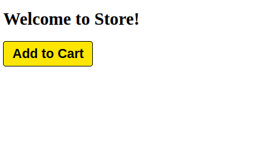
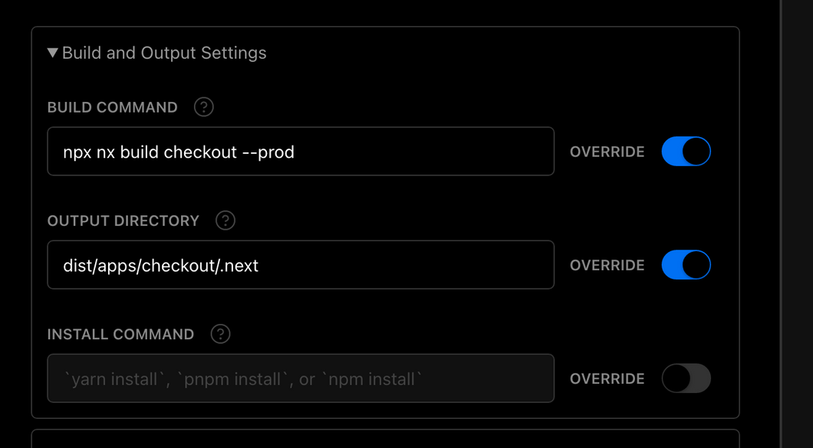
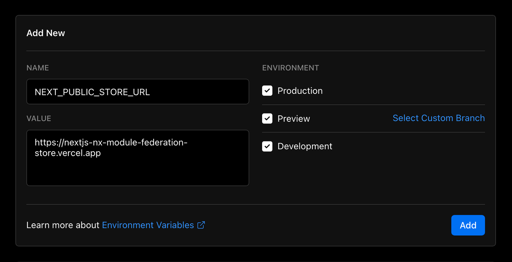

=== Micro Frontends

Você provavelmente já deve ter ouvido falar em microsserviços e a quantidade de benefícios que eles trazem tanto para a escalabilidade de uma aplicação back-end quanto para o time que a desenvolve. Agora imagine se essas mesmas vantagens pudessem ser trazidas para o front-end. Bom é sobre isso que vamos falar hoje. +
Primeiramente vamos falar sobre o que é um micro frontend e quais são seus benefícios. Micro frontend é uma forma de organizar tanto uma aplicação quanto o time que a desenvolve, pense no seguinte, uma aplicação web geralmente é composta de diversos recursos e dependendo do tamanho da aplicação ela depende de uma certa sincronia entre os times que a desenvolvem para que novas versões sejam lançadas para produção. Vamos a um exemplo: Imagine que temos um site de vendas de cursos online e nesse site tenha as seguintes funcionalidades:

* Página institucional (landing page/marketing)
* Páginas de catálogo / busca avançada
* Checkout (pagamento)
* Páginas para assistir aos cursos
* Página para upload de aulas
* Páginas de perguntas e respostas (para alunos interagirem com tutores)
* Páginas de configurações de conta de usuário para alunos e tutores

Imagine que cada uma dessas funcionalidades podem ser facilmente divididas em microsserviços quando o assunto é back-end, mas na maioria das vezes o front-end acaba sendo uma espécie de “monolito” contendo uma única stack forçando o time inteiro a se manter sincronizado sempre que uma nova funcionalidade for para produção. Você enxerga isso? Claramente poderiamos dividir cada parte deste eCommerce em aplicações distintas para times menores com responsabilidades únicas e possivelmente stacks diferentes. Pense nisso o time que ficasse responsável pelo checkout poderia trabalhar *100% focado* em melhorias do fluxo de experiência de compra do usuário, diminuindo ruídos que o fizessem desistir da compra, ou por exemplo o time de catálogo e institucional (landing page) que poderiam trabalhar em frentes diferentes de marketing, bem como o time responsável pela área de vídeos da plataforma que estaria focado em garantir velocidade / alta qualidade na entrega de aulas para os alunos. +

Enfim, são muitos os exemplos que poderíamos citar sobre o uso de microfrontends, mas como o intuíto desse artigo é ser um pouco mais prático vamos pular essa parte e caso você tenha mais interesse em entender as vantagens de usar microfrontend sugiro que leia mais sobrehttps://micro-frontends.org/[https://micro-frontends.org/[ ]]https://micro-frontends.org/[nesse site].

=== Nx e monorepos

Bom, como vimos anteriormente é possível dividir algumas aplicações web em microfrontends o que, inicialmente, pode te trazer alguns questionamentos como: “Mas então eu preciso dividir todas as aplicações em repositórios separados? Imagina a dor de cabeça que vai ser testar tudo isso!” e é aí onde falaremos sobre mono repositórios. Mono repositório ou Monorepo é um único repositório do git que busca gerenciar todo o código fonte de uma organização/aplicação, isso nos trás uma série de vantagens e algumas desvantagens, aqui vão algumas delas:

==== Prós

* Padronização (lint) do código para todo o time
* Gerenciamento de testes em um único lugar
* Centralização do gerenciamento de dependências
* Reutilização de código entre aplicações por conta da centralização de dependências
* Transparência, pois podemos ver todo o código a partir de uma única workspace

==== Contras

* Pasta .git pode acabar ficando grande por um elevado número de contribuíções, pelo fato de todo o time estar contribuíndo com commits no mesmo projeto
* Aumento no tempo de build de algumas aplicações dependendo do nível de depenência e tamanho de arquivos/dados compartilhados
* Perda do poder de restrição, uma vez que todo o time precisa ter acesso ao monorepo, perde-se o poder de restringir o acesso de certos usuários a certas partes da aplicação.
Olhando para os benefícios e para o contexto vi que seria uma excelente oportunidade de utilizar ohttps://nx.dev/[https://nx.dev/[ ]]https://nx.dev/[Nx] como gerenciador para nosso projeto. Nx é um gerenciador de monorepos com uma gama imensa dehttps://nx.dev/community#create-nx-plugin[https://nx.dev/community#create-nx-plugin[ ]]https://nx.dev/community#create-nx-plugin[plugins] para facilitar a criação de novas aplicações, bibliotecas, testes, execução de builds, padronização de lint, centralização e gerenciamento de dependências e muitas outras funcionalidades.

=== Next.js

É indiscutível que atualmente ohttps://nextjs.org/[https://nextjs.org/[ ]]https://nextjs.org/[Next.js] seja um dos frameworks web que vem ganhando mais e mais adoção nos últimos tempos e tudo isso se deve a gama de recursos como renderização do lado do servidor, otimização estática de imagens, rotas por sistema de arquivos, rotas de API e estratégias dehttps://nextjs.org/docs/basic-features/data-fetching/overview[https://nextjs.org/docs/basic-features/data-fetching/overview[ ]]https://nextjs.org/docs/basic-features/data-fetching/overview[data-fetching] que ele nos propõe. Next.js é uma ferramenta incrível, mas partiremos do princípio de que você já o conhece e pularemos para a próxima parte.

=== Nx + Next.js

Nx contém uma gama imensa dehttps://nx.dev/community#create-nx-plugin[https://nx.dev/community#create-nx-plugin[ ]]https://nx.dev/community#create-nx-plugin[plugins] para gerenciar diversos tipos de projetos, a ferramenta possui umahttps://nx.dev/getting-started/intro#philosophy[https://nx.dev/getting-started/intro#philosophy[ ]]https://nx.dev/getting-started/intro#philosophy[filosofia de desenvolvimento] muito parecida com a do Visual Studio Code. Segundo o próprio time, isso permite que o Nx possua muitas integrações, uma delas é ohttps://nx.dev/packages/next[https://nx.dev/packages/next[ ]]https://nx.dev/packages/next[*@nrwl/next]* que utilizaremos para criar e gerenciar nossas aplicações com Next.js.

=== Module Federation

Federação de módulos ou Module Federation, como vamos chamar a partir de agora, é uma funcionalidade dohttps://webpack.js.org/concepts/module-federation[https://webpack.js.org/concepts/module-federation[ ]]https://webpack.js.org/concepts/module-federation[Webpack 5] que chegou para tornar possível o compartilhamento de partes de uma aplicação a outra em tempo de execução. Isso possibilita que múltiplas aplicações compiladas usando webpack reaproveitem partes de seu código no momento em que o usuário interage com elas, o que nos leva para o próximo passo. +
Ele facilita a integração de aplicações que no final são compiladas pra javascript padrão do browser e remover os percalços que a utilização de _iframes_ ou rotas compartilhadas no servidor web implica.

=== Next.js + Module Federation

Vamos começar com o nosso primeiro exemplo desse artigo onde falamos sobre uma aplicação de um eCommerce. Agora imagine que a nossa equipe de marketing decida criar uma mega campanha de Black-Friday e decida mudar várias partes da nossa aplicação inserindo diversos componentes com banners dinâmicos, carrosséis, contadores regressivos, ofertas temáticas, etc… isso provavelmente seria uma dor de cabeça para todos os times responsáveis pelas aplicações do nosso microfrontend, de cara cada um teria que implementar as novas exigências do time de marketing em seus projetos e isso teria que ser muito bem testado e sincronizado para que tudo desse certo e nada pudesse ser divulgado antes da hora… Enfim, tudo isso poderia gerar facilmente um trabalho imenso e muita dor de cabeça para o time, mas é aí que entra o poderosíssimo Module Federation. +

Graças a ele apenas um time seria encarregado de desenvolver os novos componentes junto de suas respectivas lógicas, o resto do time seria apenas encarregado de implementar o uso desses novos complementos, que poderiam trazer consigo, hooks, componentes em React, entre outros. +

Infelizmente implementar e utilizar os recursos do Module Federation do Webpack com Next.js não é tão fácil assim, você precisaria entender profundamente o funcionamento de ambas as ferramentas para conseguir criar uma solução que facilitasse a integração entre as duas, mas felizmente já existe uma solução e conta com diversas funcionalidades inclusive suporte à SSR (renderização do lado do servidor), essas ferramentas se chamamhttps://app.privjs.com/package?pkg=@module-federation/nextjs-mf[https://app.privjs.com/package?pkg=@module-federation/nextjs-mf[ ]]https://app.privjs.com/package?pkg=@module-federation/nextjs-mf[nextjs-mf] ehttps://app.privjs.com/package?pkg=@module-federation/nextjs-ssr[https://app.privjs.com/package?pkg=@module-federation/nextjs-ssr[ ]]https://app.privjs.com/package?pkg=@module-federation/nextjs-ssr[nextjs-ssr] e juntos vamos explorar uma aplicação de prova de conceito que criei para te mostrar o poder dessas ferramentas unidas. +

*⚠️ Atenção para que a aplicação funcione com os recursos do Module Federation você precisa ter acesso ao pluginhttps://app.privjs.com/package?pkg=@module-federation/nextjs-mf[https://app.privjs.com/package?pkg=@module-federation/nextjs-mf[ ]]https://app.privjs.com/package?pkg=@module-federation/nextjs-mf[nextjs-mf] ouhttps://app.privjs.com/package?pkg=@module-federation/nextjs-ssr[https://app.privjs.com/package?pkg=@module-federation/nextjs-ssr[ ]]https://app.privjs.com/package?pkg=@module-federation/nextjs-ssr[nextjs-ssr] que atualmente requerem uma licença paga! +

=== Sobre o projeto que vamos criar

O projeto que iremos criar mostrará, na prática, como criar a base uma aplicação totalmente escalável tanto em produção quanto em desenvolvimento. Nele vamos ver alguns pequenos exemplos de como as ferramentas citadas a cima podem ser usadas.

=== Iniciando o projeto

Inicialmente precisaremos instalar o Nx no nosso ambiente para lidar com os comandos necessários para gerenciar nosso monorepo. Para isso abra o terminal e execute: +
----
npm i -g nx
----

Feito isso, navegue até um diretório onde você deseja criar o projeto e execute o comando abaixo, esse comando utilizará ohttps://nx.dev/packages/next[https://nx.dev/packages/next[ ]]https://nx.dev/packages/next[@nrwl/next] para criar nossa workspace (monorepo) e nossa primeira aplicação: +
----
npx create-nx-workspace@latest --preset=next
----

Um terminal interativo irá guiar você no processo de criação, você pode seguir como eu fiz abaixo: +

Feito isso você deverá esperar a criação do workspace (monorepo) e download das dependencias do projeto e após isso você poderá abrir o vscode na raiz do workspace, no meu caso: +
----
code ./nextjs-nx-module-federation
----

Olhando para o explorador de arquivos você poderá ver que o projeto possuí uma estrutura parecida com esta: +
----
├── apps 
│   ├── store (...) 
│   └── store-e2e (...) 
├── babel.config.json 
├── jest.config.ts 
├── jest.preset.js 
├── libs 
├── nx.json 
├── package.json 
├── package-lock.json 
├── README.md 
├── tools 
│   ├── generators (...) 
│   └── tsconfig.tools.json 
├── tsconfig.base.json 
└── workspace.json
----

Note que nossa aplicação em Next.js está dentro da pasta apps, essa pasta conterá todas as outras aplicações que você for criar, podemos ver também outros arquivos de configuração do nosso workspace. É importante notar só existe uma pasta node_modules em todo o projeto, isso acontece, por quê todas as dependencias ficarão em um único lugar, na raiz do repositório.

=== Criando páginas

O pluginhttps://nx.dev/packages/next[https://nx.dev/packages/next[ ]]https://nx.dev/packages/next[@nrwl/next] conta com várioshttps://nx.dev/packages/next#generators[https://nx.dev/packages/next#generators[ ]]https://nx.dev/packages/next#generators[geradores] (generators), comandos que servem para automatizar a criação de páginas, components e outras estruturas comuns no projeto. +

Sabendo disso iremos criar nossa primeira página utilizando um gerador chamado page para isso execute o seguinte comando no terminal +
----
nx g @nrwl/next:page home --project=store
----

----
ℹ️ Note que usamos a flag --project para indicar para o gerador em qual projeto deve ser criado a nova página. +
----

Isso ira gerar uma página chamada home que estará localizada em +
----
apps/store/pages/home/index.tsx
----

=== Criando outras aplicações

Agora precisaremos criar uma outra aplicação, que vamos chamar de checkout. Diferente da primeira aplicação que criamos junto com o workspace precisaremos usar o seguinte comando para criar uma nova aplicação Next.js na workspace atual: +
----
nx g @nrwl/next:app checkout
----

=== Rodando o projeto em desenvolvimento

----
├── apps 
│   ├── checkout (...) 
│   ├── checkout-e2e (...) 
│   ├── store (...) 
│   └── store-e2e (...) 
...
----

=== Rodando o projeto em desenvolvimento

Para seguir e podermos ver nossas alterações em execução vamos precisar executar o seguinte comando no terminal: +
----
nx serve store
----

----
ℹ️ serve é um comando do tipohttps://nx.dev/packages/next#executors[https://nx.dev/packages/next#executors[ ]]https://nx.dev/packages/next#executors[executor] +
----

Também, podemos rodar todas as aplicações ao mesmo tempo usando: +
----
nx run-many --target=serve --all
----

----
ℹ️ Note que usamos a flag --target para indicar para o nx qual executor queremos executar em todos os projetos. + 
----

=== Criando components

Como vimos anteriormente temos a possibilidade de criar estruturas na nossa aplicação usando a ferramenta de CLI do Nx, agora vamos criar um componente de botão simples no projeto checkout, para isso execute o seguinte comando: +
----
nx g @nrwl/next:component buy-button --project=checkout
----

Agora vamos editar o componente no diretório abaixo para que ele se pareça comhttps://github.com/BrunoS3D/nextjs-nx-module-federation/blob/main/apps/checkout/components/buy-button/buy-button.tsx[https://github.com/BrunoS3D/nextjs-nx-module-federation/blob/main/apps/checkout/components/buy-button/buy-button.tsx[ ]]https://github.com/BrunoS3D/nextjs-nx-module-federation/blob/main/apps/checkout/components/buy-button/buy-button.tsx[este] +
----
apps/checkout/components/buy-button/buy-button.tsx
----

Usaremos esse simples componente do app checkout no app store para exemplificar o compartilhamento de código com Module Federation e isso nos leva para o próximo passo.

=== Instalando o nextjs-mf
----
⚠️ Atenção para que a aplicação funcione com os recursos do Module Federation você precisa ter acesso ao pluginhttps://app.privjs.com/package?pkg=@module-federation/nextjs-mf[https://app.privjs.com/package?pkg=@module-federation/nextjs-mf[ ]]https://app.privjs.com/package?pkg=@module-federation/nextjs-mf[nextjs-mf] ouhttps://app.privjs.com/package?pkg=@module-federation/nextjs-ssr[https://app.privjs.com/package?pkg=@module-federation/nextjs-ssr[ ]]https://app.privjs.com/package?pkg=@module-federation/nextjs-ssr[nextjs-ssr] que atualmente requerem uma licença paga! +
----

Para instalar a ferramenta precisamos fazer login nohttps://privjs.com/[https://privjs.com/[ ]]https://privjs.com/[PrivJs] usando o npm, para isso execute o comando a seguir: +
----
npm login --registry <https://r.privjs.com>
----

Feito isso um arquivo contendo suas credenciais será salvo em ~/.npmrc. Agora você já pode instalar o nextjs-mf usando o comando abaixo: +
npm install @module-federation/nextjs-mf --registry <https://r.privjs.com>

Agora vamos precisar modificar nosso arquivo next.config.js nos dois projetos para que o plugin instalado possa funcionar, para isso abra os arquivos a seguir:

* apps/store/next.config.js
* apps/checkout/next.config.js
Você verá que neles temos um plugin do Nx sendo usado, precisaremos mantê-lo, para isso deixe os arquivos de cada projeto parecidos com estes:

* https://github.com/BrunoS3D/nextjs-nx-module-federation/blob/b20485c501c8c8353aca9b7a2b0bbf376c43348d/apps/store/next.config.js[store/next.config.js^]
* https://github.com/BrunoS3D/nextjs-nx-module-federation/blob/b20485c501c8c8353aca9b7a2b0bbf376c43348d/apps/checkout/next.config.js[checkout/next.config.js^]
Você poderá perceber que temos duas variáveis de ambiente sendo usadas nesse arquivo, precisaremos defini-las em cada projeto para isso crie um arquivo .env.development.local em cada projeto e deixe cada arquivo com os seguintes valores: +
----
NEXT_PUBLIC_CHECKOUT_URL=http://localhost:4200
NEXT_PUBLIC_STORE_URL=http://localhost:4300
----

Até agora nenhuma mudança nova poderá ser percebida, mas já podemos utilizar os recursos de do Module Federation, mas antes vamos fazer algumas modificações em nosso ambiente de desenvolvimento para que as aplicações possam se comunicar sem gerar avisos no console por colisão de porta local, para isso abra e edite os seguintes arquivos: +

"apps/store/project.json"
----
{ 
  // ... 
  "targets": { 
    // ... 
    "serve": { 
      // ... 
      "options": { 
        "buildTarget": "checkout:build", 
        "dev": true, 
        "port": 4300 
      }, 
      // ... 
    }, 
    // ... 
}
----

"apps/checkout/project.json"
----
{ 
  // ... 
  "targets": { 
    // ... 
    "serve": { 
      // ... 
      "options": { 
        "buildTarget": "checkout:build", 
        "dev": true, 
        "port": 4200 
      }, 
      // ... 
    }, 
    // ... 
}
----

Agora, para que o componente possa ser federado devemos adicioná-lo no arquivo next.config.js abra o arquivo e adicione uma nova entrada no objeto exposes: +
----
module.exports = withFederatedSidecar({ 
  // ... 
  exposes: { 
    './buy-button': './components/buy-button/buy-button.tsx', 
  }, 
  // ... 
})(nxNextConfig);
----

Agora com tudo configurado, devemos reiniciar qualquer processo do next que esteja rodando e vamos importar o componente de botão que criamos no projeto checkout no projeto store usando os recursos do Module Federation, para isso abra a página home que criamos no projeto store e importe a funcãohttps://nextjs.org/docs/advanced-features/dynamic-import[https://nextjs.org/docs/advanced-features/dynamic-import[ ]]https://nextjs.org/docs/advanced-features/dynamic-import[dynamic] do Next.js como mostrado abaixo: +
----
import dynamic from 'next/dynamic';
----

Essa função nos ajudará a importar o componente apenas no lado do cliente, para isso adicione o seguinte trecho de código na página: +
----
const BuyButton = dynamic( 
  async () => import('checkout/buy-button'), 
  { 
    ssr: false, 
  } 
);
----

E então poderemos utilizar o componente no conteúdo da página +
----
export function Page() { 
  return ( 
    
 
      <h1>Welcome to Store!</h1> 
      <BuyButton onClick={() => alert('Hello, Module Federation!')}>Add to Cart</BuyButton> 
    
 
  ); 
}
----

Feito isso agora você poderá ver o seguinte resultado

=== Criando hooks

Um dos poderes do nextjs-mf é a federação de funções, inclusive hooks. Um detalhe importante é que não podemos importar hooks de forma assíncrona o que nos leva a adotar uma solução onde importamos as funções usando require e a página ou componente que utiliza o hook sendo carregado de forma lazy/assíncrona o que chamamos de top-level-await. +

Primeiramente, precisaremos criar um hook, para isso vamos fazer uma função com estado simples, crie um arquivo no app checkout em apps/checkout/hooks/useAddToCart.ts e insira o código abaixo no arquivo: +
----
import { useState } from 'react';

export default function useAddToCartHook() { 
  const [itemsCount, setItemsCount] = useState<number>(0); 
  return { 
    itemsCount, 
    addToCart: () => setItemsCount((i) => i + 1), 
    clearCart: () => setItemsCount(0), 
  }; 
}
----

Feito isso, adicione o arquivo na lista de modulos expostos no arquivo next.config.js: +
----
module.exports = withFederatedSidecar({ 
  // ... 
  exposes: { 
    './buy-button': './components/buy-button/buy-button.tsx', 
		'./useAddToCartHook': './hooks/useAddToCart.ts' 
  }, 
  // ... 
})(nxNextConfig);
----

Agora para realizar a importação do hook vamos criar uma nova página que será importada de forma assíncrona, para isso crie uma nova pasta no app store chamada async-pages. Crie uma arquivo custom-hook.tsx que será nossa página dentro dessa pasta e adicione o seguinte código no arquivo: +
----
// tipagem para o hook +
type UseAddToCartHookType = () => UseAddToCartHookResultType;

// tipagem de retorno da função do hook +
type UseAddToCartHookResultType = { 
  itemsCount: number; 
  addToCart: () => void; 
  clearCart: () => void; 
};

// valor padrão do hook +
let useAddToCartHook = (() => ({})) as UseAddToCartHookType;

// importa o hook apenas no client-side +
if (process.browser) { 
  useAddToCartHook = require('checkout/useAddToCartHook').default; 
}

export function Page() { 
	// no lado do servidor extrai os valores como undefined +
	// no lado do client extrai os valores do hook +
  const { itemsCount, addToCart, clearCart } = 
    useAddToCartHook() as UseAddToCartHookResultType;

  return ( 
    
 
      <h1>Welcome to Custom Hook!</h1>

      
 
        Item Count: <strong>{itemsCount}</strong> 
      
 
      <button onClick={addToCart}>Add to Cart</button> 
      <button onClick={clearCart}>Clear Cart</button> 
    
 
  ); 
}

// aqui você pode usar a função normalmente +
// ela será chamada tanto no server-side quanto no client-side +
Page.getInitialProps = async (/*ctx*/) => { 
  return {}; 
};

export default Page;
----

Agora precisamos criar uma página na pasta pages que carregue nossa página assíncrona, para isso utilize o comando abaixo: +
----
nx g @nrwl/next:page custom-hook --project=store
----

Agora abra o arquivo da nova página criada e adicione o seguinte código +
----
import dynamic from 'next/dynamic'; 
import type { NextPage, NextPageContext } from 'next';

// import functions from page in synchronously way 
const page = import('../../async-pages/custom-hook');

// lazy import the page component 
const Page = dynamic( 
  () => import('../../async-pages/custom-hook') 
) as NextPage;

Page.getInitialProps = async (ctx: NextPageContext) => { 
	// capture the getInitialProps function from the page 
  const getInitialProps = ((await page).default as NextPage)?.getInitialProps; 
  if (getInitialProps) { 
		// if the function exists, call the function on server-side and client-side 
    return getInitialProps(ctx); 
  } 
  return {}; 
};

export default Page;
----

Feito isso agora você poderá ver o seguinte resultado +

image::Welcome-to-cutom-hook.gif[]

Alguns erros no momento em que escrevo esse artigo podem estar ocorrendo, por isso em caso de dúvidas, considere olharhttps://github.com/BrunoS3D/nextjs-nx-module-federation[https://github.com/BrunoS3D/nextjs-nx-module-federation[ ]]https://github.com/BrunoS3D/nextjs-nx-module-federation[esse projeto] que criei como prova de conceito, estou trabalhando ativamente com Zackary para deixá-lo atualizado e funcional.

=== Realizando o deploy dos projetos na Vercel

O procedimento que iremos realizar agora será feito nahttps://vercel.com/[https://vercel.com/[ ]]https://vercel.com/[Vercel], mas podemos replicá-lo sem muitas dificuldades em outras plataformas de hospedagem serverless comohttps://www.netlify.com/[https://www.netlify.com/[ ]]https://www.netlify.com/[Netlify],https://docs.amplify.aws/guides/hosting/nextjs/q/platform/js/[https://docs.amplify.aws/guides/hosting/nextjs/q/platform/js/[ ]]https://docs.amplify.aws/guides/hosting/nextjs/q/platform/js/[AWS Amplify], Serverless comhttps://www.serverless.com/plugins/serverless-nextjs-plugin[https://www.serverless.com/plugins/serverless-nextjs-plugin[ ]]https://www.serverless.com/plugins/serverless-nextjs-plugin[plugin] para Next.js ou até mesmo de um jeitohttps://en.wikipedia.org/wiki/Self-hosting_(web_services)[https://en.wikipedia.org/wiki/Self-hosting_(web_services)[ ]]https://en.wikipedia.org/wiki/Self-hosting_(web_services)[self-hosted] usando Docker com um servidor privado. +
Podemos realizar o processo de duas formas: porhttps://vercel.com/new[https://vercel.com/new[ ]]https://vercel.com/new[interface] ou porhttps://vercel.com/cli[https://vercel.com/cli[ ]]https://vercel.com/cli[CLI], mas para facilitar o processo vamos realizá-lo por interface, antes você só precisar hospedar o projeto nohttps://github.com/[https://github.com/[ ]]https://github.com/[GitHub] para que possamos importá-lo em poucos cliques, uma vez que o projeto esteja no GitHub você pode abrir essahttps://vercel.com/new[https://vercel.com/new[ ]]https://vercel.com/new[página] na Vercel para realizar o deploy da primeira aplicação… exatamente, embora seja um monorepo, vamos configurar tudo para que sejam feitos deploys separados. +
Primeiramente iremos "deployar" o app checkout por possuir menos dependências, para isso selecione o repositório como na imagem a seguir e clique no botão para importá-lo: +

image::Import-Git-repository.png[]

Escolha um nome para a aplicação na tela em que se abrir mas lembre de que ainda vamos realizar o mesmo passo para o app store então defina um nome diferente para cada projeto. +
Devemos mudar alguns comandos para o build do projeto na aba "Build and Output Settings”, para isso marque a opção override e deixe os campos como mostrado abaixo: +

Build command (checkout)
----
npx nx build checkout --prod
----

Output directory (checkout) 
----
dist/apps/checkout/.next
----

Por enquanto vamos pular a seção de váriáveis de ambiente, pois não temos as URLs onde as aplicações ficarão hospedadas, podemos clicar no botão "Deploy”. Você poderá notar que possivelmente teremos um erro durante a build, mas não se preocupe caso isso aconteça, logo resolveremos isso. +
Agora iremos deployar nosso app store e vamos realizar os mesmos passos anteriormente, apenas mudando alguns campos na aba "Build and Output Settings” +
Build command (store)
----
npx nx build store --prod
----

Output directory (store) 
----
dist/apps/store/.next
----

Feito isso, podemos clicar no botão "Deploy”. Novamente, você irá perceber que a build resultou em um erro, mas isso não importa o importante é que agora temos as duas URLs dos dois projetos e poderemos utilizá-las para configurar nossas váriveis de ambiente. Agora vá para o painel de configurações de cada aplicação e defina as seguintes variáveis de ambiente +

Note que estou usando uma URL do “deployment” que fiz do meu app store você deverá fazer com a URL que a Vercel gerou para o seu, lembre-se de definir as duas variáveis de ambiente NEXT_PUBLIC_CHECKOUT_URL e NEXT_PUBLIC_STORE_URL cada uma com sua reespectiva URL de produção.

=== Pacotes privados na Vercel

Se você abrir os logs de build dos projeto, irá perceber que em ambos o erro é o mesmo, provavelmente seja algo parecido com isto +
----
npm ERR! 403 403 Forbidden - GET <https://r.privjs.com/@module-federation%2fnextjs-mf/-/nextjs-mf-3.5.0.tgz> - You must be logged in to install/publish packages.
npm ERR! 403 In most cases, you or one of your dependencies are requesting 
npm ERR! 403 a package version that is forbidden by your security policy, or 
npm ERR! 403 on a server you do not have access to. 
npm ERR! A complete log of this run can be found in: 
npm ERR!     /vercel/.npm/_logs/2022-06-24T21_11_19_939Z-debug-0.log 
Error: Command "npm install" exited with 1
----

Isso acontece, pois a Vercel não tem as credenciais necessárias para acessar um pacote que esteja em um repositório privado, para dar acesso ao repositório precisamos configurar uma variável de ambiente chamada NPM_RC o valor dessa variável deverá ser o mesmo que está dentro do arquivo ~/.npmrc que foi criado quando utilizamos o comando npm login. +
Para isso basta criar uma variável nova no painel de configurações de variáveis de ambiente da Vercel chamada NPM_RC e inserir todo o conteúdo do arquivo ~/.npmrc, caso você tenha dúvidas leiahttps://vercel.com/support/articles/using-private-dependencies-with-vercel[https://vercel.com/support/articles/using-private-dependencies-with-vercel[ ]]https://vercel.com/support/articles/using-private-dependencies-with-vercel[este documento]. +

Finalmente você poderá abrir a aba de “Deployments” e “Redeployar” sua aplicação! +

Navegando para a URL da aplicação store você poderá ver o botão cujo código fonte se encontra no projeto checkout sendo "federado” para nosso site.

=== Referências

https://www.thoughtworks.com/radar/techniques/micro-frontends[Thoughtworks - Micro frontends] +
https://medium.com/localizalabs/module-federation-o-futuro-do-microfrontend-4fed87983ec2[Module Federation — O futuro do microfrontend] +
https://micro-frontends.org/[What are Micro Frontends?] +
https://www.youtube.com/watch?v=-ei6RqZilYI[Webpack 5 Module Federation - Zack Jackson - CityJS Conf 2020:] +
https://betterprogramming.pub/the-pros-and-cons-monorepos-explained-f86c998392e1[The Pros and Cons of Monorepos, Explained] +
https://github.com/module-federation/module-federation-examples/tree/master/nextjs[Next.js with Module Federation] +
https://vercel.com/support/articles/using-private-dependencies-with-vercel[How do I use private dependencies with Vercel?] +
https://nx.dev/packages/next[Nx with Next.js]

