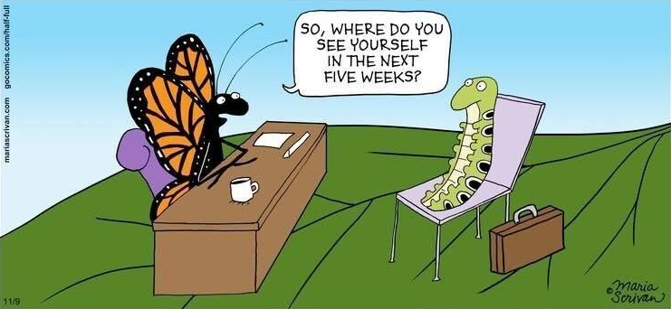
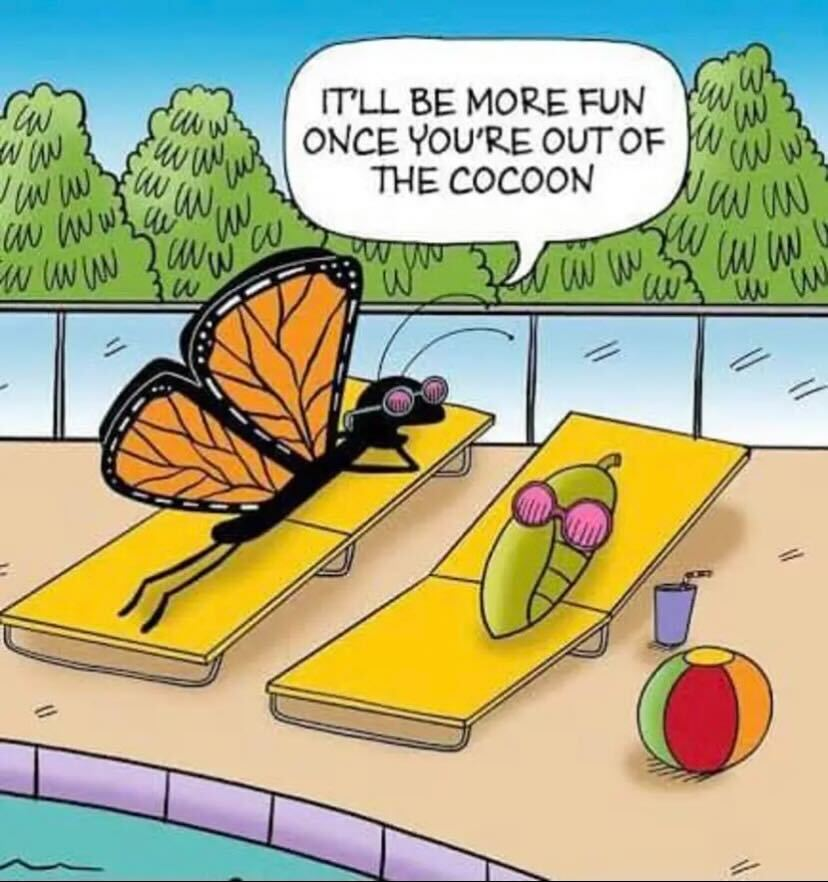

= Change is the only way to stay your true self

== Introduction

What is this all about? Am I about to spend 5 minutes on another corporate blog article that makes no sense to me and doesn’t even involve something related to my own experiences?

Well, that’s a resounding No!

`It is about us! If you’re a part of Valor, it’s all about you!*

image::IMG_Change1.png[]

== The Twisty Road We Took

It has been a long road since 2013. We have matured and adapted, we have a shared history and personal stories of all of us. During the maturation, we went through this transitional age, which cost us losing our youthful optimism and losing our Angular fanaticism in favor of a wide spectrum of technologies.

*The realization hit harder than we expected*. What we do is not about tooling but rather about what we enable, and it's always more important than the fact that we had used Angular for that particular project to achieve the firm Valor-quality result.

We all remember the cozy feeling of slipping into your favorite pair of jeans that overstayed their welcome for a couple of extra years. The same goes for technologies, limiting ourselves to only one tool from the galaxy-wide toolbox puts extra restrictions and limits us in our ability to grow in every direction out there.

Our dream was so vivid and big, that we went against the famous saying about not putting all eggs in one basket. Our dream was to become the largest Angular hub in Ukraine. Our dream was so solid that we even rented https://valor-software.com/articles/new-year-new-valor-new-you[an office for 300 folks in Kharkiv^]. And it went well for some time. We had our share of success, NgTalks 2018, the first-ever Ukrainian Kharkiv-based Angular conference was a huge blast! We also made some decent talent acquisitions in those years. But all those eggs in a single basket started to crack.

Blocks and restrictions are oftentimes nothing more than an illusion in our heads because humans’ brains tend to oppose change. *Once we recognize what’s blocking us – it’s a half-work done*. This way we understood that great people and professionals spread all around the world. And possibly we could find a common language and a common ground to make up a team. We went for it, and voila!! We're an international team of, in a good way, crazy and passionate professionals!

image::IMG_Change2.png[]

== Chasing Rainbows

Chasing personal goals is OK, but it’s only OK if it doesn’t weaken other activities. We realized that we can be the best in Angular out there, but there’s no use in being the best if you’re a company that tries to fit the market with only one way of creating a product. Maturing has a price, and we paid the price in shifting from our blind motivations for technical and professional perfection to a more mature understanding of a need to balance between real things: market demands, our personal goals, and professional perfection.

*And we've matured*. Indeed we dropped the chains of being bound to one city, one country, and one technology to become a multinational multiple tech stacks guns blazing experts.

It all came to the fact that the only permanent thing in this world is change, and it's a great state to be which drives us to move, to leave, to grow. What hasn't changed in all those years is our approach to work. Here and now *we aren’t looking for a new static vector*, rather we are looking for a way to embrace the change and share our perception of it with all of us to ride on the same wave.

== Take courage and take care

We’ve all had our chance to make sure that “it's neither my headache nor my piece of cake” isn’t working, be it projects or human relationships. We aren’t expecting that something will happen on its own. Life is a series of choices and multiple decisions when it comes to morality, quality, initiative, indifference, or involvement. So let’s get control over the only thing we have control over – whether to ignore or take action. If we notice that something isn’t working at its best, we act. In a nutshell: *“Be the driver for the change you want to achieve and the place where you want to be!”*.

image::IMG_Change4.png[]

Obviously, we are all linked by our contracts, ClickUp accounts, and daily things. But there’s something bigger that connects us. We’re part of Valor, we’re part of the team driven by the same aspirations and beliefs. *Our approach no matter what exactly is unified*. We choose to be proactive and involved, be it with tasks or the people who surround us.

== This is to humanity!

Many things are going on in our lives, within work and beyond. Now, possibly, more stuff than ever before (and definitely more than we'd like to deal with). Some time ago we would meet in Valor’s home-like office where everyone had their cups, friends, pets to pet (three of ‘em), and favorite work spots. There we could talk. We could be emotional. We could interact. Damn, we could learn from each other's mistakes faster, even! Now we give up to the new circumstances to some extent, still embracing humans which we all are.

These short talks that we will arrange once in a while, which we hope to have your feedback on, *may bring the feeling of presence, the feeling of belonging to something you’re excited about*, or just a feeling of a friend’s shoulder nearby! AND NOPE, this is not at all a small thing to desire. This format is not final, so it might morph into one or more iterations further on, to keep you and us involved.

== Let's Get Down To Business

What are we suggesting? First: ask us anything! We promise you’ll get your answers, because we strive to maintain this big human-like attitude, despite being, well, a company that makes money at the end of the day (who would have thought!).

The cool thing about all this is that we intend to share our stories, not just basic corporate-bloggy-success-stories and know-hows. We all had our share of ups and downs, and both of them deserve to be seen and heard because they are not only educational in a professional sense, but entertaining, fun, unfun, or even heartbreaking.

*We all learn as we go.* Not only Junior-level positions are bound to make mistakes, but we are also creatures who are prone to make wrong decisions. In the coming weeks, we will try to gather a cycle of sucс- and suck-sess stories from our experience working in Valor.

Do you have some? – Come tell! *There are thousands of kilometers between us, and only one button to push to get in touch.*

_Stay safe, stay tuned, and see you soon ;)_

