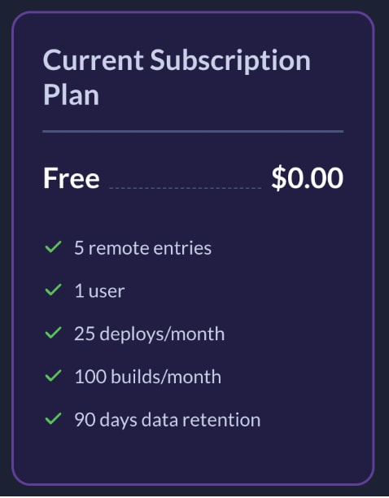
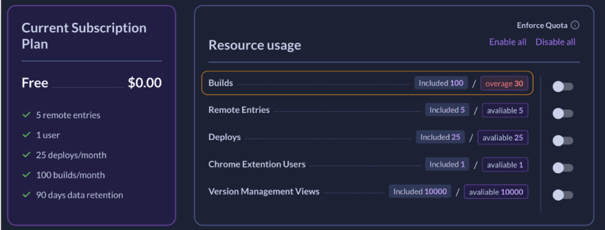
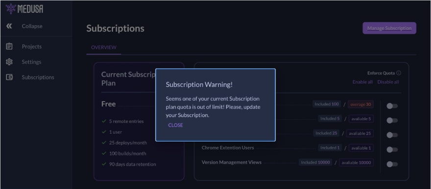

== Medusa Dashboard

*Issue:* ``**__"A user has a "Free Subscription" price plan with some limited resource usage."__**``

Currently, it looks like this:
[.small-img]

=== Let’s play with builds now.

==== How does it work?

When a user builds his application on his own (an application is connected to Medusa via tokens and medusa-plugin), medusa-plugin makes an API call to Medusa Server with a request to update application builds inside Medusa Dashboard, it creates some records in the database and you can manage and use those builds in the Dashboard then.
At the current moment, we don’t have any restrictions for build amount and usage according to the Price Plan so users can easily get a quote over the limit like for usage of 130 builds with 100 builds in the Plan.

[.img]

The task sounds like "Restrict overlimit usage of Medusa Resources according to Quota". Sounds like a five-minute task, just insert a checker before business logic. If the check is positive – go further, if negative – stop action.
Okay, it’s done. Even works. But there’s another issue – it will look for a User like a bug. No… like a BUG. As all things, described above, are under-the-hood processes, the user cannot know at that moment that he got overlimit, so we have to notify the user somehow in some way.

We don’t have any real-time solutions implemented inside yet, so it seems that, easy from first sight, the task becomes a task of implementing real-time technology. Okay, what do we know about it? Web Sockets – cool, but they are unidirectional, we do not need them. In addition, we might have an issue if the load balancer doesn’t support WebSockets (like a basic AWS Load Balancer).

=== What else?

SSE – Server-Sent-Events. Technology, which might cover a lot of cases where people use WebSockets. In addition, it brings less headache with integration as it uses HTTP protocol only.
Some words of difference between WebSockets and SSE.

Okay, we said it, we did it!
On the Back End side, we use NestJS, Front End is NextJS (for a non-native speaker, it’s quite difficult and funny to try to pronounce them instantly one by one :) ).

Let’s start. NestJS documentation has some words about the implementation of SSE. So it looks easy to do, it has simple examples, and it works… But in our case, not always and not everywhere.

There are a few issues I have faced during implementation.

=== Issue 1

An example in NestJS documentation is related to interval usage and sends messages once a second. We do not need that way, we need to send messages at the moment we want, and only to users whom this message concerns.
So we had to alter the event emitter to send messages only at that moment we need.
It was done.

[, js]
----
@Injectable()
export class ServerEventsService {
private readonly emitter: EventEmitter;

constructor() {
this.emitter = new EventEmitter();
}

subscribe(userId: string): Observable {
return fromEvent(this.emitter, userId);
}

emit(userId: string, data?: SseEventMessage): void {
this.emitter.emit(userId, { data });
}
}
----

=== Issue 2

As we are using NextJS, it means that most pages are SSR (Server Side Rendered). That means, in addition, that we cannot create the EventSource instance anywhere we want. So we have to initialize the eventsource after the component has been rendered in the browser.

Firstly, we need to receive messages and show them globally, it should not be related to a certain page. Another thing is how to make it work in our case of SSR.

We just need to do that in useEffect, to make it start working in a Browser already. So we created a Global Modal with some inputs, integrated our solution and it worked. Cool, we are so happy!

=== Issue 3

Our solution worked well in the case of real-time processes, but what if Medusa Dashboard was closed? We need to notify a user that he has some issues with using Medusa because of quota overlimit. Easy, just make a check. The thing is that we need to make an async call in useEffect and linter tells us that we are incorrect with that decision… But, there’s a workaround. We need to wrap the async function into the self-invoking unnamed function.

[, js]
----
(async () => {
await task();
})();
----

=== Issue 4

It’s a bad thing to have a checker on the Back End side for the under-the-hood process and the same checker on the Front End side, so on a Front End we just make an API call without using a response. On the server side, we check all related data, and in case the checker responds negatively, we emit a new message from Server to UI.
But it didn’t work.

Under-the-hood things emitted the message from one controller, check by demand the emitted message from another controller.

What is the issue? Why doesn't it work? I’m emitting a message, and it emits but the UI doesn't get it…

``**__- I checked if my emitters have listeners. One of them had one, and another one – did not.__**``

``**__- Whaaat?__**``

I have created an SSE Service and injected that as a provider into the App Module, then into another Module. It’s not directly said anywhere in the documentation that by doing things in this way, we will get different multiple instances of Services. Hmmm… Okay.
Creating a separate module with a separate service, then injecting modules into other modules – saved me… The Next JS modules are Singletons, so now I have only one instance of the SSE part and really can use this service everywhere in the Server and emit messages to a certain channel.

[.img]

That’s it. We have integrated SSE into the System, it works great and this is a base to develop that further.

Now we can notify a user if something is happening under the hood and the user should be aware of it. Great!
