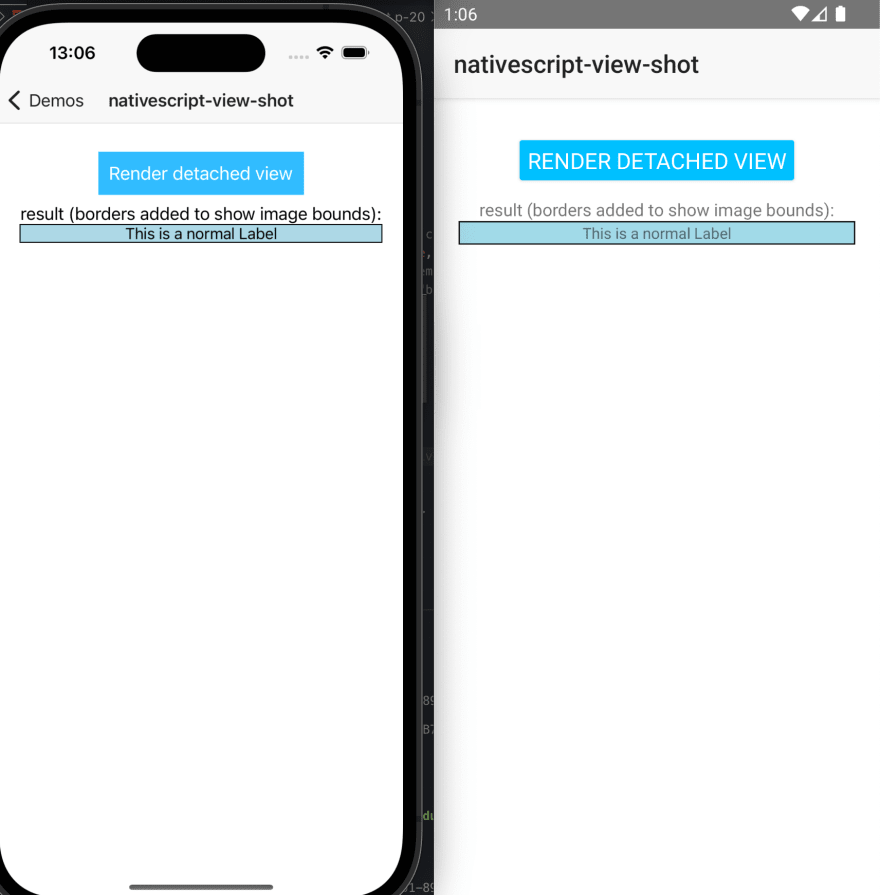
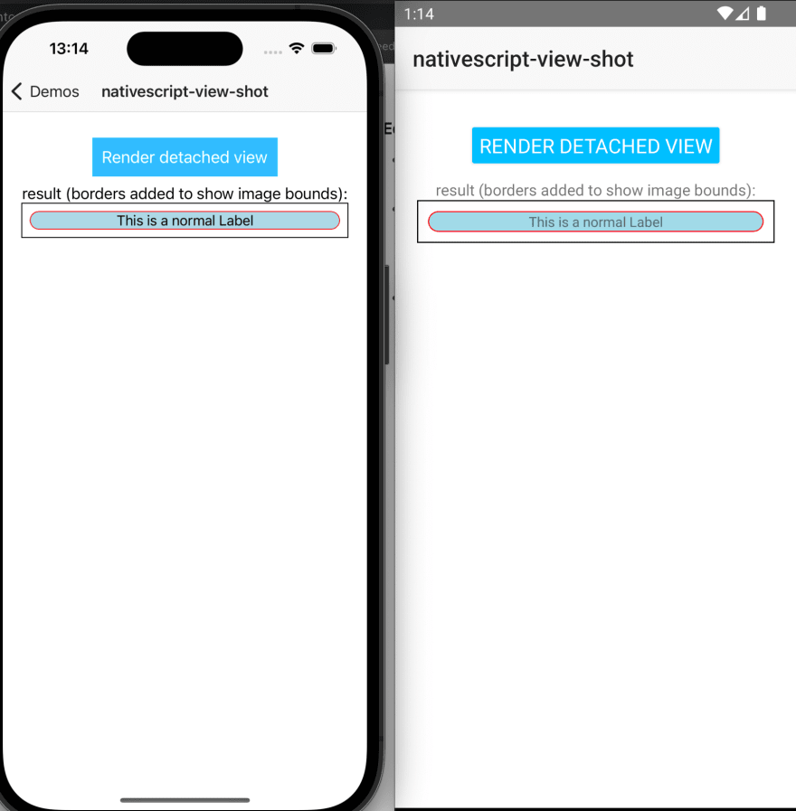
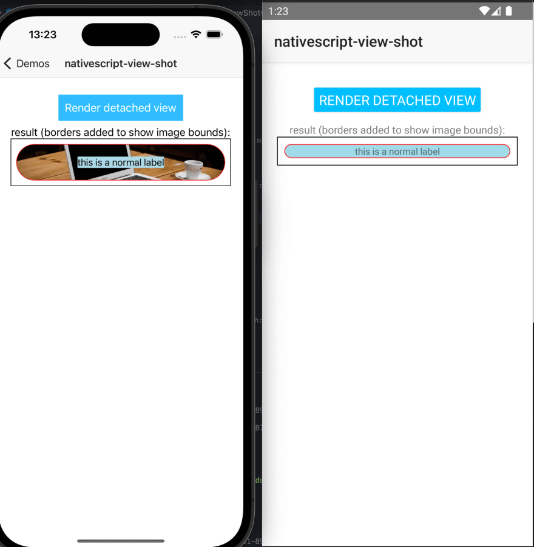

While working on a NativeScript Angular app with millions of downloads across platforms, I faced a tricky problem: I needed to generate an image that the user could share. Usually this can be done quite easily if this view is visible in your application, where you could just render it to an image (in fact, it has been done https://www.npmjs.com/package/nativescript-cscreenshot[before, window=_blank]). The difficult part here was that this view did not show anywhere in the app, and even had special layout constraints.

== Taking a view screenshot
Taking a screenshot of a view is an easy task.

On Android, it’s a simple case of creating a bitmap, attaching it to a canvas, and then drawing the view directly on that canvas:

[, js]
----
export function renderToImageSource(hostView: View): ImageSource {
 const bitmap = android.graphics.Bitmap.createBitmap(hostView.android.getWidth(), hostView.android.getHeight(), android.graphics.Bitmap.Config.ARGB_8888);
 const canvas = new android.graphics.Canvas(bitmap);
 // ensure we start with a blank transparent canvas
 canvas.drawARGB(0, 0, 0, 0);
 hostView.android.draw(canvas);
 return new ImageSource(bitmap);
}
----

On the iOS side, we have a very similar concept. We begin the image context, and then we render the view in that context:

[, js]
----
export function renderToImageSource(hostView: View): ImageSource {
 UIGraphicsBeginImageContextWithOptions(CGSizeMake(hostView.ios.frame.size.width, hostView.ios.frame.size.height), false, Screen.mainScreen.scale);
 (hostView.ios as UIView).layer.renderInContext(UIGraphicsGetCurrentContext());
 const image = UIGraphicsGetImageFromCurrentImageContext();
 UIGraphicsEndImageContext();
 return new ImageSource(image);
}
----

There it is! Taking a screenshot of any NativeScript view with a couple of lines of code!
[.small-img]
image::img1.jpeg[]

== Rendering a view detached from the view hierarchy
Now let’s take it one step further. Let’s use some clever NativeScript magic and create our layout completely detached from the native view tree:

[, js]
----
export function loadViewInBackground(view: View): void {
 // get the context (android only)
 const context = isAndroid ? Utils.android.getApplicationContext() : {};
 // now create the native view and setup the styles (CSS) as if it were a root view
 view._setupAsRootView(context);
 // load the view to apply all the native properties
 view.callLoaded();
}
----

That should do it! Now let’s just call that function and… oh…
[.small-img]
image::img2.jpeg[]

Of course! This view has no size! So we need to measure and layout it. That’s simple enough:

[, js]
----
export function measureAndLayout(hostView: View, width?: number, height?: number) {
 const dpWidth = width ? Utils.layout.toDevicePixels(width) : 0;
 const dpHeight = height ? Utils.layout.toDevicePixels(height) : 0;
 const infinity = Utils.layout.makeMeasureSpec(0, Utils.layout.UNSPECIFIED);
 hostView.measure(width ? Utils.layout.makeMeasureSpec(dpWidth, Utils.layout.EXACTLY) : infinity, height ? Utils.layout.makeMeasureSpec(dpHeight, Utils.layout.EXACTLY) : infinity);

 hostView.layout(0, 0, hostView.getMeasuredWidth(), hostView.getMeasuredHeight());
}
----

Now this view should render exactly at the width and height that I require. Let’s give it a try:
[.small-img]

It worked! Turns out it wasn’t as difficult as I thought. Now that we’re ready to go, let’s add the styling. Let’s keep the text intact, but add some styling. We need some border-radius and some margins.

[, css]
----
.view-shot {
  border-radius: 50%;
  border-width: 1;
  border-color: red;
  margin: 10;
}
----

Now run that through our render and…
[.small-img]
image::img4.png[]

Where did my margins go? Well, it turns out that, on both platforms, the parent layout is responsible for the children's positioning, and margins are just some extra positioning information given to the parent. Another quick fix then, just wrap the view with another layout:

[, js]
----
export function loadViewInBackground(view: View): View {
 // get the context (android only)
 const context = isAndroid ? Utils.android.getApplicationContext() : {};
 // create a host view to ensure we're preserving margins
 const hostView = new GridLayout();
 hostView.addChild(view);
 // now create the native view and setup the styles (CSS) as if it were a root view
 hostView._setupAsRootView(context);
 // load the view to apply all the native properties
 hostView.callLoaded();
 return hostView;
}
----

And the result:
[.small-img]

Success! We can now keep adding the remainder, like an image. The image has to be downloaded, so let’s add a delay between creating the view and screenshotting it (we can cache it later). And… oh no, not again.
[.small-img]

== Attaching the view to the view hierarchy
After digging through the native source code I realized that on Android a lot of views (like an image) will only fully render when they’re attached to the window, so how do we attach it to the view hierarchy without showing it and without affecting the layout at all?

The main function of a ViewGroup is to lay out the views in a particular way. So first, let’s create a view that will not do any layout:

[, js]
----
@NativeClass
class DummyViewGroup extends android.view.ViewGroup {
 constructor(context: android.content.Context) {
   super(context);
   return global.__native(this);
 }
 public onMeasure(): void {
   this.setMeasuredDimension(0, 0);
 }
 public onLayout(): void {
   //
 }
}
class ContentViewDummy extends ContentView {
 createNativeView() {
   return new DummyViewGroup(this._context);
 }
}
----

Now we just need to make sure that it’s visibility is set to collapse and use a very convenient method from the AppCompatActivity (https://developer.android.com/reference/androidx/appcompat/app/AppCompatActivity#addContentView(android.view.View,android.view.ViewGroup.LayoutParams)[addContentView, window=_blank]) to add the view to the root of the activity, essentially adding it to the window but completely invisible.

[, js]
----
export function loadViewInBackground(view: View) {
 const hiddenHost = new ContentViewDummy();
 const hostView = new GridLayout(); // use a host view to ensure margins are respected
 hiddenHost.content = hostView;
 hiddenHost.visibility = 'collapse';
 hostView.addChild(view);
 hiddenHost._setupAsRootView(Utils.android.getApplicationContext());
 hiddenHost.callLoaded();

 Application.android.startActivity.addContentView(hiddenHost.android, new android.view.ViewGroup.LayoutParams(0, 0));

 return {
   hiddenHost,
   hostView
 };
}
----

[.small-img]
image::img7.png[]

And we’re done!

== Integrating with Angular
So far we have only dealt with NativeScript views, but what we really care about is how we generate these views from Angular components and templates. So here's how:

[, js]
----
import { ComponentRef, inject, Injectable, Injector, TemplateRef, Type, ViewContainerRef } from '@angular/core';

import { generateNativeScriptView, isDetachedElement, isInvisibleNode, NgView, NgViewRef } from '@nativescript/angular';
import { ContentView, ImageSource, View, ViewBase } from '@nativescript/core';
import { disposeBackgroundView, loadViewInBackground, measureAndLayout, renderToImageSource } from '@valor/nativescript-view-shot';

export interface DrawableOptions<T = unknown> {
  /**
   * target width of the view and image, in dip. If not specified, the measured width of the view will be used.
   */
  width?: number;
  /**
   * target height of the view and image, in dip. If not specified, the measured height of the view will be used.
   */
  height?: number;
  /**
   * how much should we delay the rendering of the view into the image.
   * This is useful if you want to wait for an image to load before rendering the view.
   * If using a function, it will be called with the NgViewRef as the first argument.
   * The NgViewRef can be used to get the EmbeddedViewRef/ComponentRef and the NativeScript views.
   * This is useful as you can fire an event in your views when the view is ready, and then complete
   * the promise to finish rendering to image.
   */
  delay?: number | ((viewRef: NgViewRef<T>) => Promise<void>);
  /**
   * The logical host of the view. This is used to specify where in the DOM this view should lie.
   * The practical use of this is if you want the view to inherit CSS styles from a parent.
   * If this is not specified, the view will be handled as a root view,
   * meaning no ancestor styles will be applied, similar to dropping the view in app.component.html
   */
  logicalHost?: ViewBase | ViewContainerRef;
}

@Injectable({
  providedIn: 'root',
})
export class ViewShotService {
  private myInjector = inject(Injector);
  async captureInBackground<T>(type: Type<T> | TemplateRef<T>, { width, height, delay, logicalHost }: DrawableOptions<T> = {}): Promise<ImageSource> {
    // use @nativescript/angular helper to create a view
    const ngView = generateNativeScriptView(type, {
      injector: logicalHost instanceof ViewContainerRef ? logicalHost.injector : this.myInjector),
      keepNativeViewAttached: true,
    });
    // detect changes on the component
    if (ngView.ref instanceof ComponentRef) {
      ngView.ref.changeDetectorRef.detectChanges();
    } else {
      ngView.ref.detectChanges();
    }
    // currently generateNativeScriptView will generate the view wrapped in a ContentView
    // this is a minor bug that should be fixed in a future version on @nativescript/angular
    // so let's add a failsafe here to remove the parent if it exists
    if (ngView.view.parent) {
      if (ngView.view.parent instanceof ContentView) {
        ngView.view.parent.content = null;
      } else {
        ngView.view.parent._removeView(ngView.view);
      }
    }
    // use the method that loads a view in the background
    const drawableViews = loadViewInBackground(ngView.view, host);
    const { hostView } = drawableViews;

    // do the measuring of the hostView
    measureAndLayout(hostView, width, height);

    // this delay is either a function or time in ms
    // which is useful for letting async views load or animate
    if (typeof delay === 'function' || (typeof delay === 'number' && delay >= 0)) {
      if (typeof delay === 'number') {
        await new Promise<void>((resolve) =>
          setTimeout(() => {
            resolve();
          }, delay)
        );
      } else {
        await delay(ngView);
        if (ngView.ref instanceof ComponentRef) {
          ngView.ref.changeDetectorRef.detectChanges();
        } else {
          ngView.ref.detectChanges();
        }
      }
      // do a final measure after the last changes
      measureAndLayout(hostView, width, height);
    }

    // call the render function
    const result = renderToImageSource(hostView);

    // dispose views and component
    disposeBackgroundView(drawableViews);
    ngView.ref.destroy();
    return result;
  }

  // unchanged from the original implementation
  captureRenderedView(view: View) {
    return renderToImageSource(view);
  }
}
----

== Conclusion
Hopefully this gave you an insight into how the native platforms display their views and how NativeScript can be used in advanced view hierarchy composition.

The NativeScript plugin has been released as https://www.npmjs.com/package/@valor/nativescript-view-shot[@valor/nativescript-view-shot, window=_blank] and you can check its source code in our https://github.com/valor-software/nativescript-plugins[shared plugin workspace, window=_blank].

You can now enjoy creating views in the background for either showing, saving or sharing them in social media, like the following mockup:
[.small-img]
image::img8.jpeg[]

== About Valor Software
Official NativeScript professional support partner, Valor is actively contributing to the NativeScript ecosystem, providing enterprise support, consulting, and team augmentation. Valor Software additionally helps with all aspects of the SDLC, web, backend and mobile.  https://calendly.com/zack-chapple/nativescript-support?month=2023-01[Book a call, window=_blank] today or email us at mailto:sales@valor-software.com[sales@valor-software.com] if you need help.