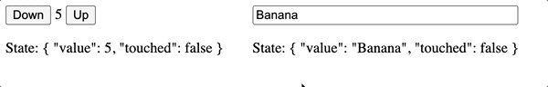

One of the biggest advantages of Angular is the variety of tools and solutions that are brought to developers out of the box. One of them is the #@angular/forms# package, which brings the solid experience of working with any kind of UI controls.
But have you ever wondered, how exactly this works under the hood? The only thing that needs to be done in order to tie FormControl with, let's say, a plain input is using a "formControl" binding on the input element, pointing that UI element to the instance of a FormControl.

[, js]
----
<input type="text" [formControl]="ctrl" />
----
And voila, everything works.

But obviously, there should be a component or directive that Angular uses to make everything happen. And that "something" can be found https://github.com/angular/angular/tree/main/packages/forms/src/directives[here, window=_blank]: Angular brings a set of directives like https://github.com/angular/angular/blob/main/packages/forms/src/directives/default_value_accessor.ts[default_value_accessor.ts, window=_blank], https://github.com/angular/angular/blob/main/packages/forms/src/directives/select_control_value_accessor.ts[select_control_value_accessor.ts, window=_blank], https://github.com/angular/angular/blob/main/packages/forms/src/directives/checkbox_value_accessor.ts[checkbox_value_accessor.ts, window=_blank], etc. All of them implement the ControlValueAccessor interface, which, according to docs: __"Defines an interface that acts as a bridge between the Angular forms API and a native element in the DOM."__

This means any component can be easily defined as a form control by implementing this interface and registering itself as an #NG_VALUE_ACCESSOR# provider. In practice, it requires you to define 4 methods:

[, js]
----
interface ControlValueAccessor {
  writeValue(obj: any): void
  registerOnChange(fn: any): void
  registerOnTouched(fn: any): void
  setDisabledState(isDisabled: boolean)?: void
}
----
__*although setDisabledState is optional, there’re only a few rare scenarios when it’s indeed not needed__

To understand how exactly everything works, let’s have a look at the very basic counter component:

[, js]
----
<lib-counter [formControl]="counter"></lib-counter>

Counter Value: {{ counter.value }}

----

[.img]
image::image1.gif[]

Here’s the code of the component itself:

[, js]
----
import { ChangeDetectionStrategy, ChangeDetectorRef, Component, forwardRef } from '@angular/core';
import { ControlValueAccessor, NG_VALUE_ACCESSOR } from '@angular/forms';

const COUNTER_CONTROL_ACCESSOR = {
    provide: NG_VALUE_ACCESSOR,
    useExisting: forwardRef(() => CounterControlComponent),
    multi: true,
};

@Component({
    selector: 'lib-counter',
    template: `
        <button (click)="down()" [disabled]="disabled">Down</button>
        {{ value }}
        <button (click)="up()" [disabled]="disabled">Up</button>
    `,
    changeDetection: ChangeDetectionStrategy.OnPush,
    providers: [COUNTER_CONTROL_ACCESSOR],
})
export class CounterControlComponent implements ControlValueAccessor {
    disabled = false;
    value = 0;

    protected onTouched: () => void;
    protected onChange: (value: number) => void;

    constructor(private _cdr: ChangeDetectorRef) {}

    up() {
        this.setValue(this.value + 1, true);
    }

    down() {
        this.setValue(this.value - 1, true);
    }

    registerOnChange(fn: (value: number) => void) {
        this.onChange = fn;
    }

    registerOnTouched(fn: () => void) {
        this.onTouched = fn;
    }

    setDisabledState(isDisabled: boolean) {
        this.disabled = isDisabled;
    }

    writeValue(value: number) {
        this.setValue(value, false);
        this._cdr.markForCheck();
    }

    protected setValue(value: number, emitEvent: boolean) {
        const parsed = parseInt(value as any);
        this.value = isNaN(parsed) ? 0 : parsed;
        if (emitEvent && this.onChange) {
            this.onChange(value);
            this.onTouched();
        }
    }
}
----

As you see here we’re implementing 4 methods and providing #COUNTER_CONTROL_ACCESSOR.# This is needed in order to let Angular know it deals with an instance of a form control.

So what’s happening with control is:

1. Once FormControl is initialised, it invokes #writeValue#, #registerOnChange# and registerOnTouched methods on the counter component. This syncs the initial state of the FormControl with our counter and also passes onTouched and onChanged methods into the counter, so it can talk back to the FormControl when the user interacts with it. +
2. When the value is changed, FormControl invokes the #writeValue# method, so counter updates its internal state without triggering the #onChange#/#onTouched# methods. +
3. When the user interacts with our counter, it’s required to not only update the internal state but also notify parent FormControl about this state change, thus #onChange#/#onTouched# methods are invoked.

Although that’s not really a lot going on here, it is worth taking a look at a few important implementation details. And this is actually what this article is about

== Common pitfalls with CVAs and how to avoid them

*#onChange# should be only triggered by an internal event!*

It’s important to keep in mind that these methods should only be used to notify FormControl about the change that was triggered in the component internally. In other words, if FormControl changes the value of the component, it should never notify FormControl back about this change. This is a quite common mistake as it won’t break anything at the first glance, instead you’ll be able to notice it by subscribing to #valueChanges# of the bound FormControl:

[, js]
----
export class AppComponent {
  readonly animal = new FormControl(‘rabbit’);

  constructor() {
    ctrl.valueChanges.subscribe(console.log);
    animal.setValue(‘hare’);
    animal.setValue(‘cat’);
  }
}
----

In the normal scenario by executing the code above you will see only 2 logs: ‘hare’, ‘cat’. However, if your #writeValue# method ends up invoking #onChange# you will see doubled console logs in the output: ‘hare’, ’hare’, ‘cat’, ‘cat’.

Here’s a modified code of #CounterComponent# where this issue can be seen, when FormControl invokes #writeValue# we notify it back with the #onChange# method:

[, js]
----
// ... code of CounterComponent
writeValue(value: number) {
    // it's convenient to reuse existing "setValue" method, right?
    // however, this will lead to the incorrect behavior
    this.setValue(value);
    this._cdr.markForCheck();
}

protected setValue(value: number) {
    const parsed = parseInt(value as any);
    this.value = isNaN(parsed) ? 0 : parsed;
    if (this.onChange) {
        this.onChange(value);
        this.onTouched();
    }
}
----

*#onChange# and #onTouched# should not always be called together!*

#onChange#/#onTouched# methods actually serve completely different purposes. While #onChange# is used to pass data when a component’s state changed internally, #onTouched# should be invoked after the user interacts with the component. This doesn’t always mean the component’s value is changed.

#onTouched# method is used in 2 cases: +

* by FormControl to update its touched state
* when you set up your control to use  https://angular.io/api/forms/AbstractControl[updateOn: “blur", window=_blank], FormControl uses it to properly identify this blur event to apply the value to itself.

For the CounterComponent both touch and change events are combined because the only way to interact with it is by clicking the button. However, with other components, the flow will be different. For instance, a plain #<input /># element with a tied FormControl (with DefaultValueAccessor under the hood) is expected to be marked as touched when the user interacts with the input even by focusing it. Thus, for this kind of components onTouched emission should be tied to the #blur# event from the input.

[.img]

=== Handling nulls properly

With an introduction of typed forms, form controls can now either infer a type from the default value or be typed explicitly. There’s an interesting thing, though: if we define a control c#onst control = new FormControl<string>()# and then check its type, it will be #string | null#. And you might wonder: why does the type of this control include #null#? This is because the control can become null at any time, by calling the #reset()# method on it. Here’s an example from angular docs:

[, js]
----
const control = new FormControl('Hello, world!');
control.reset();
console.log(control.value); // null
----

Although this becomes quite obvious with typed forms, this behavior was inherent in forms from the very beginning. And while new handy types may catch issues with control’s values, it doesn’t really save you from any issues with nulls inside your CVA. Moreover, since CVA component doesn’t have any control over the form it’s being used within and there’s no way to enforce certain types of control on the form, it’s possible to actually pass literally any value into the control. Hence this value will end up passing into the #writeValue#, which can potentially break your component.

Let’s change our CounterComponent as follows:

[, js]
----
// ... code of CounterComponent
writeValue(value: number) {
    // it's convenient to reuse existing "setValue" method, right?
    // however, this will lead to the incorrect behavior
    this.setValue(value, false);
    this._cdr.markForCheck();
}

protected setValue(value: number, emitEvent: boolean) {
    this.value = value;
    if (emitEvent && this.onChange) {
        this.onChange(value);
        this.onTouched();
    }
}
----

[.img]
image::image3.gif[]

CounterComponent is too simple to have big issues with null because JavaScript will cast null into 0 (#null + 1 = 1#), but as you can see component is visually broken after #reset()# is called. So it’s very important to keep in mind this behavior and implement some value protections for the #writeValue# method.

== Standardising your custom UI form components with ControlValueAccessor Test Suite

Even if you keep in mind all the potential pitfalls listed above, there’s always a chance something will go wrong due to some change or enhancement in the future. The best way to maintain the valid behavior of a component is to have extensive unit test coverage. However, it might be annoying to write the same list of tests for all CVA components or some use cases can be accidentally left without coverage. So it should be much better to have one unified testing solution, that can keep your components safe.

And there’s one called https://github.com/dmitry-stepanenko/ngx-cva-test-suite[ngx-cva-test-suite, window=_blank]. It’s a small npm package, that provides an extensive set of test cases, ensuring your custom controls behave as intended. It is designed and tested to work properly with both Jest and Jasmine test runners.

Among the main features:

* ensures the correct amount of calls for the #onChange# function (incorrect usage may result in extra emissions of #valueChanges# of formControl)
* ensures correct triggering of #onTouched# function (is needed for touched state of the control and #updateOn: 'blur'# https://angular.io/api/forms/AbstractControl[strategy, window=_blank] to function properly)
* ensures that no extra emissions are present when control is disabled
* checks for control to be resettable using #AbstractControl.reset()#

It is quite easy to be configured, here’s the usage scenario for the CounterComponent we looked into within this article:

[, js]
----
import { runValueAccessorTests } from 'ngx-cva-test-suite';
import { CounterControlComponent } from './counter.component';

runValueAccessorTests({
    /** Component, that is being tested */
    component: CounterControlComponent,
    /** 
     * All the metadata required for this test to run. 
     * Under the hood calls TestBed.configureTestingModule with provided config.
     */
    testModuleMetadata: {
        declarations: [CounterControlComponent],
    },
    /** Whether component is able to track "onBlur" events separately */
    supportsOnBlur: false,
    /** 
     * Tests the correctness of an approach that is used to set value in the component, 
     * when the change is internal. It's optional and can be omitted by passing "null"
     */
    internalValueChangeSetter: null,
    /** Function to get the value of a component in a runtime. */
    getComponentValue: (fixture) => fixture.componentInstance.value,
    /** When component is reset by FormControl, it should either get a certain default internal value or "null" */
    resetCustomValue: { value: 0 },
    /** 
     * This test suite applies up to 3 different values on the component to test different use cases. 
     * Values can be customized using this configuration option.
     */
    getValues: () => [1, 2, 3],
});
----

You can learn more about usage examples in the https://github.com/dmitry-stepanenko/ngx-cva-test-suite[package’s repository, window=_blank] or get inspiration by looking at a few CVA components that are placed https://github.com/dmitry-stepanenko/ngx-cva-test-suite/tree/master/apps/integration/src/app/controls[within the repository here, window=_blank].