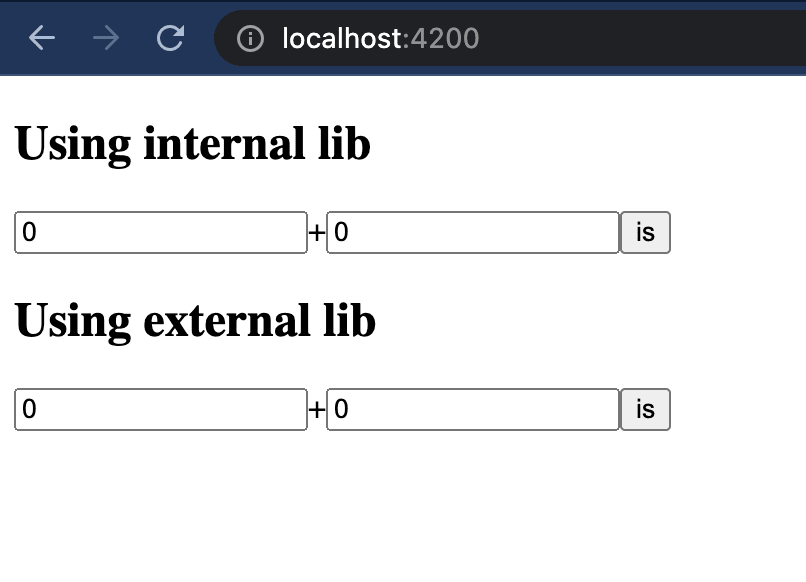
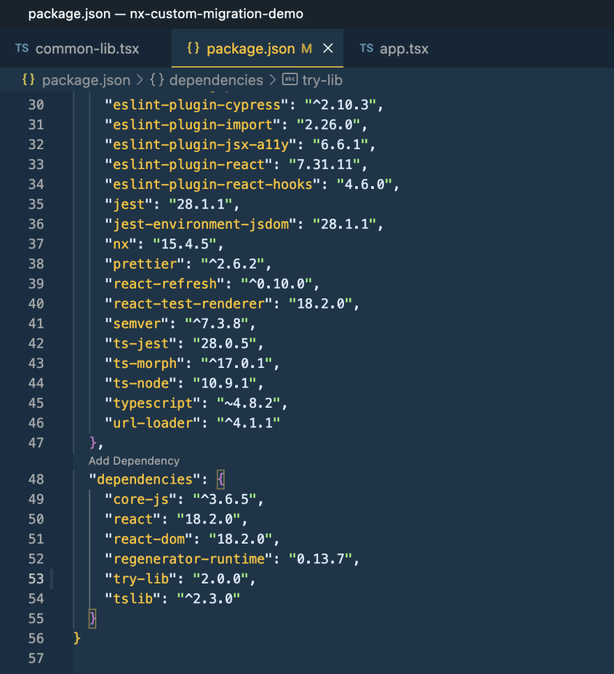

https://nx.dev/[The Nx ecosystem, window=_blank] is excellent because, on the one hand, it allows different teams to work under the same monorepo and build robust enterprise solutions. On the other hand, the basic Nx functionality is relatively easy. That's why Nx-based solutions turned out more popular last time. Consequently, increasing monorepos include technologies such as React, Angular, NestJS, and even Golang. Moreover, these libraries and frameworks are not alone under the monorepos. They often use a lot of 3-d party libraries and custom modules. One of the most painful topics regarding software development, including Nx, is managing dependency updates. Especially dependencies with breaking changes that need to be resolved in order to get the application back into a working state. This article proposes one possible solution. It is not meant as a final solution and or source of truth. These are only initial thoughts about the topic.

https://nx.dev/[Nx official documentation, window=_blank] tells us regarding migrations the following.

"Not only does nx migrate update you to the latest version of Nx, but it also updates the versions of dependencies that we support and test, such as Jest and Cypress. You can also use the migrate command to update any Nx plugin."

The Nx team did a great job because you can update the whole solution as efficiently as possible. That's why I recommend the https://nx.dev/core-features/automate-updating-dependencies[following reading, window=_blank]. Many packages have supported it. But "many" is not equal to "all." Let's look at the following case.

There is a https://github.com/buchslava/nx-custom-migration-demo[demo monorepo, window=_blank]. It contains a https://github.com/buchslava/nx-custom-migration-demo/tree/main/apps/client[React Application, window=_blank]. Also, it includes a https://github.com/buchslava/nx-custom-migration-demo/tree/main/libs/common-lib[common lib, window=_blank].

Let's dig into the demo functionality and code specific.

== The Client
The client React app is quite simple. Let's run it.

[, bash]
----
git clone git@github.com:buchslava/nx-custom-migration-demo.git
npm i
npx nx run client:serve
----

[.img]

The behavior of a couple of forms above is similar. They demonstrate the sum of two numbers. Related code is placed https://github.com/buchslava/nx-custom-migration-demo/blob/main/apps/client/src/app/app.tsx[here, window=_blank]. Let's look at the code.

[, js]
----
import { sumProxy } from '@nx-custom-migration-demo/common-lib';
import { useState } from 'react';
import { deprecatedSum } from 'try-lib';

export function App() {
  const [a, setA] = useState<number>(0);
  const [b, setB] = useState<number>(0);
  const [c, setC] = useState<number>();

  const [d, setD] = useState<number>(0);
  const [e, setE] = useState<number>(0);
  const [f, setF] = useState<number>();

  return (
    <>
      

        <h2>Using internal lib</h2>
        

          <input
            value={a}
            onChange={(e) => {
              setA(+e.target.value);
            }}
          />
          +
          <input
            value={b}
            onChange={(e) => {
              setB(+e.target.value);
            }}
          />
          <button
            onClick={() => {
              setC(sumProxy(a, b));
            }}
          >
            is
          </button>
          {c}
        

      

      

        <h2>Using external lib</h2>
        

          <input
            value={d}
            onChange={(e) => {
              setD(+e.target.value);
            }}
          />
          +
          <input
            value={e}
            onChange={(e) => {
              setE(+e.target.value);
            }}
          />
          <button
            onClick={() => {
              setF(deprecatedSum(d, e));
            }}
          >
            is
          </button>
          {f}
        

      

    </>
  );
}

export default App;
----

Pay attention to the following points.
[, js]
----
<button
  onClick={() => {
    setC(sumProxy(a, b));
  }}
>
  is
</button>
----

The code above describes the result calculation for the first form. We take #sumProxy# from the internal library #@nx-custom-migration-demo/common-lib.#

[, js]
----
<button
  onClick={() => {
    setF(deprecatedSum(d, e));
  }}
>
  is
</button>
----
The code above describes the result calculation for the second form. We take #deprecatedSum# from the external library #try-lib#.
If we look at #package.json# we can find the library.
[, json]
----
"try-lib": "^1.0.1",
----

=== The Internal (Common) Library

The library is placed https://github.com/buchslava/nx-custom-migration-demo/tree/main/libs/common-lib[here, window=_blank].
[, js]
----
import { deprecatedSum } from "try-lib";

export function sumProxy(a: number, b: number): number {
  return deprecatedSum(a, b);
}
----
It looks similar to the calculation for the second form on the client because of #deprecatedSum# from #try-lib#.

=== The external Library
It's time to look at the external library. You can find the library on https://github.com/buchslava/try-lib[github, window=_blank] and https://www.npmjs.com/package/try-lib[npm, window=_blank].
There is a couple of versions.

==== Version #1.0.1#
This version is based on the following code.
[, js]
----
export function deprecatedSum(a: number, b: number): number {
  return a + b;
}
----

==== Version #2.0.0#
The main feature of this version is that this version contains a breaking change. The breaking change is that #deprecatedSum# has changed to #sum#.
[, js]
----
export function sum(a: number, b: number): number {
  return a + b;
}
----

=== The Issue
Pay attention that now we use #try-lib@1.0.1#. A couple of important places look the following.

[.img]
image::image2.png[]
Let's change it to #version 2.0.0# and run #npm i#.

[.img]

It's easy to predict the result.

[.img]
image::image4.png[]
We have a broken solution because #try-lib# has a breaking change.

=== The Solution

Of course, we can fix the breaking changes manually and forget this story. But this approach is suitable mainly for Ad hoc or for individual developers. We need to count the following factors when discussing teams or enterprise solutions.

==== Factor 1. Time.
We don't know when we should apply the changes. Let's imagine a team has decided to bump the library version. One of the developers provides a new branch, including fixes. But the manager postponed this branch merging, and the team had no idea when the team would continue with this task. What happens there? The team wasted time because the branch was outdated, and in most cases reasonable to forget the branch and repeat breaking changes and fixing again. Another option is Version Control System (VCS) conflict resolution. But this approach is the worst because we risk damaging the solution. Of course, it depends on the number of new modifications and breaking changes.

==== Factor 2. History.

Of course, the VCS (say, Git) can log the changes. Despite this, information could be lost due to rebasing. Perhaps we must invent a new approach to log the changes more efficiently.

==== Factor 3. Independence.

As I previously told you, Nx has a powerful migration functionality that allows upgrading Nx with other dependencies it supports. But let's imagine the situation when we don't need to upgrade the Nx version. Still, at the same time, we need to upgrade an individual dependency by automatically breaking changes and fixing them exactly as Nx migration does.

== Requirements.

Analyzing the above, let's gather the requirements for the task.

* We need to upgrade an individual dependency at any time. That's why the following approach makes sense. A developer or a team doesn't work with the result code; on the contrary, they prepare an algorithm (functionality) that transforms the solution according to the expected dependency version. It allows the team to apply the changes at any time when needed. On the one hand, it makes the project more expensive. On the other hand, it decreases many risks. We have a predictable flow because we know what happens (the result of applying) and how it happens (the algorithm/functionality). Also, there is one more important thing. If something wrong happens, we can roll back the changes and repeat them easily because we don't need to provide manual jobs. +
* We need to deal with different versions of the package. +
* The functionality above should be Nx-friendly. +
* The most important thing here is that the functionality above could be shared between Nx society and used as a part of a future Nx plugin. More information https://nx.dev/packages/nx-plugin[here, window=_blank].

== Implementation

When I was thinking about the implementation thoughts above, I faced with https://blog.nrwl.io/using-nx-workspace-generators-to-scaffold-new-blog-posts-8c8162cf857b[Using Nx Workspace generators to scaffold, window=_blank] new blog posts by https://medium.com/@juristr[Juri Strumpflohner, window=_blank]. I recommend this article because I found this helpful approach to resolving my task there. Briefly, my plan is about a new workspace generator creation. The workspace generator should get the related package name and modify the source code afterward.

It's time to dig into the solution.

First, I created the new workspace generator with the following command:

[, bash]
----
npx nx g @nx/workspace:workspace-generator code-transformer
----

This creates a new folder in #tools/generators/code-transformer# with an #index.ts# and a #schema.json# file.

=== Adjusting the #schema.json#

This file describes the metadata of our generator. It allows Nx to discover the generator and provides metadata such as the possible argument the generator takes for validation purposes or dynamically rendering a UI like Nx Console does.

In our case, we have only one input parameter for the generator, and we need to pass a related dependency name.

I opened the #tools/generators/code-transformer/schema.json# and adjusted the schema to match our requirements.

[, json]
----
{
  "$schema": "http://json-schema.org/schema",
  "cli": "nx",
  "$id": "code-transformer",
  "type": "object",
  "properties": {
    "package": {
      "type": "string",
      "description": "Package",
      "$default": {
        "$source": "argv",
        "index": 0
      }
    }
  },
  "required": ["package"]
}
----

=== Code transformation runner

Next, I opened the #tools/generators/code-transformer/index.ts# and put my solution there.
Please, read the comments in the code. It will help you to understand the solution.
[, js]
----
import { Tree } from '@nrwl/devkit';
import * as fs from 'fs';
import * as path from 'path';
import * as semver from 'semver';
import * as util from 'util';
import { Project } from 'ts-morph';
import compile from './compiler';

const readFile = util.promisify(fs.readFile);

export default async function (tree: Tree, schema: any) {
  // Get "package.json"
  const packageJson: any = JSON.parse(
    (await readFile('package.json')).toString()
  );
  // "schema.package" contains the related dependency name
  // if it does not exist in "package.json" then
  // throw an error and stop the generator
  if (!packageJson.dependencies[schema.package]) {
    throw Error(`Dependency "${schema.package}" is not found in package.json`);
  }
  // Get an existing version of the related dependency
  const existingVersion = packageJson.dependencies[schema.package].replace(
    /^[\D]{1}/,
    ''
  );
  // Get `updates.json` config
  const updatesJson: any = JSON.parse(
    (await readFile('tools/updates/updates.json')).toString()
  );
  const activities: string[] = [];
  // Iterate over `updates` array
  for (const record of updatesJson.updates) {
    // if the existing (bumped) version from the package is more than "changes"-based and the package is expected
    // add the related function to activities
    if (schema.package === record.package && semver.gte(existingVersion, record.version)) {
      activities.push(path.resolve(process.cwd(), record.implementation));
    }
  }
  // Compile the related TS files
  compile(activities, {});

  // In this example, we use only "ts-morph" for the source code transformation
  const project = new Project();
  // Pass expected paths of source code
  const sources = [
    'libs/**/*.ts',
    'libs/**/*.tsx',
    'apps/client/**/*.ts',
    'apps/client/**/*.tsx',
  ];

  for (const activity of activities) {
    // Get related transformer-function
    const fn = require(activity).default;
    // Run it
    fn(project, sources);
  }
  // Save the changes
  await project.save();
}
----

You can read explained source code above https://github.com/buchslava/nx-custom-migration-demo/tree/main/tools/generators/code-transformer[here, window=_blank].
It's time to dig into the "Updates" concept. There is the following structure:
[.img]
image::image5.png[]

File https://github.com/buchslava/nx-custom-migration-demo/blob/main/tools/updates/updates.json[update/update.json, window=_blank] represents a configuration regarding all updates.

* The #updates# value is an array of records. + 
* Each record contains the following data: #package# (dependency name), #description# (change), and #version#. But the most important data here is #implementation#. It represents a file name containing the transformation's code.

In our case, the #try-lib# dependency contains changes for version #2.0.0# or more than this version.

Likewise, as in the previous code, I will explain how transformation works as in the previous code. Please, read the comments.

One important note. The following Typescript transformations idea is based on #ts-morph# library. Please, read https://ts-morph.com/[ts-morph documentation, window=_blank].

Let's look at #tools/changes-registry/index.ts# (you can find the related source https://github.com/buchslava/nx-custom-migration-demo/blob/main/tools/updates/try-lib.2.0.0.fix-deprecated-sum.ts[here, window=_blank])

[, js]
----
import { Project, SyntaxKind, Node } from 'ts-morph';

// This is a recursive function that changes 
// some code fragments ("oldName" to "newName")
// according to its Node Type
function walkAndChange(
  node: Node,
  nodeKinds: SyntaxKind[],
  oldName: string,
  newName: string
) {
  // criteria matching
  if (
    nodeKinds.includes(node.getKind()) &&
    node.getFullText().trim() === oldName
  ) {
    node.replaceWithText(newName);
    return;
  }
  // recursive call
  node.forEachChild((c) => walkAndChange(c, nodeKinds, oldName, newName));
}

// Function-transformer takes Ts-morph project and related paths
export default function (project: Project, sources: string[]) {
  project.addSourceFilesAtPaths(sources);
  const files = project.getSourceFiles();

  // iterate the related source files
  for (const file of files) {
    // change "deprecatedSum" to "sum" in 
    // imports (SyntaxKind.ImportSpecifier) and 
    // in the rest (SyntaxKind.Identifier) of the code
    walkAndChange(
      file,
      [SyntaxKind.Identifier, SyntaxKind.ImportSpecifier],
      'deprecatedSum',
      'sum'
    );
  }
}
----

Of course, the example above provides a fundamental transformation, and this logic could be much more difficult in real life.

=== Use the solution

It's time to use the solution, and let's repeat it from the beginning

==== The bump
Change the version of #try-lib# from #1.0.1# to #2.0.0# and run #npm i#.

[.img]
image::image6.png[]

==== The breaking changes
[.img]
image::image7.png[]

==== Fixing
Run the following command.

[, bash]
----
npx nx workspace-generator code-transformer -- try-lib --dry-run
----

==== Voilà!
[.img]
image::image8.png[]

Let's run the app to make sure that it works well.

[, bash]
----
npx nx run client:serve
----
[.img]
image::image9.png[]

== The Roadmap

Because this article represents only an idea or a concept, I'd like to focus on points that would be nice to consider in the future.

* The first helpful thing is to store information about past updates, and we don't need to repeat transformations that were passed before. +
* We need to deal with other languages, not only Typescript. +
* Finally, we need to have a more flexible set of the generator's input parameters.