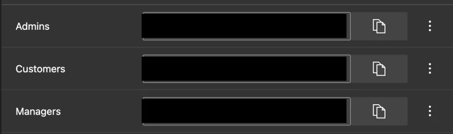
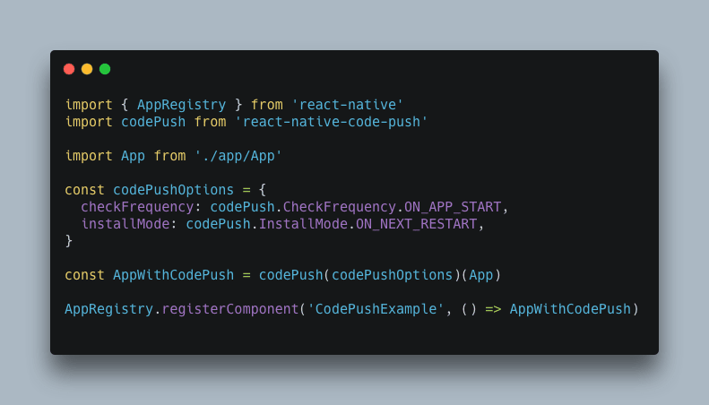
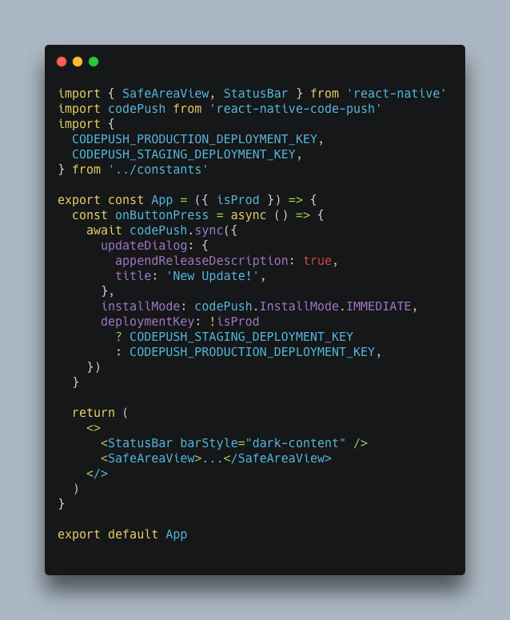
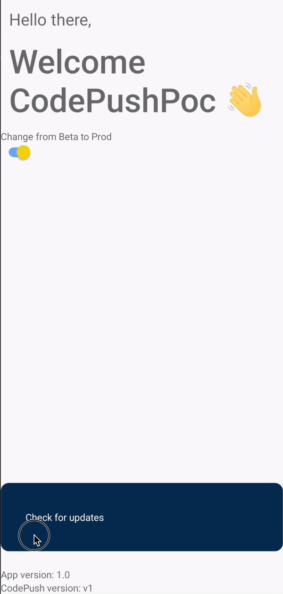

__"CodePush is an App Center cloud service that enables React Native developers to deploy mobile app updates directly to their users’ devices. It works by acting as a central repository that developers can publish certain updates to (for example, JS, HTML, CSS and image changes), and apps can query for updates from (using the provided client SDKs). This allows you to have a more deterministic and direct engagement model with your end users while addressing bugs, adding small features that don’t require you to rebuild a binary, or redistributing it through any public app stores"__

That's how Microsoft described CodePush in their documentation.

CodePush is not a new equivalent of TestFlight or Firebase Distribution. It’s a tool for delivering your builds to the end user not just beta delivery tool. In easy words, CodePush is an instrument that gives us the ability to replace JS bundle OTA and avoid the bottleneck of releasing via App Store and Play market. With CodePush you can achieve more web-like release behavior for mobile apps.

Why did I come up with this tool? We needed to make targeted releases and reduce the time of receiving updates. So we gave it a try because we were already users of AppCenter for managing beta releases.

CodePush is located inside AppCenter Dashboard.
[.img]
image::image.png[]

There’re you can manage your builds.
[.img]
image::image1.png[]

And configure your deployment keys.
[.img]
image::image2.png[]

== First steps

I don't want to waste a lot of time on detailed instructions for setting up CodePush SDK, so we have https://learn.microsoft.com/en-us/appcenter/distribution/codepush/rn-get-started[documentation, window=_blank] with all steps. So let's move on more interesting things.

Firstly, we need to specify the strategy for updating rollout targets and how we will force users to get these updates.

By rollout targets we mean that we can decide who and how can get our updates, and we can get there using deployment keys.

== Rollout targets

CodePush gives us a flexible tool for targeting.
By default, we have 2 deployment keys, one for Production, and the other for staging. It's the easiest option.
[.img]
image::image3.png[]

But we can build a fully custom system over these keys. You can create the deployment key for each situation that you need.
Example:
In your app, you have 3 types of users: admins, managers, and customers. With admins and managers, you have a direct channel of communication. So you're creating 3 keys:
[.img]

Save it in locally or put into your DB, CMS etc. Voilà! Now you can start collecting feedback if everything is okay with your app without touching the most fragile group of users.

How it will look in your app? Easy!

You just need to provide the key that you saved for user to codePush library using #sync# method
[.img]
image::image5.png[]

== Getting updates

Ok, we decided how we will send updates to users, but the next question how do they get it?

Initially you will have similar a config in your entry file
[.img]

Here we also have interesting things to play with.
We have 2 parameters that we can use to achieve the result: #checkFrequency# and #installMode#.

=== Default values
[, json]
----
{
  checkFrequency: codePush.CheckFrequency.ON_APP_START,
  installMode: codePush.InstallMode.ON_NEXT_RESTART,
}
----
According to docs:

__Your app will automatically download available updates, and apply them the next time the app restarts (like the OS or end user killed it, or the device was restarted). This way, the entire update experience is “silent” to the end user, since they don’t see any update prompt and/or “synthetic” app restarts.
The main problem with this strategy is that the user may not close the application, and you can't predict when they will get your updates.__

=== Background updates
[, json]
----
{
  checkFrequency: codePush.CheckFrequency.ON_APP_RESUME,
  installMode: codePush.InstallMode.ON_NEXT_RESUME,
  minimumBackgroundDuration: 30*60 // 30 minutes
}
----
Here with #minimumBackgroundDuration# parameter we specify how long the application will wait until it will be considered as restarted. So we avoid the case when users don't close their apps for years. But we are still not sure that users have the latest versions. Because they need to put their app in the background for the time specified in the #minimumBackgroundDuration# parameter.

=== Immediate updates
[, json]
----
{
  checkFrequency: codePush.CheckFrequency.ON_APP_RESUME,
  installMode: codePush.InstallMode.IMMEDIATE,
}
----

The main difference is that each time when the app is resumed it will be updated. The concern is that it could look clunky because the application will restart on the user's eyes.

=== Manual
[, json]
----
{
  checkFrequency: codePush.CheckFrequency.MANUAL,
}
---- 
Last but not least is manual updates, here we can trigger updates programmatically when and how we want. We just need to trigger #codePush.sync# method.

Example with updateDialog and production/staging keys:
[.img]

== Let’s see how it works!
For example, I’ll choose Manual updates
[, js]
----
const codePushOptions = {
  checkFrequency: codePush.CheckFrequency.MANUAL,
};

const AppWithCodePush = codePush(codePushOptions)(App);

AppRegistry.registerComponent('CodePushPoc', () => AppWithCodePush);
----

And our app will be look like
[.small-img]
image::image8.png[]

Using a switcher we will choose our environment.
Then we need to push our first bundle to the CodePush using the AppCenter CLI
[, bash]
----
appcenter codepush release-react -a YOUR_ORG_NAME/YOR_APP_NAME -d Prod
----

And you’ll get your build online:
[.img]
image::image9.png[]

=== Let’s change something
We can modify our code somehow and push it to the stage environment.

I’ll create a new branch with the name #feature/new-bg-color# and let’s change #backgroundColor# to ##6b5b95# and push it to the Stage environment
[, bash]
----
appcenter codepush release-react -a YOUR_ORG_NAME/YOR_APP_NAME -d Stage
----
We will be able to see this:
[.small-img]

== Last words…

CodePush is a great tool that helps you to improve and speed up your releases but it requires you to be more focused cause the chance of mistakes increases too. You can check the example app in the https://github.com/Thegrep01/code-push-example/tree/main[repo,window=_blank] (note it is configured only for Android).