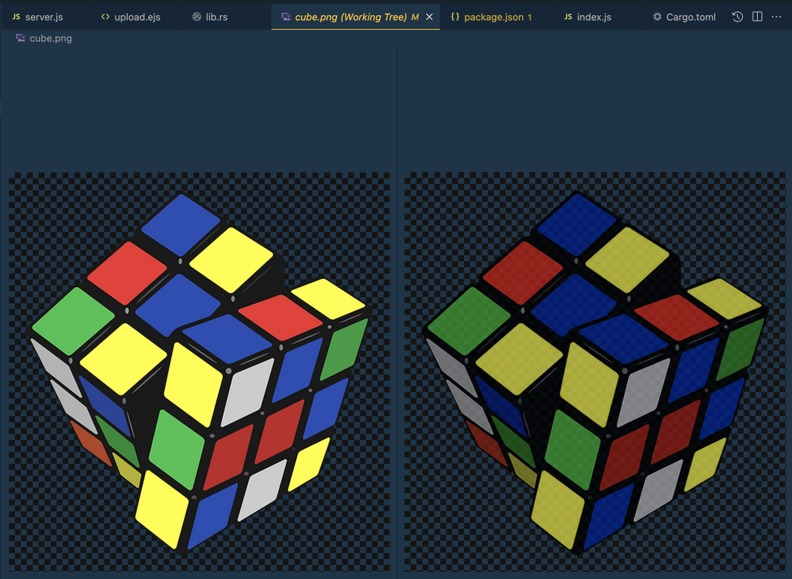

== Introduction 

It's no secret that NodeJS solutions are not so performative, especially if we consider a solution with a bunch of synchronous operations or vice versa - we work with a tricky multi-thread solution. A good example is image processing or cipher. Despite some performance issues, NodeJS retains its reputation as a mainstream. Moreover, NodeJS tries to be more flexible. A powerful https://nodejs.org/api/addons.html[NodeJS Addons, window=_blank] functionality allows developers to write some NodeJS functionalities on C++. https://blog.logrocket.com/rust-and-node-js-a-match-made-in-heaven/[Node.js with Rust, window=_blank] became popular last time. I meant this technique because I will discuss Rust programming language integration with NodeJS. Why Rust? It's a good question... I want to provide some essential facts regarding Rust briefly.

* Memory-safe approach preventing memory leaks.
* Type-safe syntax control.
* No "Data race" issue owing to concurrency management.
* Programs are compiled in the "ahead-of-time" manner.
* Utilizes and promotes zero-cost abstractions.
* No resource-consuming "garbage collectors", no JIT compiler, no virtual machine.
* Minimal runtime and memory footprint.
* Very good dependency management tool.
* Helpful compiler errors with clear and doable recommendations.

Apart from that, Rust is multithread friendly and it has a much simpler syntax compared with C/C++.

You can find the https://www.ideamotive.co/blog/rust-vs-cpp-which-technology-should-you-choose[following resource, window=_blank] valuable. https://benchmarksgame-team.pages.debian.net/benchmarksgame/fastest/rust-gpp.html[This resource, window=_blank] will persuade you regarding Rust Performance.

It's еasy to see that the Rust integration described above is a bit difficult. Fortunately, evolution does not come to a halt. Today I'm glad to introduce a new Animal to our Technological Zoo.

=== Meet NAPI-RS!

https://napi.rs/[NAPI-RS, window=_blank] is a framework for building pre-compiled Node.js addons in Rust.

Let's jump off the bat!

=== The Aim

Of course, the article aims to introduce you #napi-rs# as the easiest way to integrate NodeJS with Rust. The best way to do it is to provide a more complicated example than a standard one.

I will provide a NodeJS application that gets a file, uploads it, and transforms it afterward. Let’s say it is reducing the saturation. The image operation above should be provided on the Rust side.

But before that, let's try the standard functionality.

=== Package Template

First, you need to https://www.rust-lang.org/tools/install[install Rust, window=_blank]. #Cargo# builder is included there.

Second, I recommend creating a new project via the following https://github.com/napi-rs/package-template[template, window=_blank].
Third, #yarn# is recommended here.

It's time to cover all essential points.

=== Installation of NodeJS dependencies and build

[, bash]
----
yarn install
yarn build
----

=== Rust Part

#Cargo.toml# contains all information regarding the Rust package, including dependencies. This file is similar to package.json in NodeJS.

*#src/lib.rs#*

The file above contains Rust-defined functions for future exporting. In this example, a defined function #plus_100 #adds 100 to the input parameter.

[, js]
----
#![deny(clippy::all)]

use napi_derive::napi;

#[napi]
pub fn plus_100(input: u32) -> u32 {
  input + 100
}
----

=== NodeJS part

It's obvious to see #package.json# and other JS stuff here because we are talking about Rust and NodeJS integration. #package.json# contains required dependencies like #@napi-rs/cli# that allow you to build the solution. Also, pay attention to the following files.

*#./index.js#*

This file contains your library binding with its exporting. Please look at the last lines of code.

[, js]
----
const { plus100 } = nativeBinding;

module.exports.plus100 = plus100;
----

Do you remember Rust's #plus100# definition above? These lines
precisely represent a bridge between Rust and NodeJS.

*#./index.d.ts#*

This file contains Typescript definitions (signatures) of your Rust functionality.

[, js]
----
/* tslint:disable */
/* eslint-disable */

/* auto-generated by NAPI-RS */

export function plus100(input: number): number
----

Important note! You shouldn't edit the files above because they are autogenerated and change every Rust definition update after completing the #yarn build# command.

*#./simple-test.js#*

The following code illustrates how to run a Rust-defined function. Pay attention to the first line. You should import the function from #./index.js# (see above).

[, js]
----
const { plus100 } = require("./index");

console.assert(plus100(0) === 100, "Simple test failed");

console.info("Simple test passed");
----

Let's run it.

[, bash]
----
node simple-test
----

=== Image processing

After we are sure your solution works well, let's make the solution image-processing friendly. Let's pass the following steps.

*Change* *#./Cargo.toml#*
[, js]
----
[lib]
crate-type = ["cdylib"]
path = "lib/lib.rs"
----

#path = "lib/lib.rs"# has been added. Now we use the #lib# folder instead #src# for Rust code. #src# folder could be reserved for future JS/TS code. Let's remove the #src# folder for now.

=== Rust Stuff

First, install the expected Rust dependency (#image# package).

[, bash]
----
cargo add image
----

Second, create https://github.com/buchslava/napi-rs-images/blob/main/lib/lib.rs[lib/lib.rs, window=_blank]

[, js]
----
#![deny(clippy::all)]

use image::{GenericImageView, ImageBuffer, Pixel};

use napi_derive::napi;

#[napi]
pub fn darker(filename: String, saturation: u8) {
  let img = image::open(filename.clone()).expect("File not found!");
  let (w, h) = img.dimensions();
  let mut output = ImageBuffer::new(w, h);

  for (x, y, pixel) in img.pixels() {
    output.put_pixel(x, y, pixel.map(|p| p.saturating_sub(saturation)));
  }

  output.save(filename).unwrap();
}
----

*##[napi]#* attribute is a marker that the function should be used in JS/TS code.

The function above takes the filename and saturation, reads the file, applies the saturation, and rewrites the file.

Let's rebuild...

[, bash]
----
yarn build
----

As a result, #index.js# and #index.d.ts# should be updated.

Copy https://github.com/buchslava/napi-rs-images/blob/main/cube.png[this picture, window=_blank] to the root of the project.

Also, let's change https://github.com/buchslava/napi-rs-images/blob/main/simple-test.js[simple-test.js, window=_blank]

[, js]
----
const { darker } = require("./index");

darker("./cube.png", 50);
----

It's time to run it.

[, bash]
----
node simple-test
----

Or run the commands below if you want to reproduce all the steps from the start.
[, bash]
----
git clone git@github.com:buchslava/napi-rs-images.git
cd napi-rs-images
yarn
yarn build
node simple-test
----

Look at the following changes

[.img]

Our Rust part is ready and it's time to implement a web application that allows us to upload/desaturate the file and show it after.

If you want to try the application immediately you can play with https://github.com/buchslava/napi-rs-images[napi-rs images, window=_blank]. Otherwise, please read my explanations below.

=== The Final Stitches

First we need to install expected NodeJS dependencies.

[, bash]
----
yarn add ejs
yarn add express
yarn add express-ejs-layouts
yarn add express-fileupload
yarn add uuid
----

Make #storage# folder under the root of the project and add it to #./.gitignore#.

Add the https://github.com/buchslava/napi-rs-images/blob/main/server.js[./server.js, window=_blank] to the root of the project.

[, js]
----
const fs = require("fs");
const path = require("path");

const express = require("express");
const ejsLayouts = require("express-ejs-layouts");
const fileUpload = require("express-fileupload");
const uuidv4 = require("uuid").v4;

const { darker } = require("./index");

const STORAGE_DIR = "storage";

const app = express();

app.use(fileUpload());
app.set("view engine", "ejs");
app.use(ejsLayouts);
app.use("/storage", express.static(path.join(__dirname, STORAGE_DIR)));
app.use(express.urlencoded({ extended: true }));

app.get("/", async (req, res) => {
  let files = await fs.promises.readdir(path.join(__dirname, STORAGE_DIR));
  files = files
    .map((fileName) => ({
      name: fileName,
      time: fs
        .statSync(path.join(__dirname, STORAGE_DIR, fileName))
        .mtime.getTime(),
    }))
    .sort((a, b) => a.time - b.time)
    .map((v) => v.name);
  return res.render("upload", { files: files.reverse() });
});

app.post("/uploads", function (req, res) {
  const file = req.files.upload;
  const extname = path.extname(file.name);
  const uuid = uuidv4();
  const filePath = path.join(__dirname, STORAGE_DIR, `${uuid}${extname}`);

  file.mv(filePath, (err) => {
    if (err) {
      return res.status(500).send(err);
    }
    try {
      darker(filePath, +req.body.saturation);
    } catch (e) {
      return res.status(500).send(e);
    }
    res.redirect("/");
  });
});

app.listen(3000);
----

Also, add #"start": "node server"#, to the #scripts# section in .#/package.json#.

I don't want to explain many of the solutions above because it's obvious for a NodeJS folk. I just want to pay attention to the points below.

1. There are two endpoints: #/# and #/upload#.
2. #/# provides us with an upload form and a list of the uploaded and desaturated images.
3. #/upload# uploads and desaturates an uploaded image and redirects to #/#.

Also, please look at image desaturation
[, js]
----
try {
  darker(filePath, +req.body.saturation);
} catch (e) {
  return res.status(500).send(e);
}
----
and the fact that we take the Saturation Value from the request #+req.body.saturation# as a number, and

[, js]
----
let files = await fs.promises.readdir(path.join(__dirname, STORAGE_DIR));
files = files
  .map((fileName) => ({
    name: fileName,
    time: fs
      .statSync(path.join(__dirname, STORAGE_DIR, fileName))
      .mtime.getTime(),
  }))
  .sort((a, b) => a.time - b.time)
  .map((v) => v.name);
return res.render("upload", { files: files.reverse() });
----

where STORAGE_DIR is #storage# (see above) and we pass a sorted list of the uploaded files to the related EJS template.

Related EJS templates are below.

https://github.com/buchslava/napi-rs-images/blob/main/views/layout.ejs[views/layout.ejs, window=_blank]

[, html]
----
<!DOCTYPE html>
<html lang="en">
  <head>
    <meta charset="utf-8" />
    <meta name="viewport" content="width=device-width, initial-scale=1" />

    <link
      href="https://cdn.jsdelivr.net/npm/bootstrap@5.1.3/dist/css/bootstrap.min.css"
      rel="stylesheet"
      integrity="sha384-1BmE4kWBq78iYhFldvKuhfTAU6auU8tT94WrHftjDbrCEXSU1oBoqyl2QvZ6jIW3"
      crossorigin="anonymous"
    />
    <title>Uploads</title>
  </head>
  <body>
    <%- body %>
  </body>
</html>
----

https://github.com/buchslava/napi-rs-images/blob/main/views/upload.ejs[views/upload.ejs, window=_blank]

[, html]
----

  <form
    class="w-50 mx-auto my-3"
    action="/uploads"
    method="post"
    enctype="multipart/form-data"
  >
    

      <input class="form-control" type="file" name="upload" required />
    

    

      <label class="form-label text-nowrap pr-3" for="saturation"
        >% saturation&nbsp;</label
      >
      <input
        name="saturation"
        value="65"
        type="number"
        id="saturation"
        class="form-control"
      />
    

    <button class="btn btn-primary">Upload</button>
  </form>

  

    <% for (const file of files){ %>
    

      " class="card-img-top" alt="Image" />
    

    <% } %>
  

----

It's time to test the whole solution.

[, bash]
----
yarn start
----

and try http://localhost:3000[http://localhost:3000, window=_blank]

Finally, let's upload a couple of images.

[.img]

[.img]

[.img]

[.img]

I guess you will satisfy your curiosity about performance if you upload and process bigger images.

In conclusion, I want to mean a fact from https://github.com/napi-rs/napi-rs[here, window=_blank].

_"One nice feature is that this crate allows you to build add-ons purely with the Rust/JavaScript toolchain and without involving node-gyp."_

That’s like music to the ears of Node Folks.

== Happy coding!