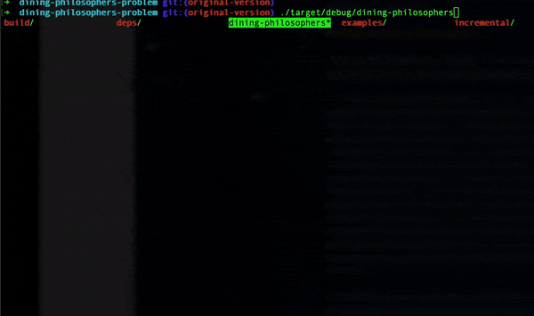

== Introduction 

As a full-stack developer, I always try to gain new knowledge. I
heard about Rust Programming Language some years ago, but hands did not reach out to try real examples. I spent some time on Rust a couple of days ago, and I want to share some experiences with you.

First, I want to note that this article is suitable mainly for NodeJS/Javascript developers who didn't hear about Rust before or for those who are trying the first steps.

Second, I'll describe only one issue I tackled, and I don't aim to provide you with the ultimate set of knowledge. Despite that, I hope my example will engage you regarding learning Rust.

I suppose, at this point, you ask me a question. As a Web developer, why should I learn Rust? I predicted this question. Honestly, this article is a logical continuation of https://valor-software.com/articles/node-rust-friendship-forever-the-napi-rs-way[my previous one, window=_blank].

It's time to tell you a couple of words about Rust.

https://en.wikipedia.org/wiki/Rust_(programming_language)"[Wikipedia, window=_blank] tells us about Rust the following.

_"Rust is a multi-paradigm, high-level, general-purpose programming language. Rust emphasizes performance, type safety, and concurrency. Rust enforces memory safety—that is, that all references point to valid memory—without requiring the use of a garbage collector or reference counting present in other memory-safe languages. To simultaneously enforce memory safety and prevent concurrent data races, Rust's "borrow checker" tracks the object lifetime of all references in a program during compilation. Rust is popular for systems programming but also offers high-level features including some functional programming constructs. Software developer Graydon Hoare created Rust as a personal project while working at Mozilla Research in 2006. Mozilla officially sponsored the project in 2009. Since the first stable release in May 2015, Rust has been adopted by companies including Amazon, Discord, Dropbox, Facebook (Meta), Google (Alphabet), and Microsoft."_

Don't think about https://www.rust-lang.org/[Rust, window=_blank] as a Javascript-similar one. This language is entirely different. Please, pay attention to the points below.

1. Rust is a compilable language.
2. Despite its general purpose, it mostly looks like a competitor in C++ (even C). If you are Golang-familiar folk, please, don't compare Rust with Golang! They are different too.
3. One of the main features is safe Multi-Threading.
4. https://doc.rust-lang.org/book/ch04-02-references-and-borrowing.html["References and Borrowing", window=_blank] topic could be a bit difficult for Javascript folk. Please, focus on it!
5. Please, read https://doc.rust-lang.org/stable/book/[this resource, window=_blank].

I want to focus on safe Multi-Threading in this article because understanding this feature is the number one way to understand this beautiful language. I also understand that the safe Multi-Threading topic is one of the trickiest in languages outside Rust. Java, Goalng, and C++ are good examples. Rust language has a large community, and there are many resources ( https://doc.rust-lang.org/stable/book[this one, window=_blank], for example) about it. But I was faced with a lack of practical examples and simple explanations. Despite that, I found one classic example that helps you to enter this topic as quickly as possible.

=== Meet Dining Philosophers!

#Dining Philosophers Problem# is a classic Multi-Threading task described https://www.hackertouch.com/dining-philosophers-problem-in-rust.html[here, window=_blank].

_"Five silent philosophers sit at a round table with bowls of spaghetti. Forks are placed between each pair of adjacent philosophers. Each philosopher must alternately think and eat. However, a philosopher can only eat spaghetti when they have both left and right forks. Each fork can be held by only one philosopher and so a philosopher can use the fork only if it is not being used by another philosopher. After an individual philosopher finishes eating, they need to put down both forks so that the forks become available to others. A philosopher can take the fork on their right or the one on their left as they become available, but cannot start eating before getting both forks. Eating is not limited by the remaining amounts of spaghetti or stomach space; an infinite supply and an infinite demand are assumed. The problem is how to design a discipline of behavior (a concurrent algorithm) such that no philosopher will starve; i.e., each can forever continue to alternate between eating and thinking, assuming that no philosopher can know when others may want to eat or think."_

Initially, Rust's solution looked like the one below. You can find it https://github.com/buchslava/dining-philosophers-problem/tree/original-version[here, window=_blank]

[, rust]
----
use std::sync::{Arc, Mutex};
use std::{thread, time};

struct Philosopher {
    name: String,
    left: usize,
    right: usize,
}

impl Philosopher {
    fn new(name: &str, left: usize, right: usize) -> Philosopher {
        Philosopher {
            name: name.to_string(),
            left: left,
            right: right,
        }
    }

    fn eat(&self, table: &Table) {
        let _left = table.forks[self.left].lock().unwrap();
        let _right = table.forks[self.right].lock().unwrap();

        println!("{} is eating.", self.name);

        let delay = time::Duration::from_millis(1000);

        thread::sleep(delay);

        println!("{} is done eating.", self.name);
    }
}

struct Table {
    forks: Vec<Mutex<()>>,
}

fn main() {
    let table = Arc::new(Table {
        forks: vec![
            Mutex::new(()),
            Mutex::new(()),
            Mutex::new(()),
            Mutex::new(()),
            Mutex::new(()),
        ],
    });

    let philosophers = vec![
        Philosopher::new("Donald", 0, 1),
        Philosopher::new("Larry", 1, 2),
        Philosopher::new("Mark", 2, 3),
        Philosopher::new("John", 3, 4),
        Philosopher::new("Bruce", 0, 4),
    ];

    let handles: Vec<_> = philosophers
        .into_iter()
        .map(|p| {
            let table = table.clone();

            thread::spawn(move || {
                p.eat(&table);
            })
        })
        .collect();

    for h in handles {
        h.join().unwrap();
    }
}
----

I don't want to dig into the code above a lot, and I guess you will enjoy doing it from your side. But I need to focus on some essential points.

It's no secret that the main Multi-Threading task is about preventing data collisions. In our example, collision means neighbor philosophers simultaneously took the same fork because each philosopher has his thread and is eating and thinking simultaneously with others. https://fongyoong.github.io/easy_rust/Chapter_43.html[Mutex, window=_blank] tackles it. Mutex means mutual exclusion, "only one at a time." That's why forks association with the related mutexes is a great idea.

At this point, I'd like to interrupt my story and tell you one important note. Honestly, this example is more complicated than I'm explaining it. I just aim to excite new Rust folks. Sorry for telling you that, dear experts. Despite Mutex being a golden concurrency standard, it's not a panacea. Some issues are possible even here. I'll provide more helpful information about that in the article's *The Roadmap* part. Please, read carefully about "Deadlock," "Livelock," and "Starvation."

The related code is the following.

[, rust]
----
    let table = Arc::new(Table {
        forks: vec![
            Mutex::new(()),
            Mutex::new(()),
            Mutex::new(()),
            Mutex::new(()),
            Mutex::new(()),
        ],
    });
----
and
[, rust]
----
        let _left = table.forks[self.left].lock().unwrap();
        let _right = table.forks[self.right].lock().unwrap();
----

===== The code above literally means the following.

A philosopher takes a couple of forks and holds them.

What happens with his neighbors at this moment?
*_They want to take a fork. But the fork is already taken._*

What happens in this case with the neighbors?
*_They (means related threads) are waiting when the first philosopher releases the forks (unlocks his mutexes)._*

Why are they waiting?
*_Because of mutexes!_*

Look at the code below.

[, rust]
----
    fn eat(&self, table: &Table) {
        let _left = table.forks[self.left].lock().unwrap();
        let _right = table.forks[self.right].lock().unwrap();

        println!("{} is eating.", self.name);

        let delay = time::Duration::from_millis(1000);

        thread::sleep(delay);

        println!("{} is done eating.", self.name);
    }
----

When the philosopher leaves the forks?

_He grabs the forks and waits for 1 second. The mutexes will be released after the #eat# function is completed._
_Other lucky neighbors (right and left) grab the related forks. Pay attention to neighbors running in separate threads (i.e., simultaneously)._

Also, let's look at the following code directly related to multi-threading.

[, rust]
----
    let handles: Vec<_> = philosophers
        .into_iter()
        .map(|p| {
            let table = table.clone();

            thread::spawn(move || {
                p.eat(&table);
            })
        })
        .collect();

    for h in handles {
        h.join().unwrap();
    }
----

It's time to run the original example.

[, bash]
----
git clone git@github.com:buchslava/dining-philosophers-problem.git
cd dining-philosophers-problem
git checkout original-version
cargo build
./target/debug/dining-philosophers
----

[.img]

I asked myself.
_Is it possible to collect all results during the program execution (I mean print messages) and provide them immediately after the whole logic has been completed?_

I found this task challenging because I know from other technologies that cross-thread interaction is always painful. As a Javascript folk, I first thought about something like #Promise.all# technique.

Surprisingly, I found a similar technique in https://blog.yoshuawuyts.com/[YOSHUA WUYTS blog, window=_blank]. I strongly recommend reading this resource.

Please, look at the https://blog.yoshuawuyts.com/futures-concurrency/[following article, window=_blank].

Moreover, I found the following table pleasant for Javascript folk.

[.turbo-table]
|===
|JavaScript	|Rust	|description
|Promise.allSettled |future::join |does not short-circuit
|Promise.all |future::try_join |short-circuits when an input value is rejected
|Promise.race |future::select |short-circuits when an input value is settled
|Promise.any |future::try_select |short-circuits when an input value is fulfilled
|===

According to the information above, the new solution should look like the one below.

[, rust]
----
use async_std::future;

let a = future::ready(Ok(1));
let b = future::ready(Ok(2));

let c = future::try_join(a, b);
assert_eq!(c.await?, (1, 2));
----

As an impatient learner, I looked at the futures approach and the origin example at the same time. I was slightly disappointed because I couldn't reimplement the original version in a future-based way. Honestly, I don't have enough time for that. In addition, according to digging results, the future's concept is drastically different from threads. That's why I'm not sure this idea is good. I postponed this activity.

I decided to choose another way. I researched more and found https://doc.rust-lang.org/stable/book/ch16-02-message-passing.html[Using Message Passing to Transfer Data Between Threads, window=_blank].

I think you would agree the way below is most friendly to the original Dinning Philosophers implementation.

[, rust]
----
use std::sync::mpsc;
use std::thread;

fn main() {
    let (tx, rx) = mpsc::channel();

    thread::spawn(move || {
        let val = String::from("hi");
        tx.send(val).unwrap();
    });

    let received = rx.recv().unwrap();
    println!("Got: {}", received);
}
----

It's time to move forward and modify our solution. I want to provide the complete source code and explain it step by step.

[, rust]
----
use std::sync::{Arc, Mutex};
use std::{thread, time};
use std::sync::mpsc::{Sender};
use std::sync::mpsc;

struct Philosopher {
    name: String,
    left: usize,
    right: usize,
}

impl Philosopher {
    fn new(name: &str, left: usize, right: usize) -> Philosopher {
        Philosopher {
            name: name.to_string(),
            left: left,
            right: right,
        }
    }

    fn eat(&self, table: &Table, sender: &Sender<String>) {
        let _left = table.forks[self.left].lock().unwrap();
        let _right = table.forks[self.right].lock().unwrap();

        // println!("{} is eating.", self.name);
        sender.send(format!("{} is eating.", self.name).to_string()).unwrap();

        let delay = time::Duration::from_millis(1000);

        thread::sleep(delay);

        // println!("{} is done eating.", self.name);
        sender.send(format!("{} is done eating.", self.name).to_string()).unwrap();
    }
}

struct Table {
    forks: Vec<Mutex<()>>,
}

fn main() {
    let (tx, rx) = mpsc::channel();
    let table = Arc::new(Table {
        forks: vec![
            Mutex::new(()),
            Mutex::new(()),
            Mutex::new(()),
            Mutex::new(()),
            Mutex::new(()),
        ],
    });

    let philosophers = vec![
        Philosopher::new("Donald", 0, 1),
        Philosopher::new("Larry", 1, 2),
        Philosopher::new("Mark", 2, 3),
        Philosopher::new("John", 3, 4),
        Philosopher::new("Bruce", 0, 4),
    ];

    let handles: Vec<_> = philosophers
        .into_iter()
        .map(|p| {
            let table = table.clone();
            let sender = tx.clone();

            thread::spawn(move || {
                p.eat(&table, &sender);
            })
        })
        .collect();

    for h in handles {
        h.join().unwrap();
    }

    tx.send("Done".to_string()).unwrap();

    let mut result: String = String::from("");

    for received in rx {
        if received == "Done" {
            break;
        }
        result.push_str(&received);
        result.push_str("\n");
    }
    println!("{}", result);
}
----

==== Add related packages
[, rust]
----
use std::sync::mpsc::{Sender};
use std::sync::mpsc;
----
==== Initialize the channel
[, rust]
----
fn main() {
    let (tx, rx) = mpsc::channel();
    // ...
}
----
==== Pass the sender to the #eat# function
[, rust]
----
            thread::spawn(move || {
                p.eat(&table, &sender);
            })
----
==== Send expected information instead immediate printing
[, rust]
----
fn eat(&self, table: &Table, sender: &Sender<String>) {
        let _left = table.forks[self.left].lock().unwrap();
        let _right = table.forks[self.right].lock().unwrap();

        // println!("{} is eating.", self.name);
        sender.send(format!("{} is eating.", self.name).to_string()).unwrap();

        let delay = time::Duration::from_millis(1000);

        thread::sleep(delay);

        // println!("{} is done eating.", self.name);
        sender.send(format!("{} is done eating.", self.name).to_string()).unwrap();
    }
----

==== Gather the final result
[, rust]
----
    for h in handles {
        h.join().unwrap();
    }

    tx.send("Done".to_string()).unwrap();

    let mut result: String = String::from("");

    for received in rx {
        if received == "Done" {
            break;
        }
        result.push_str(&received);
        result.push_str("\n");
    }
    println!("{}", result);
----

Pay attention to the "Done" message. This is a criterion of the end of the process.

It's time to run the final solution.

[, bash]
----
git checkout main
cargo build
./target/debug/dining-philosophers
----
[.img]
image::img2.gif[]

Looks good!

=== The Roadmap.

As promised, I will provide some crucial additions to this task.

==== The Task Restrictions.

A deadlock can occur in this task when all philosophers hold exactly one single fork. This is currently being worked around in the article by ignoring #the the philosophers sit at a round table#: Since Donald and Bruce share the same left fork (0), one of them will never be able to hold one fork if the other holds any number of forks (due to constantly trying left first).
If we consider the round table part, Bruce’s left fork should be 4, and his right fork should be 0:

[, rust]
----
Philosopher::new("Bruce", 4, 0),
----

Now, this introduces a possible deadlock. It’s tough to replicate, but it’s easy to replicate once we implement the "an infinite supply and an infinite demand is assumed" part. As in infinite time, we will eventually hit a deadlock where all philosophers will be stuck thinking forever.

An easy way to reproduce it is to add a 5ms wait on every philosopher’s left fork pickup; it will deadlock.

[, rust]
----
use std::sync::{Arc, Mutex};
use std::{thread, time};

struct Philosopher {
    name: String,
    left: usize,
    right: usize,
}

impl Philosopher {
    fn new(name: &str, left: usize, right: usize) -> Philosopher {
        Philosopher {
            name: name.to_string(),
            left: left,
            right: right,
        }
    }

    fn eat(&self, table: &Table) {
        println!("{} is picking up the left fork.", self.name);
        let _left = table.forks[self.left].lock().unwrap();

        // added 5ms duration
        thread::sleep(time::Duration::from_millis(5));

        println!("{} is picking up the right fork.", self.name);
        let _right = table.forks[self.right].lock().unwrap();

        println!("{} is eating.", self.name);

        let delay = time::Duration::from_millis(1000);

        thread::sleep(delay);

        println!("{} is done eating.", self.name);
    }
}

struct Table {
    forks: Vec<Mutex<()>>,
}

fn main() {
    let table = Arc::new(Table {
        forks: vec![
            Mutex::new(()),
            Mutex::new(()),
            Mutex::new(()),
            Mutex::new(()),
            Mutex::new(()),
        ],
    });                                         

    let philosophers = vec![
        Philosopher::new("Donald", 0, 1),
        Philosopher::new("Larry", 1, 2),
        Philosopher::new("Mark", 2, 3),
        Philosopher::new("John", 3, 4),
        // changed from Philosopher::new("Bruce", 0, 4),
        Philosopher::new("Bruce", 4, 0),
    ];

    let handles: Vec<_> = philosophers
        .into_iter()
        .map(|p| {
            let table = table.clone();

            thread::spawn(move || {
                p.eat(&table);
            })
        })
        .collect();

    for h in handles {
        h.join().unwrap();
    }
}
----

You can find a working (but really not working...) example https://github.com/buchslava/dining-philosophers-problem/tree/deadlock[here, window=_blank].

==== Useful Information and References

As a concurrency folk, you should start thinking about #Deadlock#, #Livelock#, and #Starvation#. Please, read about it https://www.baeldung.com/cs/deadlock-livelock-starvation[here, window=_blank].

Tackling #Deadlock#, #Livelock#, and #Starvation# is not easy, and there is no silver bullet here. Despite you can dig into different existing solutions on the topic. https://github.com/shelbyd/cooptex[This one, window=_blank], for example.

Also, it would be best if you learned Atomic Calculations. To become the Ninja of Concurrency, start digging from https://marabos.nl/atomics/[Rust Atomics and Locks Low-Level Concurrency in Practice, window=_blank].

=== NodeJS

Finally, I will satisfy your curiosity and give you a https://github.com/buchslava/dining-philosophers-problem/blob/main/nodejs/index.js[NodeJS version, window=_blank] of the solution. It was taken from https://gist.github.com/Leko/753c3c53ab9a45f7dcbd1519dfca2cbd[here, window=_blank] and corrected a bit...

You could read and run it.
[, bash]
----
cd nodejs
node index
----

I hope it will also widen your NodeJS horizons.

=== Happy hacking!

PS: Thanks to https://dev.to/edusperoni[Eduardo Speroni, window=_blank] for very useful comments and for helping during my work on the article.