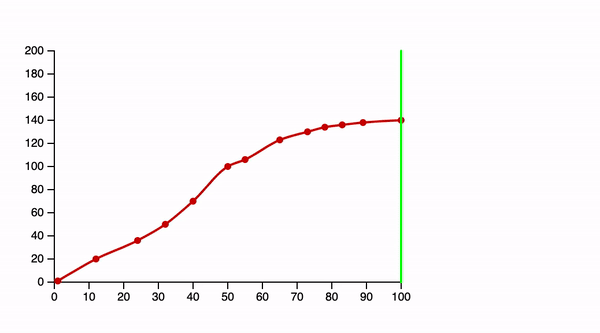
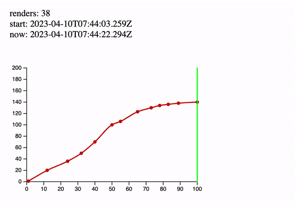
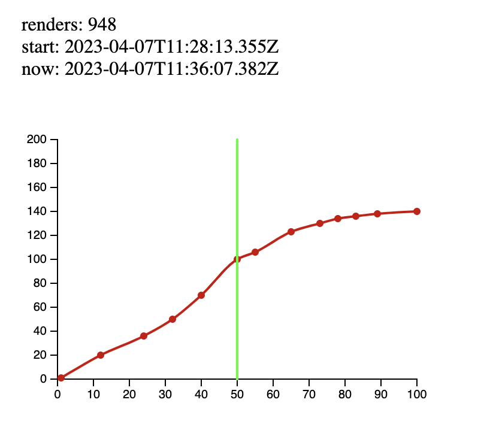
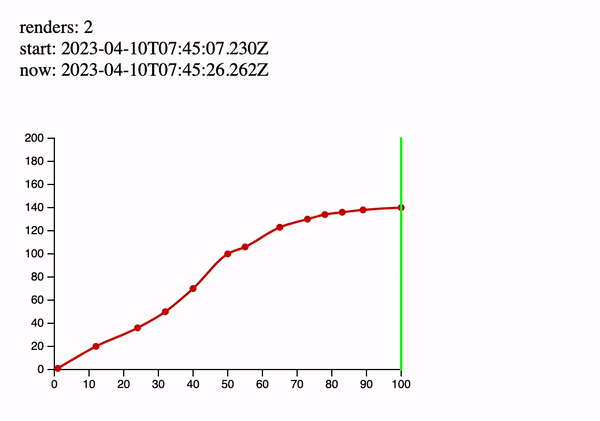

== Introduction 
It's no secret that the rules on pure React solutions are pretty simple. We just need to properly use all React inventory like useState, useEffect, useMemo, and useCallback. There are many intelligent articles, guides, and examples on the topic. But let's answer the following question.

_How many "pure" projects did you tackle?_

A pure React (Angular, NodeJS, etc.) project could look like nonsense in real life. Customers expect complicated solutions, including different 3-rd party stuff like Payment Systems, Graphical Libraries, CRM integrations, Tracking Tools, etc. Obviously, not all of them are React-friendly, so we should count these libraries' features in most cases and try to perfect React code simultaneously.

Today I want to tell you some performance specifics across React and D3.

I wrote several articles on the D3 topics before, and I guess it will also be interesting for you. There are the following related articles.

* https://valor-software.com/articles/tasty-recipes-for-react-d3-the-ranking-bar[Tasty Recipes for React & D3. The Ranking Bar, window=_blank].
* https://valor-software.com/articles/a-qwik-view-of-the-ranking-bar[A Qwik View of the Ranking Bar, window=_blank]

But let's focus on the current topic.

_https://d3js.org/[D3.js, window=_blank] is a JavaScript library for manipulating documents based on data. D3 helps you bring data to life using HTML, SVG, and CSS. D3’s emphasis on web standards gives you the full capabilities of modern browsers without tying yourself to a proprietary framework, combining powerful visualization components and a data-driven approach to DOM manipulation._

D3 is great! I'm fond of this beautiful library. But it lives its own life. That's why we need to remember this fact when we work with D3 outside Vanilla JS, say, in React.

=== The Objective
The goal is a simple D3 line chart implemented with dynamic guideline movement every second.

I'm pretty sure the best way to understand what's good is to explain what's wrong. That's why I will start my solutions from the worst example. I'm also going to explain why the example is so wrong, and after that, I'll propose to you the best way of implementation.

=== The Worst Solution
There is the following component represents a https://stackblitz.com/edit/react-d3-zero-cost?file=src%2FLineChart.jsx[line chart, window=_blank].

[, js]
----
import React, { useEffect, useRef } from "react";
import * as d3 from "d3";

const transform = "translate(50,50)";

export default function LineChart({ data, width, height, marker }) {
  const svgRef = useRef();

  const renderSvg = () => {
    const chartWidth = width - 200;
    const chartHeight = height - 200;

    const svg = d3.select(svgRef.current);

    svg.selectAll("*").remove();

    const xScale = d3.scaleLinear().domain([0, 100]).range([0, chartWidth]);
    const yScale = d3.scaleLinear().domain([0, 200]).range([chartHeight, 0]);

    const g = svg.append("g").attr("transform", transform);

    g.append("g")
      .attr("transform", "translate(0," + chartHeight + ")")
      .call(d3.axisBottom(xScale));

    g.append("g").call(d3.axisLeft(yScale));

    svg
      .append("g")
      .selectAll("dot")
      .data(data)
      .enter()
      .append("circle")
      .attr("cx", function (d) {
        return xScale(d[0]);
      })
      .attr("cy", function (d) {
        return yScale(d[1]);
      })
      .attr("r", 3)
      .attr("transform", transform)
      .style("fill", "#CC0000");

    const line = d3
      .line()
      .x(function (d) {
        return xScale(d[0]);
      })
      .y(function (d) {
        return yScale(d[1]);
      })
      .curve(d3.curveMonotoneX);

    svg
      .append("path")
      .datum(data)
      .attr("class", "line")
      .attr("transform", transform)
      .attr("d", line)
      .style("fill", "none")
      .style("stroke", "#CC0000")
      .style("stroke-width", "2");

    if (marker) {
      svg
        .append("svg:line")
        .attr("transform", transform)
        .attr("stroke", "#00ff00")
        .attr("stroke-linejoin", "round")
        .attr("stroke-linecap", "round")
        .attr("stroke-width", 2)
        .attr("x1", xScale(marker))
        .attr("y1", 200)
        .attr("x2", xScale(marker))
        .attr("y2", 0);
    }
  };

  useEffect(() => {
    renderSvg();
  }, [width, height, data, marker]);

  if (!width || !height || !data) {
    return <></>;
  }

  return <svg ref={svgRef} width={width} height={height} />;
}
----

This component takes the following props.

* data - chart data as a two-dimensional array of x and y
* #width# - with of the chart
* #height# - height of the chart
* #marker# - X axis of a guideline

And there is a related https://stackblitz.com/edit/react-d3-zero-cost?file=src%2FApp.js[parent component, window=_blank].

[, js]
----
import React, { useState, useEffect } from "react";
import LineChart from "./LineChart";
import "./style.css";

const data = [
  [1, 1],
  [12, 20],
  [24, 36],
  [32, 50],
  [40, 70],
  [50, 100],
  [55, 106],
  [65, 123],
  [73, 130],
  [78, 134],
  [83, 136],
  [89, 138],
  [100, 140],
];

export default function App() {
  const [marker, setMarker] = useState(10);

  useEffect(() => {
    const intervalId = setInterval(() => {
      setMarker((prevMarker) => (prevMarker + 10 > 100 ? 10 : prevMarker + 10));
    }, 1000);

    return () => {
      clearInterval(intervalId);
    };
  }, []);

  return (
    

      <LineChart data={data} width={500} height={400} marker={marker} />
    

  );
}
----

There is an interval refresh a marker value every second and pass it as a chat's prop.

[.img]

You can play with the complete example https://stackblitz.com/edit/react-d3-zero-cost?file=src%2FApp.js[here, window=_blank].

It seems it's nothing foreshadowing the issue. I want to modify the code above. The aim is to show the issue eloquently.

=== The Number of Renders
First, I'll add a global #renders# and #timeStart# variables to https://stackblitz.com/edit/react-d3-zero-cost-hqxk3a?file=public%2Findex.html[public/index.html, window=_blank]

[, js]
----

----

Second, I increase #renders# every #LineChart# render.

[, js]
----
export default function LineChart({ data, width, height, marker }) {
  // no changes here ...

  renders++;

  useEffect(() => {
    renderSvg();
  }, [width, height, data, marker]);

  if (!width || !height || !data) {
    return <></>;
  }

  return <svg ref={svgRef} width={width} height={height} />;
}
----

And finally, I changed the parent component the following way.

[, js]
----
export default function App() {
  const [marker, setMarker] = useState(10);

  useEffect(() => {
    const intervalId = setInterval(() => {
      setMarker((prevMarker) => (prevMarker + 10 > 100 ? 10 : prevMarker + 10));
    }, 1000);

    return () => {
      clearInterval(intervalId);
    };
  }, []);

  const currentTime = new Date().toISOString();

  return (
    

      

        renders: {renders}
         
        start: {timeStart}
         
        now: {currentTime}
      

      <LineChart data={data} width={500} height={400} marker={marker} />
    

  );
}
----

The main goal is to display three metrics: the number of renderings, start time, and current time.
Let's run the https://stackblitz.com/edit/react-d3-zero-cost-hqxk3a?file=src%2FApp.js[modified example, window=_blank].

[.img]

As far as we can see, each marker change causes LineChart component to render. If the result above doesn't persuade you, I have prepared the experiment below. I left the working example for a few minutes and drank coffee.

[.img]

When I returned, I saw the following.

[.img]

*#948# render per cup of coffee! Looks awful...*
Moreover, a bunch of D3 heavyweight operations covers each render!

=== The Best Solution
It's time to fix the issue above.

First, let me provide you the final https://stackblitz.com/edit/react-d3-zero-cost-d5kyuq?file=src%2FLineChart.jsx[LineChart version, window=_blank] and explain what's changed there step by step.

[, js]
----
import React, {
  useEffect,
  forwardRef,
  useImperativeHandle,
  useRef,
} from "react";
import * as d3 from "d3";

const transform = "translate(50,50)";

const LineChart = forwardRef(({ data, width, height }, ref) => {
  const svgRef = useRef();
  let svg;
  let xScale;

  useImperativeHandle(ref, () => ({
    setMarker: (value) => {
      if (isNaN(value)) {
        return;
      }
      svg.selectAll(".marker").remove();

      svg
        .append("svg:line")
        .attr("transform", transform)
        .attr("class", "marker")
        .attr("stroke", "#00ff00")
        .attr("stroke-linejoin", "round")
        .attr("stroke-linecap", "round")
        .attr("stroke-width", 2)
        .attr("x1", xScale(value))
        .attr("y1", 200)
        .attr("x2", xScale(value))
        .attr("y2", 0);
    },
  }));

  const renderSvg = () => {
    const chartWidth = width - 200;
    const chartHeight = height - 200;

    svg = d3.select(svgRef.current);

    svg.selectAll("*").remove();

    xScale = d3.scaleLinear().domain([0, 100]).range([0, chartWidth]);
    const yScale = d3.scaleLinear().domain([0, 200]).range([chartHeight, 0]);

    const g = svg.append("g").attr("transform", transform);

    g.append("g")
      .attr("transform", "translate(0," + chartHeight + ")")
      .call(d3.axisBottom(xScale));

    g.append("g").call(d3.axisLeft(yScale));

    svg
      .append("g")
      .selectAll("dot")
      .data(data)
      .enter()
      .append("circle")
      .attr("cx", function (d) {
        return xScale(d[0]);
      })
      .attr("cy", function (d) {
        return yScale(d[1]);
      })
      .attr("r", 3)
      .attr("transform", transform)
      .style("fill", "#CC0000");

    const line = d3
      .line()
      .x(function (d) {
        return xScale(d[0]);
      })
      .y(function (d) {
        return yScale(d[1]);
      })
      .curve(d3.curveMonotoneX);

    svg
      .append("path")
      .datum(data)
      .attr("class", "line")
      .attr("transform", transform)
      .attr("d", line)
      .style("fill", "none")
      .style("stroke", "#CC0000")
      .style("stroke-width", "2");
  };

  renders++;

  useEffect(() => {
    renderSvg();
  }, [width, height, data]);

  if (!width || !height || !data) {
    return <></>;
  }

  return <svg ref={svgRef} width={width} height={height} />;
});

export default LineChart;
----

*forwardRef*
Now LineChart's parent is able to work with the related component reference.
[, js]
----
const LineChart = forwardRef(({ data, width, height }, ref) => {
----

*useImperativeHandle*
During some interviews, I ask my interviewees this question. I'm surprised because most of them can't answer it. In my opinion, https://react.dev/reference/react/useImperativeHandle[this hook, window=_blank] is as important as the basic like useState and useEffect because it makes your code more flexible and performative.

Here is the exposed code.
[, js]
----
useImperativeHandle(ref, () => ({
  setMarker: (value) => {
    if (isNaN(value)) {
      return;
    }
    svg.selectAll(".marker").remove();

    svg
      .append("svg:line")
      .attr("transform", transform)
      .attr("class", "marker")
      .attr("stroke", "#00ff00")
      .attr("stroke-linejoin", "round")
      .attr("stroke-linecap", "round")
      .attr("stroke-width", 2)
      .attr("x1", xScale(value))
      .attr("y1", 200)
      .attr("x2", xScale(value))
      .attr("y2", 0);
  },
}));
----

I moved it from the end of #renderSvg# function. See the https://stackblitz.com/edit/react-d3-zero-cost-hqxk3a?file=src%2FLineChart.jsx[previous example, window=_blank].
Let's focus on the https://stackblitz.com/edit/react-d3-zero-cost-d5kyuq?file=src%2FApp.js[parent component, window=_blank]. Please, read comments there.

[, js]
----
import React, { useState, useEffect, useMemo, useRef } from 'react';
import LineChart from './LineChart';
import './style.css';

const data = [
  // no changes
];

export default function App() {
  const [marker, setMarker] = useState(10);
  // Provide a reference for LineChart
  const chartRef = useRef();

  useEffect(() => {
    // If the marker has been changed set it on LineChart directly, see useImperativeHandle
    chartRef.current.setMarker(marker);
  }, [marker]);

  useEffect(() => {
    const intervalId = setInterval(() => {
      setMarker((prevMarker) => (prevMarker + 10 > 100 ? 10 : prevMarker + 10));
    }, 1000);

    return () => {
      clearInterval(intervalId);
    };
  }, []);

  const currentTime = new Date().toISOString();

  // There is a trick because we don't need to render LineChart after every App state variable change
  // As you can see we don't pass the marker here.
  const chart = useMemo(() => {
    return <LineChart ref={chartRef} data={data} width={500} height={400} />;
  }, [data]);

  return (
    

      

        renders: {renders}
         
        start: {timeStart}
         
        now: {currentTime}
      

      {chart}
    

  );
}
----

According to the comments above, there are three points of change.
1. Provide a reference for LineChart
2. Marker direct setting via #useImperativeHandle#. Pay attention to the fact that every useImperativeHandle-based call doesn't cause the component to render. It's super important!
3. Memoise the #LineChart# component. We don't need to refresh it with each #App# state change.

Finally, the most tricky stuff has remained.

After attentional looks at the code above, you could ask a question.

_On the one hand, now the component shouldn't be re-rendered. On the other hand, the guideline moves from point A to point B. Of course, c#hartRef.current.setMarker(marker);# direct call allows us to set the guideline in the new position. But what approach allows us to remove the previous guideline from point A?_

At the start of the article, I meant that we need to count D3 library features. In this case, we should know two facts below.

* D3 objects are stateful, so we can operate them whenever needed. In this context, please look at the following code.

[, js]
----
  let svg;

  const renderSvg = () => {
    // ...
    svg = d3.select(svgRef.current);
    //All futures results of modifications will be present persistently in SVG object
};
----

* According to the feature above, we can change the D3 object every time without re-rendering. Moreover, we can manipulate different chart parts via fake CSS classes.

Look at the following code.

[, js]
----
    setMarker: (value) => {
      if (isNaN(value)) {
        return;
      }
      svg.selectAll('.marker').remove();

      svg
        .append('svg:line')
        .attr('transform', transform)
        .attr('class', 'marker')
        .attr('stroke', '#00ff00')
        .attr('stroke-linejoin', 'round')
        .attr('stroke-linecap', 'round')
        .attr('stroke-width', 2)
        .attr('x1', xScale(value))
        .attr('y1', 200)
        .attr('x2', xScale(value))
        .attr('y2', 0);
    },
  }));
----

When we add a guideline, we add a special fake class into it:
[, js]
----
.attr('class', 'marker')
----
But before we remove the previous guideline via
[, js]
----
svg.selectAll('.marker').remove();
----
That's all for today about the secrets of D3.

It's time to run the final example! You can play with the complete final example https://stackblitz.com/edit/react-d3-zero-cost-d5kyuq?file=src%2FApp.js[here, window=_blank].

[.img]

Only #two renders# per all time. Looks cool! 
That’s like music to the ears of React developer!

=== Happy coding!

PS: If you are wondering why two renders, please read about https://legacy.reactjs.org/docs/strict-mode.html[React Strict Mode, window=_blank].