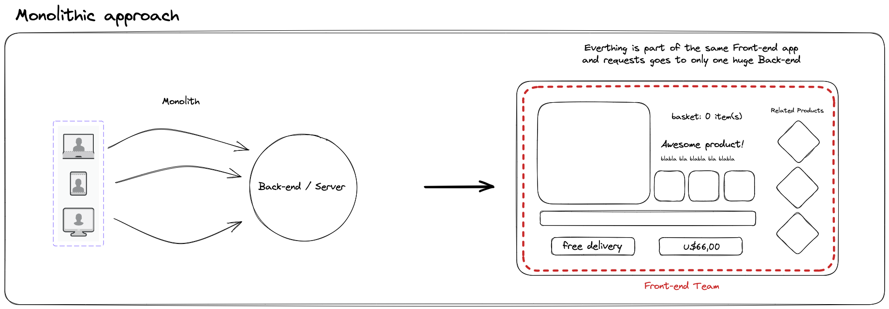
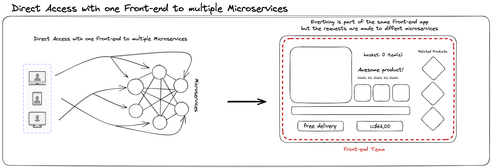
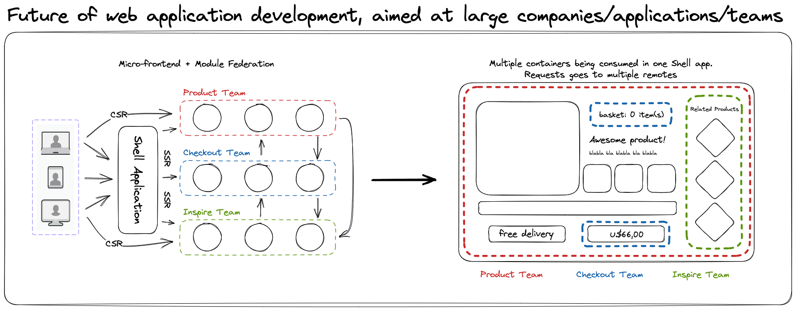

== Introduction 
Web application development has undergone significant changes over the years, as developers and businesses seek to create more scalable, maintainable and user-friendly applications. In this short snippet, we will explore the evolution of web application development, from the traditional way of building monolithic applications to the more modern trends of using micro-frontends and Module Federation.

=== Conventional Ways of Developing Web Applications

Monolithic web applications are those where everything is part of the same front-end application and the request goes to only one huge back-end. This is the simplest and easiest way to build a web application, but it has many drawbacks. For example, a monolithic web application is hard to scale, maintain, and update. It also creates a tight coupling between the front-end and the back-end, which limits the flexibility and reusability of the code. A monolithic web application is like a single executable file or directory that makes deployment easier, but also makes changes more difficult.

[.img]

Direct access with one front-end to multiple microservices is an improvement over the monolithic approach. In this case, everything is still part of the same front-end application, but the requests are made to different microservices. Microservices are small, independent, and loosely coupled units of functionality that communicate with each other through APIs. This way, a web application can achieve better scalability, modularity, and performance. However, this approach still has some challenges. For instance, it can increase the complexity and overhead of managing multiple microservices. It also does not solve the problem of code duplication and inconsistency across the front-end.

[.img]

=== Future of Web Application Development Aimed at Large Companies, Applications, and Teams

Micro-frontend and module federation are the future of web application development aimed at large companies, applications, and teams. In this approach, multiple containers are being consumed in one shell app. Each container represents a micro-frontend that encapsulates a specific feature or domain of the web application. The shell app acts as a host that dynamically loads and renders the micro-frontends based on the user's needs and preferences. Module federation is a technique that enables the shell app and the micro-frontends to share code and dependencies without bundling them together. This way, each micro-frontend can be developed, deployed, and updated independently of each other and from the shell app.

Micro-frontend and module federation offer many benefits for web application development. They enable faster delivery, better quality, and more innovation of web features. They also promote team autonomy, code reusability, and consistency across the web application. They also reduce the risk of breaking changes and conflicts among different parts of the web application.

Web application development has evolved from monolithic to micro-frontend and module federation approaches to deal with the increasing complexity and variety of web applications. These approaches provide more flexibility, scalability, and efficiency for web developers and users alike.

[.img]
