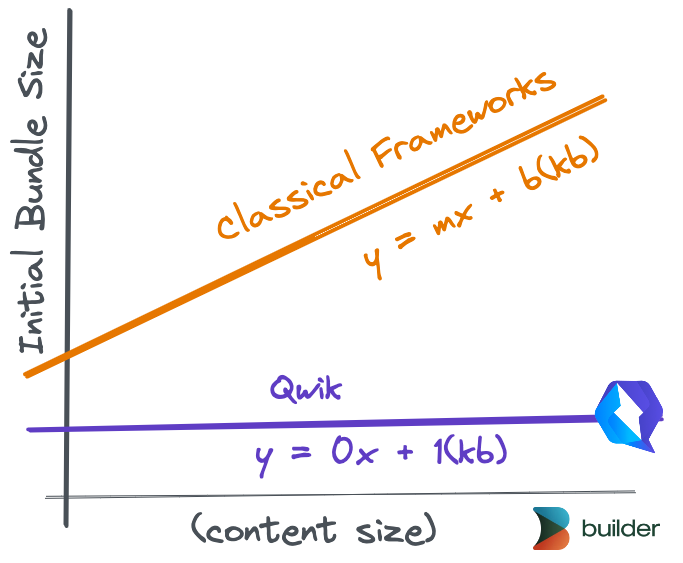
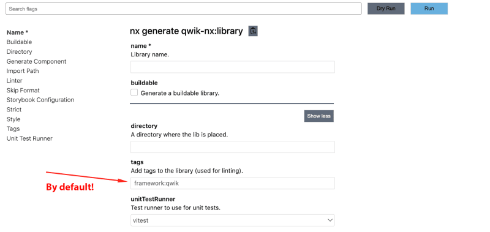

== Introduction 
A lot has happened since we https://dev.to/valorsoftware/introducing-qwik-integration-for-nx-1k5b[introduced, window=_blank] the https://github.com/qwikifiers/qwik-nx[qwik-nx, window=_blank], an official plugin for the Qwik framework. As Qwik breaks free by reaching the v1, we’re happy to announce the release of the stable version of the Nx integration for it.

=== A few words about Qwik
Qwik is referred to as a next-generation framework because of its revolutionary new approaches to performance optimization, among which:

* *JavaScript Streaming* - an ability to load and execute only the bare minimum of the code as Qwik analyses and splits your code into chunks up to a function level. Those chunks are prefetched in a separate thread, similar to "buffering" in video streaming. The prefetched code only executes upon user action;

* *resumability* - a new rendering paradigm to bring you instantly interactive apps by serializing/deserializing your app as it goes from SSR to client without the need for hydration;

In practise this means that you get an app with O(1) size, as its initial bundle is constant at about 1kb no matter the application complexity.

[.img]

This is extremely beneficial for enterprise companies, that usually want to bring an enormous amount of functionality to their users without any performance impact.

While Qwik helps to scale the application's functionality expressed via code without effort, Nx is there to make sure your codebase can be managed at any scale. And here's where qwik-nx comes into play. It provides the same experience of the generation and execution of Qwik applications in an Nx workspace that fits the standards of other Nx projects.

=== What's new?
In the https://dev.to/valorsoftware/introducing-qwik-integration-for-nx-1k5b[previous article, window=_blank], we have talked about how you get started by initializing your Nx repository with Qwik.

Recap: you can generate a new workspace by running: 
[, bash]
----
npx create-nx-workspace@latest org-workspace --preset=qwik-nx
----

Or add a new Qwik application to an existing workspace by running:
[, bash]
----
npm install -D qwik-nx
----

and then
[, bash]
----
nx generate qwik-nx:app
----
Today let's talk about what new opportunities does it offer:

=== #qwikNxVite# plugin

If you stick to using Qwik with Nx from its first days, you might have noticed that importing Qwik components from libraries does not work out of the box as all those dependencies should be configured as #vendorRoots# for #qwikVite# plugin in order for Qwik Optimizer to actually include and process them.

The good news is you don't have to do it manually any more: #qwikNxVite# plugin will by default analyze the Nx dependency graph and put all libraries your app uses as vendorRoots for the Qwik Optimizer to consume.

[, ts]
----
// vite.config.ts

import { qwikNxVite } from 'qwik-nx/plugins';

export default defineConfig({
  plugins: [
    qwikNxVite(), // <= that's all you need!
    qwikCity(),
    qwikVite(),
    tsconfigPaths({ root: '../../' }),
  ],
  ...
});
----

And this behavior can be fine-tuned even further to make sure you're including only what's intended. As an example, you can mark all Qwik-specific libraries with a specific tag and filter your vendorRoots with it. Let's see how you can leverage the usage of #"framework:qwik"# tag.

1) Mark libs you need with the respective tag:

[, ts]
----
// some lib's project.json
{
...
"tags": ["type:ui", "scope:products", "framework:qwik"]
}
----

2) Configure the plugin

[, ts]
----
// app's vite.config.ts
qwikNxVite({ 
  // filter out all projects that does not have this tag
  // use "tags", "name", "path" regex 
  // or even "customFilter" to achieve desired filtering logic
  includeProjects: { tags: ["framework:qwik"] } 
  debug: true // <= put this to see what projects are included
})
----

This configuration will make #qwikNxVite# plugin to load only libraries that have respective tag AND are recognized by Nx as your app's dependency.

=== Pro tip
You can configure the Nx Console to always put the tag you want as a default value for the #tags# field for the #qwik-nx:library# generator. This can be achieved by setting that default value in the https://nx.dev/reference/nx-json[build options of nx.json, window=_blank]

[, ts]
----
{
  "generators": {
    "qwik-nx:library": {
      "tags": "framework:qwik"
    }
  }
}
----

[.img]

=== Automatic versions migrations

One of the biggest benefits of using Nx to manage the codebase is their seamless migration process: with a single command #nx migrate latest# Nx CLI will analyze the workspace and provide the set of migrations written by Nx team to update versions of your dependencies and mutate all necessary bits of code. This is a great capability that allows large codebases to always stay up to date without investing weeks of refactoring.

#qwik-nx# aims to provide the same feature for its users to make sure your Qwik apps are updated. This means you don't have to update the app's dependencies manually anymore, just run
#nx migrate qwik-nx@latest# and you are done: it will update all breaking changes and bump versions of Qwik packages.

=== React integration
Qwik https://qwik.builder.io/docs/integrations/react/[offers a great capability, window=_blank] to #qwikify$# React components - reuse existing React components and libraries within Qwik applications. Not only does this open the world of using existing UI libraries (Material UI, Threejs, React Spring, etc.) and utilities that were developed for React over time within Qwik applications, but also this turns out to be a powerful *migration strategy*, as you can migrate your existing React applications chunk by chunk, preserving large parts of functionality in the old syntax without a need to rewrite everything at once.

As React and Qwik components can not be mixed in the same file, if you check your project right after adding React integration to a plain Qwik app, you will see a new folder #src/integrations/react/#, and its recommended to place all React components there.

#qwik-nx# gives you more control over structuring your "qwikified" react code by defining 2 approaches for you:

* use a #react-in-app# generator, that behaves in the same manner as native Qwik integration. It will add integrations/react folder in the existing Qwik app

* #react-library# generator, which will create a separate library to keep qwikified components in it. This means you can now structure your React code as you need and still be able to use it within Qwik apps.

In the Qwik repository there're opened PRs for Angular, Vue and Svelte integrations. As soon as they're available, you will also be able to generate separate libraries for components of those frameworks.

=== Storybook integration
#qwik-nx# now supports adding storybooks for your apps and libs! We get you covered in all scenarios:

* run #nx g qwik-nx:storybook-configuration# to add storybook to your existing libs and apps
* generate a new library with a preconfigured storybook and stories for newly generated components by running #nx g qwik-nx:library mylib --storybookConfiguration#
* add a new component along with a story for it by running #nx g qwik-nx:component --generateStories#

=== Deployments
Qwik offers a variety of ways to deploy your app with its CLI, such as Netlify, Cloudflare Pages, Azure, Vercel, etc. With qwik-nx, we already provide support for Cloudflare Pages with Netlify and other integrations on their way.

To try it out, all you have to do is run #nx g qwik-nx:cloudflare-pages-integration myapp#. This will create a Cloudflare adapter and add necessary targets to preview and deploy your website with Wrangler (Cloudflare CLI tool).

=== Build executor
As you probably know, Qwik builds your code twice, running a client build first and an SSR one after that. In the Nx world, each step of the process is supposed to be a separate target of the application, so that you can keep full control of what you're building.

To achieve this, we're exposing real build steps and wrapping them into our custom build executor.

[, json]
----
{ 
 "targets": [
    "build": {
      "executor": "qwik-nx:build",
      "options": {
        "runSequence": [
          "myapp:build.client", 
          "myapp:build.ssr"
        ],
        "outputPath": "dist/apps/myapp"
      }
    },
    "build.client": {
      "executor": "@nrwl/vite:build",
      "options": {
        "outputPath": "dist/apps/myapp",
        "configFile": "apps/myapp/vite.config.ts"
      }
    },
    "build.ssr": {
      "executor": "@nrwl/vite:build",
      "options": {
        "outputPath": "dist/apps/myapp"
      }
    }
  ]
}
----

The cool thing with this build executor is that you can customize and add additional targets to the build process if that's needed. For example, you can add "myapp:i18n" target to the #runSequence# property in order to process your translations after building the app.

Oh, and keep in mind that #build# executor has another important purpose: it runs type checks for your app before building it!

=== Micro frontends
Qwik is able to render https://qwik.builder.io/docs/advanced/containers/[multiple application instances, window=_blank] within the page as it can be attached to an HTML element, that becomes the root of the application. Inspired by this https://blog.cloudflare.com/better-micro-frontends/[awesome article, window=_blank], we've added micro-frontend support to the Qwik apps. As of now this functionality is in beta

The intent is to bring the same level of convenience as what you get with Nx's tooling to generate and run https://nx.dev/recipes/module-federation/module-federation-with-ssr[Module Federation setup, window=_blank] with React and Angular.

#qwik-nx# provides all necessary generators and executors to use it with ease.

To get started, run the following:

* #nx g qwik-nx:host shell --remotes=products,settings#, which will scaffold the host application and 2 remotes for it
* #nx g qwik-nx:remote myanotherremote --host=shell# to add a new remote application to your existing setup

That is it! You can now run either #nx serve shell# or #nx preview shell# and see both host and remotes built and served together. This is because #qwik-nx#'s executors for serve and preview are able to process all remotes for you with 0 configuration.

=== Excited? Go try it out!
The package already provides a solid way of working with Qwik applications within Nx workspaces. Our main goal is to eventually reach feature parity with Qwik CLI.

So feel free to try it out and let us know how it works out for you!

You are welcome to join the https://discord.com/invite/ndsMfSdR[Qwikifiers, window=_blank] and https://discord.com/invite/nM8hQ7yr[Qwik, window=_blank] Discord servers to keep track of any updates or find any help you need.

We are also looking forward to see any https://github.com/qwikifiers/qwik-nx[new contributions, window=_blank] to the package itself.

Last but not least, we'd like to extend a heartfelt thank you to https://twitter.com/ryanhutchison[Ryan Hutchison, window=_blank] and https://www.asicentral.com/[ASI Central, window=_blank] for their unwavering support of our project.

=== Need Help?
At Valor Software, we are passionate about staying at the forefront of technology and are integration partners with the creators of Qwik, Builder.io. If you have any questions or need assistance with your project, don't hesitate to contact us at mailto:sales@valor-software.com[sales@valor-software.com]