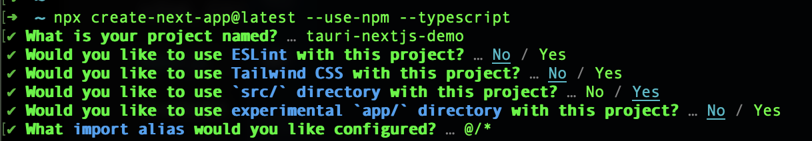
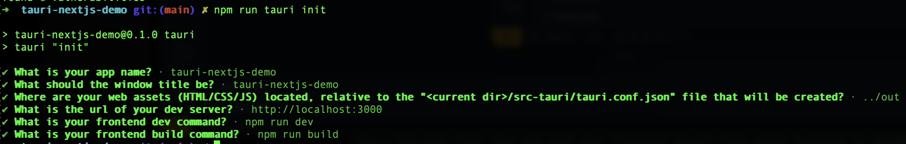
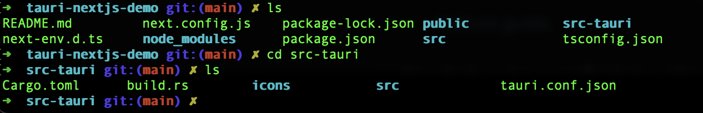
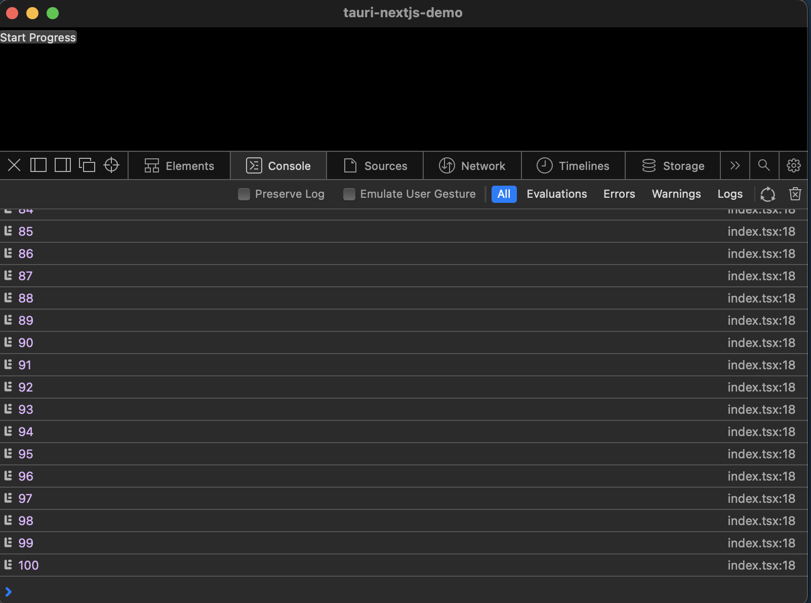
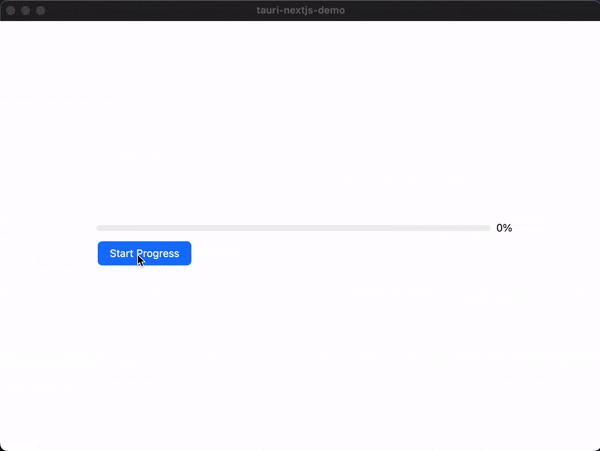
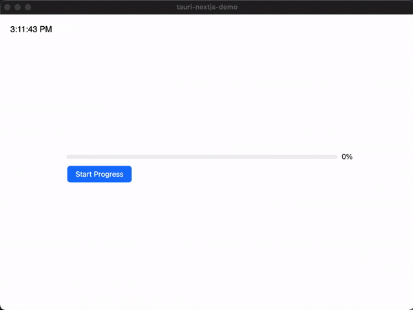
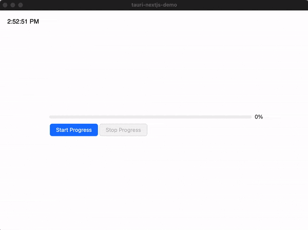
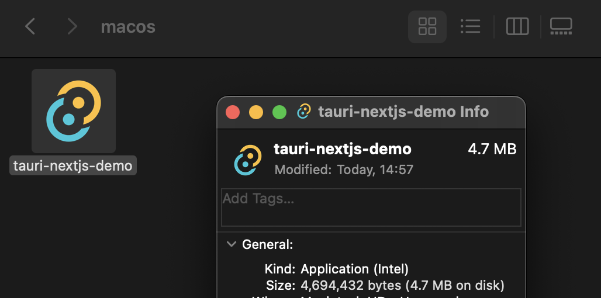
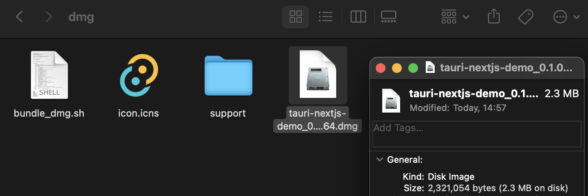
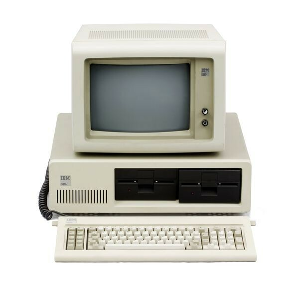

== Introduction 
This article introduces you to a specific but exciting topic and is the sequel to my previous article. If you are keen on Rust integrations, please read https://valor-software.com/articles/node-rust-friendship-forever-the-napi-rs-way[Node & Rust: Friendship Forever. The NAPI-rs Way, window=_blank].

I suppose all of you, dear colleagues work or at least know about https://github.com/microsoft/vscode[VSCode, window=_blank]. Did you think about the technologies used in VSCode creation? You probably will be surprised if I tell you that VSCode is mainly written on Typescript. But stop... Typescript and Javascript are typical for web or backend-based applications, and VSCode is a standalone UI application. Is it possible to create a Javascript-based standalone UI application? Yes, it is!

If we had discussed this topic a couple of months ago, I would have recommended https://www.electronjs.org/[ElectronJS, window=_blank] if you were looking for a way to create a standalone Javascript application. Also, I would provide you the following list of popular Electron-based applications.

* Microsoft Teams
* Zoom
* Slack for Desktop
* WordPress for Desktop
* Skype
* Discord
* WhatsApp Desktop
* Postman
* MongoDB Compass

But the modern IT World does not stand still, and we’ve already had a powerful ElectronJS competitor (it could be its killer in the nearest future, BTW).

=== https://tauri.app/[Meet Tauri!, window=_blank]
If you want to get a brief comparison Tauri with Electron, please, read https://www.levminer.com/blog/tauri-vs-electron[this article, window=_blank]. https://betterprogramming.pub/adi%C3%B3s-electron-a-rust-powered-alternative-has-arrived-and-its-lovely-bd26262dcf1a["Goodbye Electron. Hello Tauri", window=_blank] will also be helpful if you want to understand Tauri pros and some brief technical details.

There is a brief comparison for my impatient readers.

[.turbo-table]
|===
|Framework	|"Front-end"	|"Back-end"
|Electron |Chromium browser |NodeJS
|Tauri |Native Webview |Rust-compiled code
|===

One small note regarding Native Webview meant above. You can find ultimate information on this topic https://github.com/tauri-apps/wry[here, window=_blank]. In a nutshell, Tauri applications use as HTML renderer Webkit (safari engine) on MacOS, https://developer.microsoft.com/en-us/microsoft-edge/webview2/[Microsoft Edge WebView2, window=_blank] on Windows, and https://webkitgtk.org/[WebKitGTK, window=_blank] on Linux (port of Webkit for Linux). Pay attention to the fact that a Tauri application could behave differently on different platforms according to the information above.

What thoughts would we conclude regarding the table above? Tauri is about performance and simplicity! As a developer who spent several years on Electron-related projects, I'm pretty sure NodeJS could be a bottleneck for the following reasons.

1. NodeJS is a heavyweight solution with complicated architecture. I mean V8, LibUV with Event Loop, etc.
2. NodeJS is not a good choice if we need to implement heavy processes like image, data processing, or complicated math calculations.
3. https://www.electronjs.org/docs/latest/tutorial/ipc[Inter-Process Communication (Electron IPC), window=_blank] is a way of communication between the "Frontend" and "Backend" in Electron. Its functionality is overcomplicated in coding.
4. Implementing a multithreading NodeJS-based "Backend" in our Electron-based application could be a nightmare.

Tauri demolishes all of the cons above for the following reasons.

1. Rust-complied code contains only the needed minimum of functionality (without redundant architectural stuff like V8 or LibUV).
2. Rust is multithreading-friendly and allows us to get multi-platform implementations.
3. Rust is full of useful memory-safe mechanisms that prevent developers from making the mistakes, and as a result, we get high-quality predictable code.
4. Rust-complied code is also more performative than NodeJS-based.

In my opinion, the pros above are critical for the "Backend." That's why according to the reasons above, I found Tauri approach as a perspective.

BTW if you are not a Rust expert and want to know something new about Rust multithreading , please read https://valor-software.com/articles/multi-threading-for-impatient-rust-learners[Multi-threading for Impatient Rust Learners, window=_blank].

== The Objective
Of course, Tauri is something new. Despite this, it has good documentation. There are many interesting articles on this topic, and I recommend the following resources reading or watching.

* https://www.youtube.com/watch?v=4Amz3fh3T2U[Tauri, a Rust-powered Electron alternative, window=_blank] - a video allows us to do the first steps
* https://betterprogramming.pub/adi%C3%B3s-electron-a-rust-powered-alternative-has-arrived-and-its-lovely-bd26262dcf1a[Goodbye Electron. Hello Tauri, window=_blank] - provides an exciting example including events between "Frontend" and "Backend"
* https://tauri.app/v1/guides/getting-started/setup/next-js/[Tauri - Next.js, window=_blank] - explains how to provide NextJS-based "Frontend"

My objective is to provide you with something new to run and test. I created a Tauri application with NextJS & Ant Design-based "Frontend" with some "Backend" calculations that look heavyweight. This application shows us Progress Bar on a screen, and related "progress" data is prepared on the "Backend" (Rust) side.

=== First Steps
Let's get started!

==== Create "Frontend" part
[, bash]
----
npx create-next-app@latest --use-npm --typescript
----
Answer the following questions...

[.img]

==== Install Tauri dependencies
[, bash]
----
cd tauri-nextjs-demo
npm i --save-dev @tauri-apps/cli
npm i @tauri-apps/api --save
----

==== Updates
Update #next.config.js#

[, js]
----
/** @type {import('next').NextConfig} */

const nextConfig = {
  reactStrictMode: true,
  // Note: This feature is required to use NextJS Image in SSG mode.
  // See https://nextjs.org/docs/messages/export-image-api for different workarounds.
  images: {
    unoptimized: true,
  },
};

module.exports = nextConfig;
----

Update scripts section in #package.json#

[, json]
----
{
  "scripts": {
    "dev": "next dev",
    "build": "next build",
    "export": "next export",
    "start": "next start",
    "tauri": "tauri",
    "lint": "next lint"
  }
}
----

==== Initialize "Backend" (Tauri) part
[, bash]
----
npm run tauri init
----
Answer the following questions...
[.img]

Answer the following questions...

#src-tauri# folder contains our backend part.
[.img]

== "Backend" functionality

The first bootstrapped version contains a minimal set of functionality. Let's fix it.

Please, open #src-tauri/src/main.rs# and put the following code.

[, js]
----
#![cfg_attr(
  all(not(debug_assertions), target_os = "windows"),
  windows_subsystem = "windows"
)]
use tauri::Window;
use std::{thread, time};

#[derive(Clone, serde::Serialize)]
struct Payload {
    progress: i16,
}

#[tauri::command]
async fn progress_tracker(window: Window){
  let mut progress = 0;
  loop {
      window.emit("PROGRESS", Payload { progress }).unwrap();
      let delay = time::Duration::from_millis(100);
      thread::sleep(delay);
      progress += 1;
      if progress > 100 {
        break;
      }
  }
}

fn main() {
  tauri::Builder::default()
    .invoke_handler(tauri::generate_handler![progress_tracker])
    .run(tauri::generate_context!())
    .expect("error while running tauri application");
}
----

Pay attention to the points below.

1. #progress_tracker# function should be called from the "Frontend" (Typescript) part.
2. ##[tauri::command]# is an attribute that defines the function above as a Javascript-friendly
3. #window: Window# parameter should be passed from the "Frontend" side.
4. The loop inside #progress_tracker# returns a number every 100ms 100 times.
5. Pay attention on #.invoke_handler(tauri::generate_handler![progress_tracker])# in #main# function. You must "register" your Frontend-friendly function.

Also, you need to change #tauri.identifier# value in #src-tauri/tauri.conf.json#. Say, to #com.buchslava.dev# in my case.
After that, change #build.beforeBuildCommand# value to #npm run build && npm run export# in the file above. It's important because in this example we work with NextJS SSG.

== "Frontend" first scratches.

Let's move to our "Frontend" part.

Move to the project's root folder and put the following code into #src/pages/index.tsx#

[, ts]
----
import { invoke } from "@tauri-apps/api/tauri";
import { listen } from "@tauri-apps/api/event";
import { useEffect, useState } from "react";

interface ProgressEventPayload {
  progress: number;
}

interface ProgressEventProps {
  payload: ProgressEventPayload;
}

export default function Home() {
  const [busy, setBusy] = useState<boolean>(false);

  useEffect(() => {
    // listen what can Rust part tell us about
    const unListen = listen("PROGRESS", (e: ProgressEventProps) => {
      console.log(e.payload.progress);
    });

    return () => {
      unListen.then((f) => f());
    };
  }, []);

  return (
    

      {!busy && (
        <button
          onClick={() => {
            setBusy(true);
            setTimeout(async () => {
              const { appWindow } = await import("@tauri-apps/api/window");
              // call Rust function, pass the window
              await invoke("progress_tracker", {
                window: appWindow,
              });
              setBusy(false);
            }, 1000);
          }}
        >
          Start Progress
        </button>
      )}
    

  );
}
----

It's time to run the example...

[, bash]
----
npm run tauri dev
----
Let's open Developer Console (Right click on the screen -> Inspect -> Switch to Console tab) and press "Start Progress" button.

[.img]

Congrats! We finished the basic Touri stuff and it's time to focus on "Frontend" upgrading.

You can find this solution https://github.com/buchslava/tauri-nextjs-demo/tree/version1[here, window=_blank].

== Add UI part
We need to add a Progress Bar widget to the screen and show the progress on it instead of Console.
First, install https://ant.design/[Ant Design, window=_blank] dependency.

[, bash]
----
npm i antd --save
----
Second, remove all content from #src/styles/Home.module.css#.
Third, put the following content into #src/styles/globals.css#.

[, css]
----
body {
  position: relative;
  width: 100vw;
  height: 100vh;
  font-family: sans-serif;
  overflow-y: hidden;
  display: flex;
  justify-content: center;
  align-items: center;
}
----

Fourth, put the following code into #src/pages/index.tsx# instead the existing.

[, ts]
----
import { invoke } from "@tauri-apps/api/tauri";
import { listen } from "@tauri-apps/api/event";
import { useEffect, useState } from "react";
import { Button, Progress } from "antd";

interface ProgressEventPayload {
  progress: number;
}

interface ProgressEventProps {
  payload: ProgressEventPayload;
}

export default function Home() {
  const [busy, setBusy] = useState<boolean>(false);
  const [progress, setProgress] = useState<number>(0);

  useEffect(() => {
    const unListen = listen("PROGRESS", (e: ProgressEventProps) => {
      setProgress(e.payload.progress);
    });

    return () => {
      unListen.then((f) => f());
    };
  }, []);

  return (
    

      

        <Progress percent={progress} />
      

      <Button
        type="primary"
        disabled={busy}
        onClick={() => {
          setBusy(true);
          setTimeout(async () => {
            const { appWindow } = await import("@tauri-apps/api/window");
            await invoke("progress_tracker", {
              window: appWindow,
            });
            setBusy(false);
          }, 1000);
        }}
      >
        Start Progress
      </Button>
    

  );
}
----

Let's look at the result...
[, bash]
----
npm run tauri dev
----

[.img]

Looks good. But I'm a suspicious guy, and I must be 100% sure that everything between Rust and NextJS parts stays together. I want to add a timer to the "Frontend" screen. As a result, Progress and Timer should work simultaneously without stops.

Let's put the following code into #src/pages/index.tsx# instead the existing.

[, ts]
----
import { invoke } from "@tauri-apps/api/tauri";
import { listen } from "@tauri-apps/api/event";
import { useEffect, useState } from "react";
import { Button, Progress } from "antd";

interface ProgressEventPayload {
  progress: number;
}

interface ProgressEventProps {
  payload: ProgressEventPayload;
}

export default function Home() {
  const [busy, setBusy] = useState<boolean>(false);
  const [progress, setProgress] = useState<number>(0);
  const [timeLabel, setTimeLabel] = useState<string>();

  useEffect(() => {
    const timeIntervalId = setInterval(() => {
      setTimeLabel(new Date().toLocaleTimeString());
    }, 1000);
    const unListen = listen("PROGRESS", (e: ProgressEventProps) => {
      setProgress(e.payload.progress);
    });

    return () => {
      clearInterval(timeIntervalId);
      unListen.then((f) => f());
    };
  }, []);

  return (
    

      
{timeLabel}

      

        <Progress percent={progress} />
      

      <Button
        type="primary"
        disabled={busy}
        onClick={() => {
          setBusy(true);
          setTimeout(async () => {
            const { appWindow } = await import("@tauri-apps/api/window");
            await invoke("progress_tracker", {
              window: appWindow,
            });
            setBusy(false);
          }, 1000);
        }}
      >
        Start Progress
      </Button>
    

  );
}
----

[.img]

It's time to make the last stitch. Till we have progress functionality, we need to stop it somehow. The following modifications allow us to do it.

#src-tauri/src/main.rs#

[, ts]
----
#![cfg_attr(
  all(not(debug_assertions), target_os = "windows"),
  windows_subsystem = "windows"
)]
use tauri::Window;
use std::{thread, time};
use std::sync::{Arc, RwLock};

#[derive(Clone, serde::Serialize)]
struct Payload {
    progress: i16,
}

#[tauri::command]
async fn progress_tracker(window: Window){
  // New code
  let stop = Arc::new(RwLock::new(false));
  let stop_clone = Arc::clone(&stop);
  let handler = window.once("STOP", move |_| *stop_clone.write().unwrap() = true);
  // / New code

  let mut progress = 0;
  loop {
      // New code
      if *stop.read().unwrap() {
        break;
      }
      // / New code
      window.emit("PROGRESS", Payload { progress }).unwrap();
      let delay = time::Duration::from_millis(100);
      thread::sleep(delay);
      progress += 1;
      if progress > 100 {
        break;
      }
  }
  window.unlisten(handler); // New code
}

fn main() {
  tauri::Builder::default()
    .invoke_handler(tauri::generate_handler![progress_tracker])
    .run(tauri::generate_context!())
    .expect("error while running tauri application");
}
----

#src/pages/index.tsx#

[, ts]
----
import { invoke } from "@tauri-apps/api/tauri";
import { listen } from "@tauri-apps/api/event";
import { useEffect, useState } from "react";
import { Button, Progress } from "antd";

interface ProgressEventPayload {
  progress: number;
}

interface ProgressEventProps {
  payload: ProgressEventPayload;
}

export default function Home() {
  const [busy, setBusy] = useState<boolean>(false);
  const [progress, setProgress] = useState<number>(0);
  const [timeLabel, setTimeLabel] = useState<string>();

  useEffect(() => {
    const timeIntervalId = setInterval(() => {
      setTimeLabel(new Date().toLocaleTimeString());
    }, 1000);
    const unListen = listen("PROGRESS", (e: ProgressEventProps) => {
      setProgress(e.payload.progress);
    });

    return () => {
      clearInterval(timeIntervalId);
      unListen.then((f) => f());
    };
  }, []);

  return (
    

      
{timeLabel}

      

        <Progress percent={progress} />
      

      <Button
        type="primary"
        disabled={busy}
        onClick={() => {
          setBusy(true);
          setTimeout(async () => {
            const { appWindow } = await import("@tauri-apps/api/window");
            await invoke("progress_tracker", {
              window: appWindow,
            });
            setBusy(false);
          }, 1000);
        }}
      >
        Start Progress
      </Button>
      {/* New code */}
      <Button
        type="primary"
        disabled={!busy}
        onClick={async () => {
          const { appWindow } = await import("@tauri-apps/api/window");
          await appWindow.emit("STOP");
          setProgress(0);
          setBusy(false);
        }}
      >
        Stop Progress
      </Button>
      {/* / New code */}
    

  );
}
----

[.img]

=== Looks persuasive!
https://betterprogramming.pub/front-end-back-end-communication-in-tauri-implementing-progress-bars-and-interrupt-buttons-2a4efd967059[Frontend Backend Communication in Tauri: Implementing Progress Bars and Interrupt Button, window=_blank] will tell you more regarding the technique above.

You can find the related source https://github.com/buchslava/tauri-nextjs-demo[here, window=_blank].

== The Fasts
Finally, I want to focus on build stuff. Let's build the app. BTW, I'm working under MacOS. Please, read https://tauri.app/v1/guides/building/[this one, window=_blank] if you want to get more about Tauri build. Let's build!

[, bash]
----
npm run tauri build
----
The next information will help you understand where and what you can find regarding the result of the build. You can find your build in #/src-tauri/target/release/bundle#.

In MacOS, you will find the standalone application #/src-tauri/target/release/bundle/macos# with the installer-based build #/src-tauri/target/release/bundle/dmg#.

The most exciting thing here is the 4.7Mb application and 2.3Mb installer. Can you believe it? 4.7Mb of Rust & NextJS & Ant Design!
[.img]

Do you want to compare Tauri's result with Electron's one???

_Honestly, when I got this result, my memories from my past returned. I remember 20mb hard disks and IBM PC XT._

[.img]

I also thought about the following. Amazing! I can put an application from 2023 to my PC from 1990. Sounds like a time machine!

PS: Thanks to https://dev.to/edusperoni[Eduardo Speroni, window=_blank] for helpful notes that improve the article.