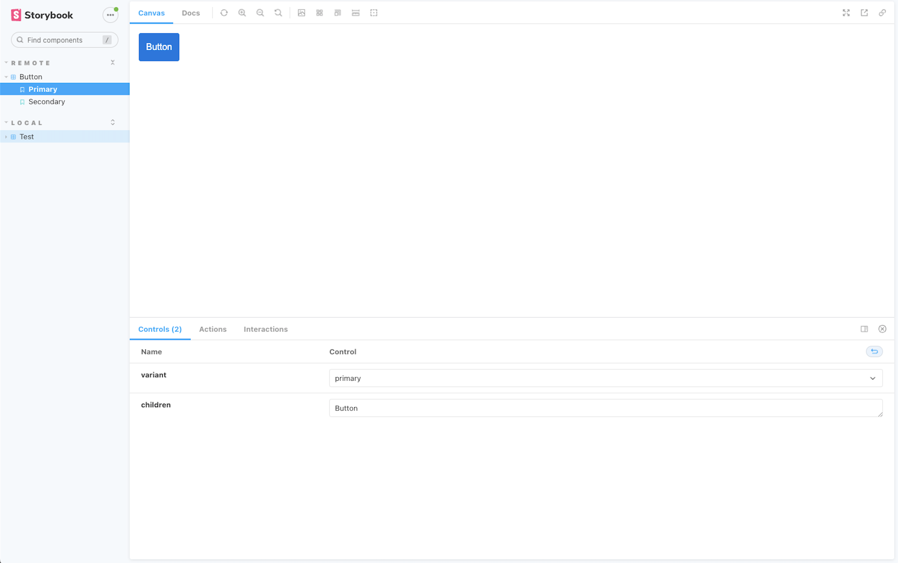
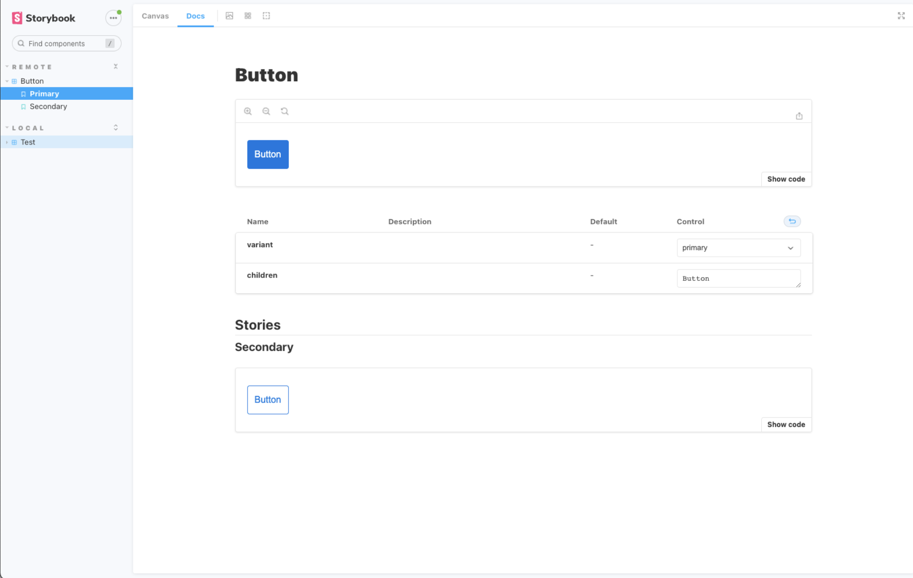

== Introduction 
At Valor Software, we are steadfast in our belief in the transformative power of collaboration and the open-source community. As partners in Module Federation, we have recently ramped up our Developer Relations (DevRel) initiatives to elevate awareness surrounding Module Federation and its ongoing development. In this article, we present an inspiring account of our collaboration with an external contributor, Fyodorov Andrei, who effectively implemented a plugin for Storybook that supports Module Federation remote containers.

=== The Catalyst: Embracing a Culture of Learning and Cooperation

As a company committed to Module Federation, we at Valor Software acknowledge the critical role that collaboration and learning play in driving progress. This narrative revolves around Andrei’s journey, motivated by a passion for learning and a desire to contribute to the community. He joined forces with us and embarked on a developmental journey that encompassed numerous conversations with our team and the Nx team, and eventually led to a beautifully crafted https://github.com/module-federation/universe/pull/598[result, window=_blank].

=== Andrei’s Perspective: Venturing into Storybook and Webpack Configuration
I started by researching how to modify the Webpack configuration for Storybook. I discovered the webpackFinal method and https://github.com/robdonn/storybook-module-federation[storybook-module-federation, window=_blank] utility that is used to update storybook configuration, and realized I could create a Storybook add-on to achieve my goal. After learning how to create an addon, similar to the ones Module Federation https://github.com/module-federation/universe/tree/main/packages/nextjs-mf[already had, window=_blank]. I began the implementation and created a small project to evaluate my solution.

=== Overcoming the Initial Obstacle: Resolving Shared Dependencies Consumption Error
The first issue I encountered indicated that shared dependencies could not be consumed. After investigating, I found that I needed to apply an asynchronous boundary with the help of VirtualModulesPlugin. Since Storybook already had this plugin in its Webpack configuration, I had to take all virtual modules, write them physically in node modules, and create a new virtual module to apply the asynchronous boundary.

=== Seamless Integration: Adapting the Solution for the Nx Framework
Upon achieving preliminary results, I turned my attention to integrating my solution within an existing project. As the project utilized the Nx framework, I had to familiarize myself with creating a package therein. After figuring out the process, I successfully moved my solution to the https://github.com/module-federation/universe[universe, window=_blank] repository.

Having relocated the solution, I generated a https://github.com/module-federation/universe/pull/598[pull request, window=_blank] and proceeded with the implementation. In response to my initial review, I was tasked with incorporating examples into the project. However, I encountered difficulties with the applications produced by Nx. Further scrutiny revealed that Nx had altered Webpack and returned the configuration as a module, which was incompatible with Storybook.

=== A Tailored Solution: Crafting Utils to Replace Nx Utils
To address this issue, I developed utils that supplanted Nx utils. Subsequently, I submitted a pull request to the Nx repository, seeking the simplification of certain utils. Following its approval, I updated the Nx version and performed the requisite refactoring.

[.img]

[.img]

=== The Power of Collaboration Yields Remarkable Outcomes
My dedication to learning and enriching the community, bolstered by the invaluable support and guidance offered by the Valor Software and Nx teams, culminated in a triumphant collaboration. This partnership serves to underscore the extraordinary possibilities inherent within the open-source community and the immense potential that arises from collaboration grounded in a collective aspiration for innovation and advancement.

By uniting our efforts, we can continue to break new ground, unlock novel discoveries, and contribute to a vibrant, perpetually expanding ecosystem of knowledge and development.
