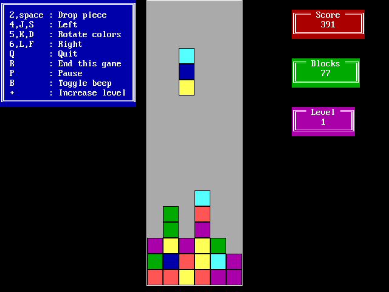
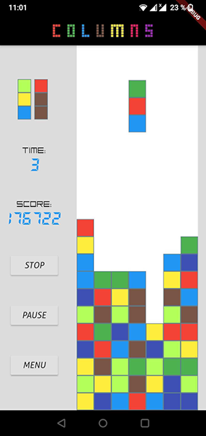
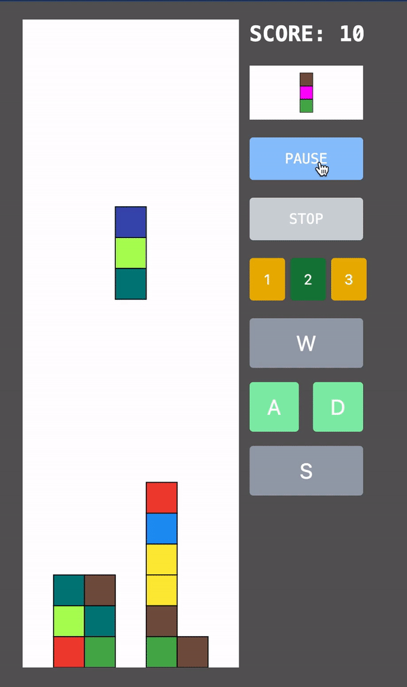
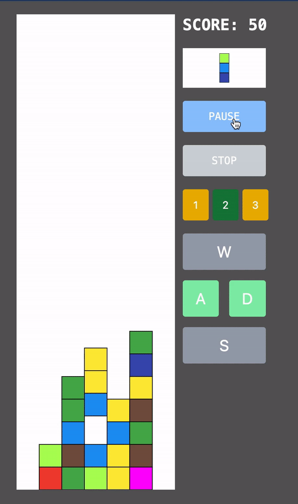
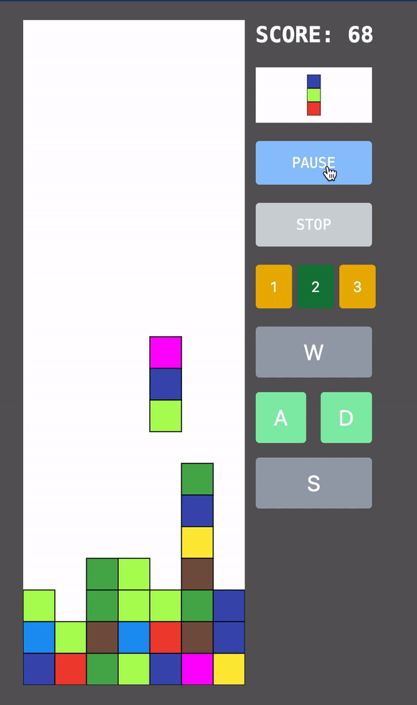
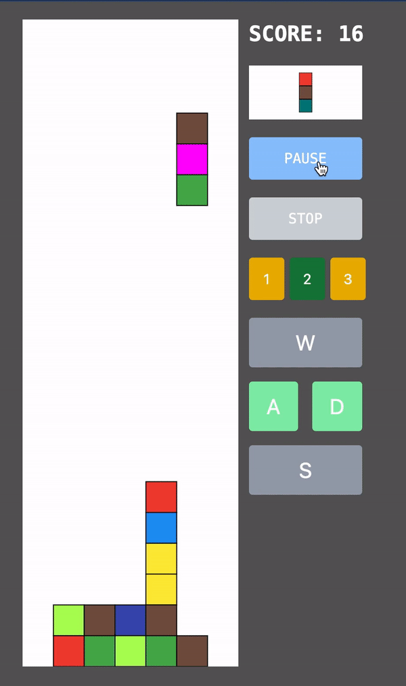
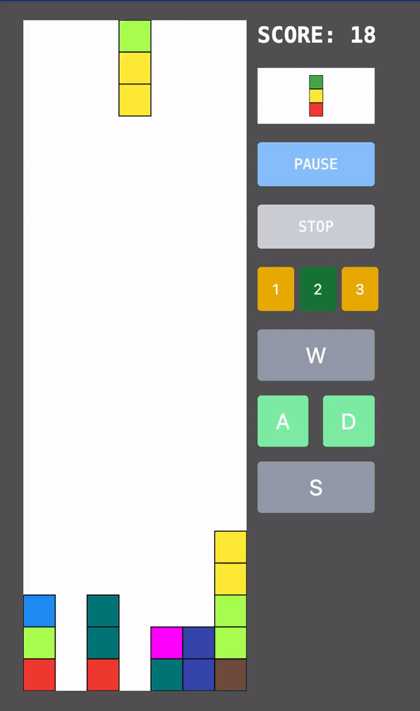
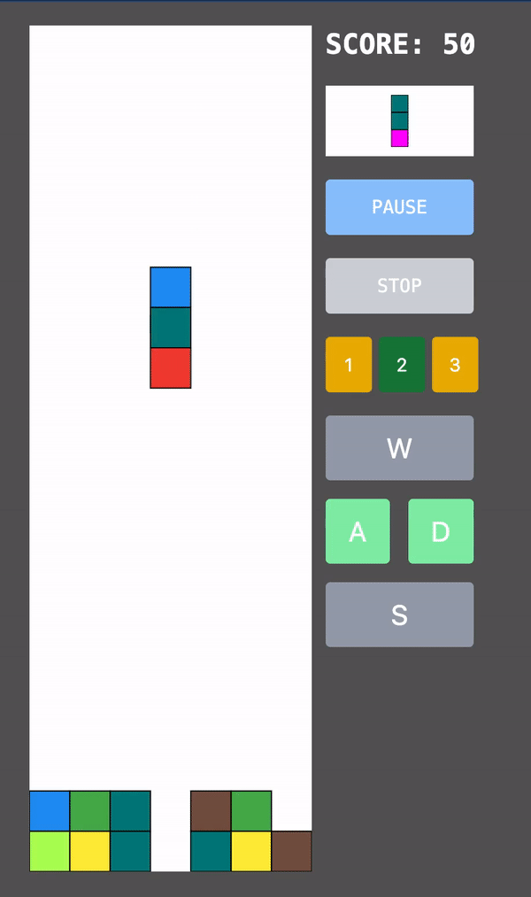

== The Columns Game
=== Preface
This story started in 1991 when I had just finished high school and began studying at Kharkiv Polytechnic University. During my first face with IBM PC, I faced this beautiful game, and since then, I can't get it out of my head. I want to tell you about the Columns game. This game is a perfect example of an arcade game. Although it has many different implementations, including https://www.youtube.com/watch?v=gx3VSzKMxb8[Sega version, window=_blank], my favorite one is https://archive.org/details/columns_ms-dos[Nathan Meyers 1989 MS-DOS port, window=_blank]. I'm keen on its coloristic, minimalistic, and aesthetic.

[.img]

I'm a person who follows traditions, and this game has become one of them. Whenever an interesting UI-related technology emerges or when I begin using one, I implement my Columns solution using that particular technology. For example 2007, I created the Adobe Flash version, and in 2019, I provided a Flutter-based one.

[.small-img]

But let's stop digging into the history and focus on today.

The https://qwik.builder.io/[Qwik web framework, window=_blank] was released in 2021 and, in my mind, became one of the most ambitious competitors in the UI area. A few months ago, I provided https://valor-software.com/articles/a-qwik-view-of-the-ranking-bar[an article, window=_blank] regarding Qwik.

However, in retrospect, I realize that I didn’t provide as much information as I intended to. The best way to disclose an essential topic is to provide a real-life example. And then, I remembered my old tradition and decided that the Web-based Columns game could be a great option if I want to improve my Qwik skills and tell this story to you, my dear reader.

Looking ahead, I'm glad to introduce you https://buchslava.github.io/qwik-columns/[Qwik Columns, window=_blank]!

Most of my friends compare this game with Tetris. At first glance, it really looks like Tetris. But this game is a bit different because it forces you to think differently than you do it playing Tetris. The main point is that colors are valuable in Columns. I'll explain the rules a bit later.

=== The Aim

I guess you noticed "Episode 01" in the title. This topic, frankly, could not be represented as an article due to the number of points to be covered. That's why I decided to split my telling into chunks and provide you with episodes. Each episode will focus on a subtopic, including Gameplay Architecture, Animation, Vector graphics via the D3 library, and, of course, Qwik. The current episode is just an introduction.

=== The Rules

There is a rectangle-based area that contains squares. It will be empty (white) before playing. A shape (actor) consists of three vertically arranged squares with different colors. It moves down until possible; that is, it reaches the bottom of the area or is faced with the next cell as a colored one. After, the related cells become colored according to the actor's colors. And then, a new actor appears at the top of the area. There is a checking process before the new actor appears. If colored squares are three or more equal colors on horizontal, vertical, and diagonal, then they should be demolished with increasing scores, and gaps will be collapsed. These are the original rules. Please look at the illustrations below.

#Diagonal#

[.small-img]

#Vertical and Horizontal#

Checking and collapsing works till all of the same-colored verticals, horizontals, and diagonals are demolished.

[.small-img]

But it would not be me if I implemented the rules as they are. I decided to add a couple of extra points.

#1. If a square containing 4 squares appears, this shape should
be demolished.#
[.small-img]

#2. If a square containing 2 + 2 squares like the one below appears, this shape should be demolished.#
[.small-img]

Let's https://buchslava.github.io/qwik-columns/[enjoy the game, window=_blank]!
[.small-img]

[.small-img]

== What's next?
As I mentioned earlier, this article is the start of the episodes that reveal the exciting game creation process. Step by step, we will reach the https://github.com/buchslava/qwik-columns/tree/final-devto-edition[final solution, window=_blank]!

In the next episode, I will explain how to bootstrap the project and make the first scratches via Qwik and D3.