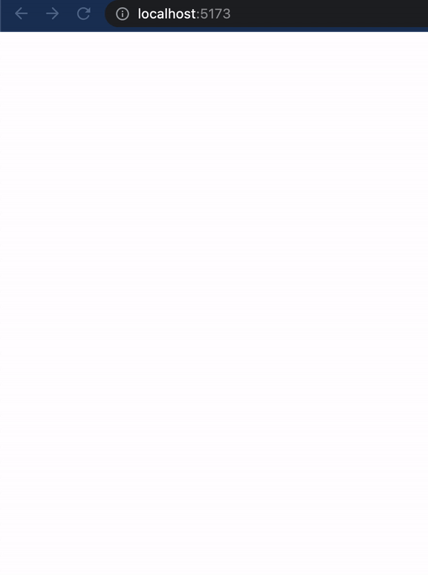

== The First Scratches.

I introduced you to the general Columns Game idea in the https://valor-software.com/articles/game-n-qwik-episode-01[previous episode, window=_blank]. And now, it's time to move forward. This episode will explain how to start the game implementation on https://qwik.builder.io/[Qwik, window=_blank]. The first steps will include the following points.

1. Bootstrapping.
2. The first steps in gameplay.

But before, I want to speculate a bit regarding the Web implementation of an Arcade Game and focus on one strategic topic. First, we must understand what issues to consider to implement the game successfully. They are the following:

* Library or Framework. In this case, we talk about Qwik, as I explained in Episode 01.
* We need to choose an approach for graphical objects drawing. Of course, we can use a pure HTML canvas-based approach. But let's not reinvent the wheel; let's wear it out.
* It is also essential to determine which CSS framework we will use. In my mind, pure CSS usage is also not a good idea for the reason explained in the previous point.

It's time to start our implementation with the points above covering.

=== Bootstrapping.

I recommend https://qwik.builder.io/docs/getting-started/[Getting Started Qwikly, window=_blank] before we start.

Please, run
[, bash]
----
npx npm create qwik@latest
----

and answer the following questions as:

#Where would you like to create your new project?# +
./qwik-columns +
#Select a starter# +
Basic App + 
#Would you like to install npm dependencies?# + 
Yes +
#Initialize a new git repository?# +
Yes or No, it's your choice... +

Congratulations! We just successfully started bootstrapping.

[, bash]
----
cd qwik-columns
----

Let's return to the points above regarding Graphical Drawing and CSS.

Before the first serious facing with https://d3js.org/[D3, window=_blank], I thought this beautiful library was just about charts. But as far as I implemented different custom charts, I found this is a delusion. One of the main pros of D3 is its universality. In the following episodes, I'll prove it! Together we will implement the game via D3!

Currently, I don't see any alternative to the https://d3js.org/[D3, window=_blank] drawing approach because:

1. It has powerful shape-drawing tools and color management.
2. D3 is about vector graphics; also, this library is animation-friendly.
3. It allows associating (or binding) data to the graphical representation.
4. It has a lot of patterns, like different, even tricky chart types.
5. D3 is well-documented and has a vast community.

Let's install D3 dependencies.

[, bash]
----
npm i d3 --save
----

Also, we need to install expected typings

[, bash]
----
npm i @types/d3 --save-dev
----

Let's switch to CSS issue.

The relationships between me and CSS are very pragmatic because I'm a full-stack guy and always don't have much time for sophisticated dancing with CSS. Of course, I understand and respect the beauty of https://getbem.com/introduction/[BEM, window=_blank] and https://www.arekibo.com/blog/popular-css-methodologies-for-scaling-web-projects/[some other methodologies, window=_blank]. But I'm simultaneously thinking about architecture and design, the beauty of JS, TS, Go, Rust code, DB structure, etc. Moreover, some existing CSS-based implementations make me suffer and waste my time. A good example is https://chipperci.com/news/node-sass-node-gyp-nodejs-errors[Node-sass and Node-gyp Errors, window=_blank]. That's why I expect something powerful, easy, and lightweight. According to the https://www.webdesignerdepot.com/2021/09/the-pros-and-cons-of-tailwind-css/[following points, window=_blank], I think https://tailwindcss.com/[Tailwindcss, window=_blank] is the best choice.

1. Control Over Styling
2. Faster CSS Styling Process
3. Responsiveness and Security
4. Additional Features. Tailwind CSS works in the front end of a website. For this reason, it is reasonable for developers to demand ultimate responsiveness. Well, Tailwind provides the ability to create responsive themes for your web applications and remove all unused CSS classes. With PurgeCSS, Tailwind helps you keep your final CSS as small as possible.

Of course, it has https://www.webdesignerdepot.com/2021/09/the-pros-and-cons-of-tailwind-css/[some cons, window=_blank].

1. Styling and HTML are Mixed
2. Lack of Important Components
3. It Takes Time to Learn

Let's analyze them. The first couple is only relevant when considering big or even enterprise projects. In that case, we could think about another framework. Regarding the third point, I agree only partially because Tailwind is well-documented, and you can also find many examples and valuable existing approaches. Our current project is not so large, and we can 100% use Tailwind which keeps our time and nervousness.

Fortunately, Qwik is super friendly with Tailwind!

Please, follow this https://qwik.builder.io/docs/integrations/tailwind/[documentation, window=_blank].

Let's do it.

[, bash]
----
npm run qwik add tailwind
----

Answer "Yes." That's it. Feel free to use Tailwind in the project!

=== The first steps in Gameplay.
It's time to think about our first steps regarding gameplay. I want to take my time with this and pass it through the following steps.

1. Make a working canvas.
2. Implement an elementary moving shape, say, a square.
3. Make the shape above also movable via keyboard events.
4. These steps will efficiently introduce you to the future tricky gameplay.

Create a new folder: #src/components/game-play#

Put #utils.ts# there.

[, js]
----
import type { Signal } from "@builder.io/qwik";
import type { MainStore } from "./game";

export function setSvgDimension(
  svgRef: Signal<Element | undefined>,
  store: MainStore
) {
  if (svgRef?.value) {
    const { width, height } = svgRef.value.getBoundingClientRect();

    store.width = width;
    store.height = height;
  }
}
----

The main goal of #setSvgDimensionis# to set keep width and height of a component in the https://qwik.builder.io/tutorial/introduction/store/[Qwik store, window=_blank]. The component is represented by svgRef as a https://qwik.builder.io/docs/components/state/[Qwik Signal, window=_blank]. Please, look at a couple of links above if Qwik is something new to you.

Put the following content into #src/routes/index.tsx#

[, js]
----
import { component$ } from "@builder.io/qwik";
import Game from "../components/game-play/game";

export default component$(() => {
  return <Game />;
});
----

Remove #src/components/starter# folder. Also, remove all files except #src/routes/index.tsx# from #src/routes/#. And finally, put #game.tsx# file into #src/components/game-play#.

#game.tsx#
[, js]
----
import type { Signal } from "@builder.io/qwik";
import { useVisibleTask$ } from "@builder.io/qwik";
import {
  component$,
  useStore,
  useSignal,
  useOnDocument,
  useOnWindow,
  $,
} from "@builder.io/qwik";
import * as d3 from "d3";
import { setSvgDimension } from "./utils";

export function render(
  svgRef: Signal<Element | undefined>,
  width: number,
  height: number,
  x: number,
  y: number
) {
  if (!svgRef.value) {
    return;
  }

  const svg = d3.select(svgRef.value);
  svg.selectAll("*").remove();
  svg
    .append("svg")
    .attr("width", width)
    .attr("height", height)
    .append("g")
    .attr("transform", "translate(0,0)");

  svg
    .append("g")
    .append("rect")
    .attr("x", 0)
    .attr("width", width)
    .attr("y", 0)
    .attr("height", height)
    // @ts-ignore
    .attr("fill", () => d3.color("#ffffff"));

  const data = [{ x, y }];

  svg
    .selectAll()
    .data(data)
    .enter()
    .append("g")
    .append("rect")
    .attr("x", (d) => d.x)
    .attr("width", 15)
    .attr("y", (d) => d.y)
    .attr("height", 15)
    // @ts-ignore
    .attr("fill", () => d3.color("#ff0000"));
}

export interface MainStore {
  width: number;
  height: number;
  horPos: number;
  vertPos: number;
}

export default component$(() => {
  const store = useStore<MainStore>({
    width: 0,
    height: 0,
    horPos: 200,
    vertPos: 0,
  });
  const containerRef = useSignal<Element>();
  const svgRef = useSignal<Element>();

  useOnWindow(
    "resize",
    $(() => {
      setSvgDimension(containerRef, store);
    })
  );

  useOnDocument(
    "keypress",
    $((event) => {
      const keyEvent = event as KeyboardEvent;
      if (keyEvent.code === "KeyA") {
        store.horPos -= 10;
      } else if (keyEvent.code === "KeyD") {
        store.horPos += 10;
      }
    })
  );

  useVisibleTask$(({ cleanup }: { cleanup: Function }) => {
    setSvgDimension(containerRef, store);
    const intervalId = setInterval(() => {
      store.vertPos += 10;
      render(svgRef, store.width, store.height, store.horPos, store.vertPos);
    }, 700);
    cleanup(() => clearInterval(intervalId));
  });

  return (
    

      <svg
        class="game-area"
        width={store.width}
        height={store.height}
        ref={svgRef}
      />
    

  );
});
----

It's time to run the solution: #npm start#.

[.small-img]

As we can see here, there is a moving square. You can move it left via the "A" key and right via "D."

If you want to dig into this code immediately, please use https://github.com/buchslava/qwik-columns/tree/step-3[this source, window=_blank].

=== The HTML part
[, html]
----

  <svg
    class="game-area"
    width={store.width}
    height={store.height}
    ref={svgRef}
  />

----

We use SVG as a game board container. It will be represented as a Qwik Signal.

=== The Signals
[quote]
____
Use #useSignal()# to create a reactive signal (a form of state). The #useSignal()# takes an initial value and returns a reactive signal.

The reactive signal returned by #useSignal()# consists of an object with a single property .value. If you change the value property of the signal, any component that depends on it will be updated automatically.
____

We use #containerRef# as a data associated with the root element. BTW, pay attention to the Tailwind-based 'class.' The aim of #containerRef# is to keep the dimension of the screen.

[, js]
----
const containerRef = useSignal<Element>();
const svgRef = useSignal<Element>();
----

=== The Store
The heart of the component is a store.

[, js]
----
export interface MainStore {
  width: number;
  height: number;
  horPos: number;
  vertPos: number;
}
----
[, js]
----
const store = useStore<MainStore>({
  width: 0,
  height: 0,
  horPos: 200,
  vertPos: 0,
});
----

We keep the following data:

* Width and height of the component (root component dimension equals to the root's)
* Horizontal and vertical positions of the square

=== Initializing/resuming
#useVisibleTask$# hook is very important in Qwik because

[quote]
____
Use https://qwik.builder.io/tutorial/hooks/use-visible-task/[useVisibleTask$(), window=_blank] to execute code after the component is resumed. This is useful for setting up timers or streams on the client when the application is resumed.
____

[, js]
----
useVisibleTask$(({ cleanup }: { cleanup: Function }) => {
  setSvgDimension(containerRef, store);
  const intervalId = setInterval(() => {
    store.vertPos += 10;
    render(svgRef, store.width, store.height, store.horPos, store.vertPos);
  }, 700);
  cleanup(() => clearInterval(intervalId));
});
----

There are two main activities above.

1. Set the root component/board dimension: #setSvgDimension(containerRef, store)#;
2. Provide a main loop of the game via #setInterval#.

=== The main loop
Let's dig into the main loop. Moving down is represented by #store.vertPos += 10;#.
We just adding 10 pixels every 700 millisecond.

After, we should render the board and the square.

=== The render
#render# function literally does the following things.

* It takes the SVG-based component representation #svgRef.value# and binds it with #svg# variable via #d3.select# method. Clears all previous stuff in the SVG if it does exist.

[, js]
----
const svg = d3.select(svgRef.value);
svg.selectAll("*").remove();
----

* Draws a white rectangle due to the screen dimension. BTW, the https://stackoverflow.com/questions/42568992/how-to-draw-a-rectangle-in-d3-js-with-only-2-coordinates[following link, window=_blank] will be useful.

[, css]
----
svg
  .append("svg")
  .attr("width", width)
  .attr("height", height)
  .append("g")
  .attr("transform", "translate(0,0)");

svg
  .append("g")
  .append("rect")
  .attr("x", 0)
  .attr("width", width)
  .attr("y", 0)
  .attr("height", height)
  // @ts-ignore
  .attr("fill", () => d3.color("#ffffff"));
----

* Associate the SVG-based component with x and y (just one element) and draw it.

[, js]
----
const data = [{ x, y }];

svg
  .selectAll()
  .data(data)
  .enter()
  .append("g")
  .append("rect")
  .attr("x", (d) => d.x)
  .attr("width", 15)
  .attr("y", (d) => d.y)
  .attr("height", 15)
  // red
  .attr("fill", () => d3.color("#ff0000"));
----

=== Recalculate the board dimension and keyboard processing

[quote]
____
Use #useOn()# / #useOnDocument()# / #useOnWindow()# to programmatically set up listeners on host elements. This is useful when you are creating custom APIs and don't have access to place these events in the JSX or if the events are not known ahead of time, such as if they are created based on component props.
____

The following code allows us to resize the component during the window resizing.

[, js]
----
useOnWindow(
  "resize",
  $(() => {
    setSvgDimension(containerRef, store);
  })
);
----

The following code allows us to process keyboard events. In this example, a user moves the square left when the "A" key has been pressed and right if the "D" key has been pressed.

[, js]
----
useOnDocument(
  "keypress",
  $((event) => {
    const keyEvent = event as KeyboardEvent;
    if (keyEvent.code === "KeyA") {
      store.horPos -= 10;
    } else if (keyEvent.code === "KeyD") {
      store.horPos += 10;
    }
  })
);
----

=== Build process
It's time to build the solution.
[, bash]
----
npm run build
----

It seems we passed this step successfully. But please pay attention to the text at the bottom:

[, bash]
----
Missing an integration 

・ Use npm run qwik add to add an integration
・ Use npm run preview to preview the build
----
As a result, you don't see #index.html# in the #dist# folder. Let's fix this issue.

If you want to make this solution web-friendly, please run:

[, bash]
----
npm run qwik add
----

#What integration would you like to add?# +
Adapter: Static site (.html files) +

#Ready to apply the static updates to your app?# +
Yes looks good, finish update! +

Let's build the solution again...
And now we should see the expected #index.html#.

Please, read https://qwik.builder.io/docs/deployments/[Qwik Deployments, window=_blank] if you need to learn more about Qwik providers.

=== What's next?
I hope this episode was useful and informative. Feel free to read and run https://github.com/buchslava/qwik-columns/tree/step-3[this solution, window=_blank]. But it is just preparation before the actual gameplay implementation. The next episode will disclose all the main secrets about the game! See you!