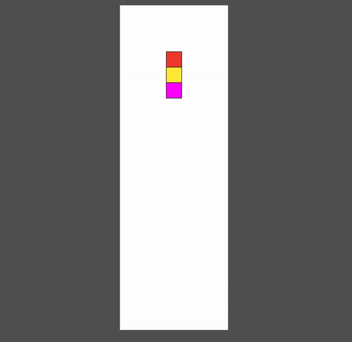

== Make it a pure game! The main changes.
I'm glad to see you in Game-n-Qwik Episode 03. I appreciate your patience! In the https://valor-software.com/articles/game-n-qwik-episode-02[past episode, window=_blank], I explained what steps we should pass before implementing actual gameplay. I want to highlight some critical steps we passed there.

1. Bootstrapping. Qwik. Tailwind. D3.
2. First scratches regarding gameplay.

Just to be sure that we are on the same page now, I'd like to recommend returning to the https://github.com/buchslava/qwik-columns/tree/step-3[source, window=_blank] of the last episode, running it, and reading the https://valor-software.com/articles/game-n-qwik-episode-02[explanation, window=_blank].

In a nutshell, we stopped at a simple example with a big white canvas and a red square that moves down. Also, the user can move it left and right via the keyboard. This example allows us to move forward. Please use https://github.com/buchslava/qwik-columns/tree/step-3[this source, window=_blank] if you want to pass all future steps manually. For my impatient audience, I'd like to provide the https://github.com/buchslava/qwik-columns/tree/step-2[final version of this episode's code, window=_blank].

Let's move forward. Our aim, for now, is to provide the game's basic functionality. Traditionally, I'll give the code before and comment afterward.

=== The Screen Management
First, let's change #src/components/game-play/utils.ts# to...

[, js]
----
import type { Signal } from "@builder.io/qwik";
import type { MainStore } from "./game";

export function setSvgDimension(
  svgRef: Signal<Element | undefined>,
  store: MainStore
) {
  if (svgRef?.value) {
    const { height } = svgRef.value.getBoundingClientRect();
    const rows = store.game.board.length;
    const columns = store.game.board[0].length;

    const newHeight = (height * 5) / 6;
    const blockSize = newHeight / rows;
    const newWidth = blockSize * columns;

    store.width = newWidth;
    store.height = newHeight;
    store.blockSize = blockSize;
  }
}
----

In the last version of the game, board dimensions were equal to the root component's dimensions. In this case, we need to provide trickier logic.

* The height of the game's canvas should be 5/6 of the root height
[, js]
----
const newHeight = (height * 5) / 6;
----

* The width should relate to height and the horizontal number of the board's cells. That's why we must detect the cell size using the following formula.
[, js]
----
const blockSize = newHeight / rows;
----

One note regarding the board's grid. As I explained in Episode 01, the game is represented by a grid-based canvas. Of course, the main attributes of each grid are rows and columns numbers. You can look at the initial state of the grid https://t.ly/SVeCg[here, window=_blank].
[, js]
----
export const COLOR_WHITE = "#ffffff";

const w = COLOR_WHITE;
// .......
export const initData: ColumnsColor[][] = [
  [w, w, w, w, w, w, w],
  // .......
  [w, w, w, w, w, w, w],
];
----

According to the above information, we can calculate our columns and rows quantities using the following formulas.
[, js]
----
const columnsQty = initData[0].length;
const rowsQty = initData.length;
----

or 
[, js]
----
const columnsQty = board[0].length;
const rowsQty = board.length;
----

This is a https://t.ly/HjVPC[good example, window=_blank].

* And calculate the width.
[, js]
----
const newWidth = blockSize * columns;
----

* And finally, we can update the Qwik store. I'll focus on it a bit later.
[, js]
----
store.width = newWidth;
store.height = newHeight;
store.blockSize = blockSize;
----

That's it for #setSvgDimension#.

The most important and complicated part of the game is https://github.com/buchslava/qwik-columns/blob/step-2/src/components/game-play/game-logic.ts[this one, window=_blank]. I'll break my tradition and ask you to put this file as it is to #src/components/game-play# without the source code provided. Also, I want to explain only some of the code because the all-code explanation will be too dull. You can dig into this outside this alone. The reason is quite simple. This file contains all of the logic details. Despite that, I'll provide you with all exported functions and explain what they do because they are used in our Qwik part.

=== The Phase
One of the basic definitions regarding gameplay is a https://t.ly/286Rg[Phase, window=_blank]. The thing is that each game is a process that has one state per time. The following enum describes all possible states of our Columns. Please, read carefully the comments in the code below.
[, js]
----
export enum Phase {
  INACTIVE, // Has not started or stopped
  PAUSED, // On pause
  MOVING, // An actor moves down
  MATCH_REQUEST, // Checking process, see Episode 01
  COLLAPSE_REQUEST, // Calls collapsing process after checking, see Episode 01
}
----

=== The Actor
The second important definition is regarding the https://t.ly/OoAbI[Actor, window=_blank]. Please, read carefully the comments in the code below.

[, js]
----
export interface Actor {
  state: ColumnsColor[]; // The actor's state is represented by 3 colored cells
  column: number; // Actor's horizontal position
  row: number; // Actor's vertical position
}
----

=== The Main Definition
The third and most important definition is the https://t.ly/eGN3l[Game, window=_blank]. The following interface describes all information about our Columns. Please, read carefully the comments in the code below.

[, js]
----
export interface Game {
  board: ColumnsColor[][]; // Current board state as a two-dimensional array (horizontal x vertical)
  actor: Actor; // The actor; described above
  phase: Phase; // Current phase; described above
  nextActor: ColumnsColor[]; // We also need to display the next actor that's why we define it here
  score: number; // Current score as a number
}
----

=== Exports
I'd like to recommend you refresh your knowledge about the gameplay before you browse the following table. Please, look through Episode 01.

The following calculations as a set of functions are directly related to the https://github.com/buchslava/qwik-columns/blob/step-2/src/components/game-play/game-logic.ts[gameplay, window=_blank].

[.turbo-table]
|===
|The name of the function	|Purpose	
|https://t.ly/EOl-r[matching, window=_blank]|Conducts checking process
|https://t.ly/T5nZo[collapse, window=_blank] | Conducts collapsing process
|https://t.ly/JqYIQ[isNextMovePossible, window=_blank] | Answers, if the next actor's moving down possible?
|https://t.ly/GaI6u[endActorSession, window=_blank] | Finalizes current actor's moving down if it's impossible due to `isNextMovePossible` above
|https://t.ly/dEEN3[isFinish, window=_blank] | Checks, is the game finished?
|https://t.ly/o5sJD[swapActorColors, window=_blank] | Swaps colors in the actor
|https://t.ly/QOOu9[init, window=_blank] | Init a new game; resets a state of the game.
|https://t.ly/n6DYK[isActorEmpty, window=_blank] | Answers is the actor empty?
|https://t.ly/Ay-vY[isNextActorInit, window=_blank] | Answers, is the next actor colored?
|https://t.ly/i8IkO[randomColors, window=_blank] | Provides an array of random colors
|https://t.ly/-WCFn[doNextActor, window=_blank] | Bumps the new actor's state due to the next one and init the new next state after that.
|https://t.ly/cblmE[actorDown, window=_blank] | Moves the actor down
|https://t.ly/cGCDj[moveLeft, window=_blank] | Moves the actor one cell left
|https://t.ly/JNkg3[moveLeftTo, window=_blank] | Moves the actor N cells left
|https://t.ly/WqtsN[moveRight, window=_blank] | Moves the actor one cell right
|https://t.ly/Q9Xbj[moveRightTo, window=_blank] | Moves the actor N cells right
|===

Please, don’t be scared by the list above. We will use all these functions, and I'll describe how exactly.

And now, I'm happy to give you the most exciting part of the code when we gather all previous knowledge: I've grouped all of them into the following features.

1. The store.
2. Gameplay utilization functions.
3. The heart of the game.

All our future activities will be around https://github.com/buchslava/qwik-columns/blob/step-3/src/components/game-play/game.tsx[the source of the game 1, window=_blank]. The related destination is placed in https://github.com/buchslava/qwik-columns/blob/step-2/src/components/game-play/game.tsx[the source of the game 2, window=_blank]. All my future reasonings will reveal the source of the game transformation from state 1 to 2.

Let's get started!

=== The store

Let's focus on the https://t.ly/-AXUp[store definition, window=_blank].

[, js]
----
export interface MainStore {
  // Canvas width
  width: number;
  // Canvas height
  height: number;
  // We should keep the current state of the game. See "The Main Definition" above.
  game: Game;
  // We need to keep the size of the cell because if relates to the screen size
  blockSize: number;
  // The following field is an indicator of the finished game. I'll focus on it a bit later.
  gameOverPopup: boolean;
}
----
And now, we are ready for the https://t.ly/WWtKJ[store initialization, window=_blank]. I hope it helps you ultimately understand the declarative part of the game.

[, js]
----
const store = useStore<MainStore>({
  // Initially, we don't know about the screen dimensions
  width: 0,
  height: 0,
  // The initial state of the game
  game: {
    // The current board should be a clone of initData
    board: [...initData],
    actor: {
      // The current actor should be a clone of initActor
      state: [...initActor],
      // start actor's column (horizontal position) should be ±at the middle of the canvas
      column: Math.floor(initData[0].length / 2),
      // start actor's row (vertical position) should be outside the canvas
      row: -2,
    },
    // Let's set Phase.MOVING
    phase: Phase.MOVING,
    // Set "nextActor" as a randomly generated
    nextActor: randomColors(3),
    score: 0,
  },
  // Initially, we don't know about the screen dimensions that's why blockSize = 0
  blockSize: 0,
  // The game is not over yet
  gameOverPopup: false,
});
----

=== Gameplay utilization functions
Let me introduce you to the "workhorse" of the game. The feature is that all UI stuff here is encapsulated in one function. Please, look at the https://t.ly/dv37z[render, window=_blank] function and read carefully the comments there.

[, code]
----
export function render(
  game: Game, // pass the state of the game; I'll focus on it a bit later
  svgRef: Signal<Element | undefined>, // we also need the SVG representation
  width: number, // tha shapes; see also "setSvgDimension"
  height: number,
  blockSize: number
) {
  if (!svgRef.value) {
    return;
  }

  // Associate our SVG with D3; read also, https://github.com/d3/d3-selection
  const svg = d3.select(svgRef.value);
  // Remove all existing content from the SVG if it present.
  // The reason is that all render calls should fully refresh the screen
  svg.selectAll("*").remove();
  // Append the root SVG element
  svg
    .append("svg")
    .attr("width", width)
    .attr("height", height)
    .append("g")
    .attr("transform", "translate(0,0)");
  // Draw a white rectangle over ALL canvas
  svg
    .append("g")
    .append("rect")
    .attr("x", 0)
    .attr("width", width)
    .attr("y", 0)
    .attr("height", height)
    // @ts-ignore
    .attr("fill", () => d3.color(COLOR_WHITE));

  // Prepare board cells data by the game state (board).
  // The data is represented by an array of objects.
  // Each object contains
  // x (horizontal coordinate of the cell),
  // y (vertical coordinate of the cell)
  // value - cell's color
  const data = [];
  for (let i = 0, x = 0, y = 0; i < game.board.length; i++) {
    x = 0;
    for (let j = 0; j < game.board[i].length; j++) {
      data.push({ x, y, value: game.board[i][j] });
      x += blockSize;
    }
    y += blockSize;
  }

  // Draw the current board
  svg
    .selectAll()
    // Data binding allows us to draw each cell of the board
    // It's a kind of declarative loop.
    .data(data.filter((d) => d.value !== COLOR_WHITE))
    .enter()
    .append("g")
    .append("rect")
    // x is taken from the data; see data preparation above
    .attr("x", (d) => d.x)
    .attr("width", blockSize)
    // y is taken from the data; see data preparation above
    .attr("y", (d) => d.y)
    .attr("height", blockSize)
    // color/value is taken from the data; see data preparation above
    // it represented by a hex value as a string and finally
    // it should be transformed to the D3 compatible color: "d3.color(d.value)"
    // @ts-ignore
    .attr("fill", (d) => d3.color(d.value))
    .attr("stroke", "#000000")
    .attr("stroke-width", 1);

  // We need to draw an actor only the actor should be moving (Phase.MOVING)
  if (game.phase === Phase.MOVING) {
    // Actor data preparation
    const actorData = [];
    for (let i = 0; i < game.actor.state.length; i++) {
      actorData.push({
        x: game.actor.column * blockSize,
        y: (game.actor.row + i - 1) * blockSize,
        value: game.actor.state[i],
      });
    }

    // Draw the actor according to the data above
    // similarly to "Draw the current board" above
    svg
      .selectAll()
      .data(actorData)
      .enter()
      .append("g")
      .append("rect")
      .attr("class", "could-fly")
      .attr("x", (d) => d.x)
      .attr("width", blockSize)
      .attr("y", (d) => d.y)
      .attr("height", blockSize)
      // @ts-ignore
      .attr("fill", (d) => d3.color(d.value))
      .attr("stroke", "#000000")
      .attr("stroke-width", 1);
  }
}
----

The following https://t.ly/uevbF[functions, window=_blank] are responsible for the user's actions.

[, code]
----
//  Just call the render
const reRender = $(() => {
  render(store.game, svgRef, store.width, store.height, store.blockSize);
});
// Move left action handler
const doLeft = $(() => {
  // if the actor is moving then call "moveLeft" (see Exports above) and re-render
  if (store.game.phase === Phase.MOVING) {
    moveLeft(store.game);
    reRender();
  }
});
// Move right action handler
const doRight = $(() => {
  // if the actor is moving then call "moveRight" (see Exports above) and re-render
  if (store.game.phase === Phase.MOVING) {
    moveRight(store.game);
    reRender();
  }
});
// Swap colors in the actor action handler
const doSwap = $(() => {
  if (store.game.phase === Phase.MOVING) {
    // if the actor is moving then call "swapActorColors" (see Exports above) and re-render
    swapActorColors(store.game);
    reRender();
  }
});
----

#An important note regarding Qwik#
I suppose you just noticed that the functions above are wrapped by #$()#. It could look weird for a non-Qwik guy. I want to explain the reason for #$()# usage because it's essential if you want to understand the most essential part of Qwik.

Let's remove #$()# from, say, #reRender# and run the app... We will see the error below.

[, code]
----
const reRender = () => {
  render(store.game, svgRef, store.width, store.height, store.blockSize);
};
----

[, code]
----
Captured variable in the closure can not be serialized because it's a function named "reRender". You might need to convert it to a QRL using $(fn):

const reRender = $(()=>{

        render(store.game, svgRef, store.width, store.height, store.blockSize);
    });

Please check out https://qwik.builder.io/docs/advanced/qrl/ for more information.
----

If we refactor the function above the following way

[, code]
----
function reRender() {
  render(store.game, svgRef, store.width, store.height, store.blockSize);
}
----
then we also get an error.
[, code]
----
Seems like you are referencing "reRender" inside a different scope ($), when this happens, Qwik needs to serialize the value, however it is a function, which is not serializable.
Did you mean to wrap it in `$()`?

The cause of the errors above is Qwik architecture. The fact is that Qwik is uniquely focused on performance, and I'd like to recommend that you dig into the QRL idea.

QRL (Qwik URL) is a particular form of URL that Qwik uses to lazy load content.
----

In this context, I recommend you read the following brief but eloquent explanations of Qwik fundamentals.

* https://qwik.builder.io/docs/advanced/qrl/[QRL, window=_blank]
* https://qwik.builder.io/docs/advanced/dollar/[The dollar $ sign, window=_blank]

In short, we must wrap our functions by #$()# to make them Qwik-friendly!

=== The heart of the game.
Let's dig into the heart of the game. I used a heart as allegory because our game looks like a living thing. In our case, we are talking about a 700-millisecond interval that keeps the gameplay. I intentionally don't want to write comments in the code because it does not need extra explanations. Just read and https://t.ly/ObL4-[enjoy it, window=_blank]!

[, code]
----
useVisibleTask$(({ cleanup }: { cleanup: Function }) => {
  setSvgDimension(containerRef, store);
  const intervalId = setInterval(() => {
    const game = store.game;

    if (game.phase === Phase.MOVING) {
      if (isNextMovePossible(game)) {
        actorDown(game);
      } else {
        endActorSession(game);
        if (isFinish(game)) {
          game.phase = Phase.INACTIVE;
          store.gameOverPopup = true;
        } else {
          game.phase = Phase.MATCH_REQUEST;
        }
      }
    } else if (game.phase === Phase.MATCH_REQUEST) {
      const matched = matching(game, true);
      if (matched) {
        game.phase = Phase.COLLAPSE_REQUEST;
      } else {
        doNextActor(game);
        game.phase = Phase.MOVING;
      }
    } else if (game.phase === Phase.COLLAPSE_REQUEST) {
      collapse(game);
      game.phase = Phase.MATCH_REQUEST;
    }

    reRender();
  }, 700);
  cleanup(() => clearInterval(intervalId));
});
----

And finally, there is a https://t.ly/54Rii[small stitch, window=_blank] regarding the finished game criteria.

[, code]
----
useTask$(({ track }: { track: Function }) => {
  track(() => store.gameOverPopup);

  if (store.gameOverPopup) {
    console.log("Game Over!");
  }
});
----

We need to track the #gameOverPopup# field and inform the user. Please, don't worry about console.log. We will deal with it in the next episode.

[.small-img]

=== What's next?

I hope this episode was exciting despite its size ;) Feel free to read and run the https://github.com/buchslava/qwik-columns/tree/step-2[related solution, window=_blank].

Are you worrying about the situations when you decide about the actor's colors and need to move the actor somehow immediately to the bottom of the board? What about controls like "Start," "Stop," and "Pause"? What about the score and the speed of the actor's movement?

I'm going to reveal these points in the next episode. Stay in touch!