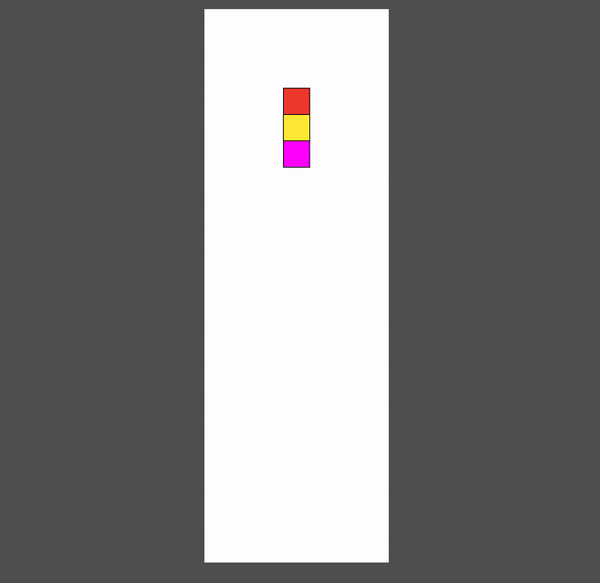
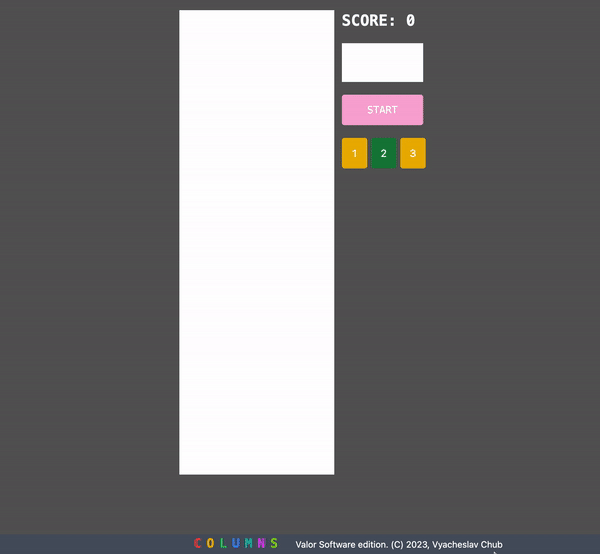
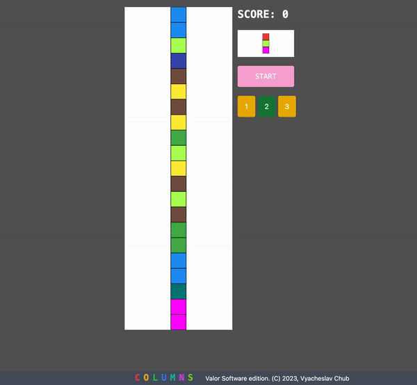
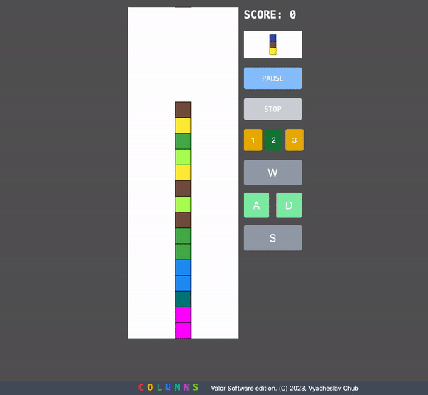
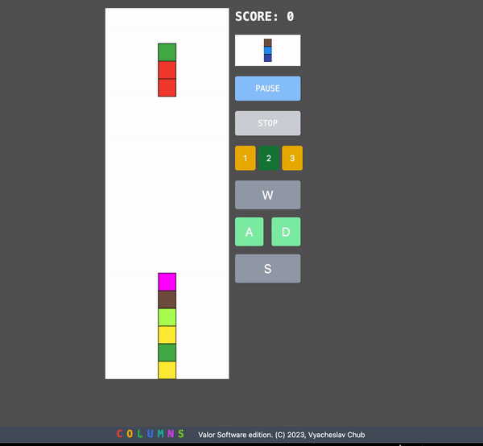
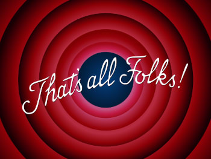

== The Final Stitches.
Congratulations! We are in the final stretch! Let's summarize our previous points.

1. In https://valor-software.com/articles/game-n-qwik-episode-01[Episode 01, window=_blank], I introduced you to the Columns Game history and concept.
2. https://valor-software.com/articles/game-n-qwik-episode-02[Episode 02, window=_blank] is devoted to initial technical points like Bootstrapping, Libraries, and gameplay's first steps.
3. https://valor-software.com/articles/game-n-qwik-episode-03[Episode 03, window=_blank] is the most complicated and exciting. In this episode, we passed all the mandatory steps to get the natural Qwik Columns gameplay.

[.small-img]

Despite the above, our current solution still needs to be finished for the reasons below.

1. A player can set the game on pause.
2. Move the actor somehow immediately to the bottom of the board. This feature is essential because, in many cases, a player has decided on the final actor's color combination, and the player wants to drop it to the bottom immediately. Moreover, the dropping above is preferable to be animated.
3. Provide visual controls "Start," "Stop," and "Pause" as a set of buttons.
4. Provide different customized speeds for the moving actor, like "Slow," "Normal," and "Fast," with related score calculation. Slow speed gives us less score; Fast pace gives us more.
5. Visual end of the game. Currently, we have only "console.log" when the game has finished.
6. UI footer, preferably UI responsive.
Traditionally I'll explain all my modifications step by step. My impatient readers can read and run the final working https://github.com/buchslava/qwik-columns/tree/final-devto-edition[solution, window=_blank].

If you want to trace future steps with me, please use https://github.com/buchslava/qwik-columns/tree/step-1[the destination code from the previous episode, window=_blank].

Let's get started!

=== Gameplay changes

First, let's deal with https://github.com/buchslava/qwik-columns/blob/final-devto-edition/src/components/game-play/game-logic.ts[src/components/game-play/game-logic.ts, window=_blank]. Please, read my comments in the code!

Pay attention to the new https://t.ly/0h3Zo[Phase, window=_blank]

[, code]
----
export enum Phase {
  INACTIVE,
  // Pause is ON
  PAUSED,
  MOVING,
  // Drop is requested
  DROP,
  // Drop action is under progress
  FLYING,
  MATCH_REQUEST,
  COLLAPSE_REQUEST,
}
----

and change the main game definition.

[, code]
----
export interface Game {
  board: ColumnsColor[][];
  actor: Actor;
  phase: Phase;
  // we need to save our current phase before pause
  savedPhase: Phase;
  nextActor: ColumnsColor[];
  score: number;
  // this is a key/value-based score descriptors
  // key describes type of speed, Slow, Normal, Fast
  // value is a related score extent
  scores: { [key: string]: number };
}
----

Pass current speed (Level) to https://t.ly/shR-j[matching function, window=_blank]. It's needed for score calculation.

[, code]
----
export function matching(
  game: Game,
  // new parameter
  level: Level,
  mark: boolean,
  customBoard?: ColumnsColor[][]
) {
  // ...
  function checkCollapsed(match: boolean[][], mark: boolean): boolean {
    let result = false;
    for (let row = 0; row < rowsQty; row++) {
      for (let col = 0; col < columnsQty; col++) {
        if (match[row][col]) {
          if (mark) {
            board[row][col] = colorsToDisappearHash[board[row][col]];
            // calculate the score according to the level
            game.score += game.scores[level];
          }
          result = true;
        }
      }
    }
    return result;
  }

  // ...
  return checkCollapsed(match, mark);
}
----

https://t.ly/5EsED[isFinish, window=_blank] should also know about the #level#

[, code]
----
export function isFinish(game: Game, level: Level): boolean {
  // ...
  if (matching(game, level, false, getNextBoard())) {
    return false;
  }
  // ...
}
----

Add https://t.ly/1_Ko4[pause, window=_blank] implementation.

[, code]
----
export function pause(game: Game) {
  if (game.phase === Phase.PAUSED) {
    game.phase = game.savedPhase;
  } else {
    game.savedPhase = game.phase;
    game.phase = Phase.PAUSED;
  }
}
----

That's it regarding the gameplay definitions. It's time to focus on https://github.com/buchslava/qwik-columns/blob/final-devto-edition/src/components/game-play/game.tsx[src/components/game-play/game.tsx, window=_blank]

There are the expected definitions.

[, code]
----
// Levels definitions
export enum Level {
  SLOW = "SLOW",
  NORMAL = "NORMAL",
  FAST = "FAST",
}
// Connects levels with the interval speeds in milliseconds
export const SPEEDS = {
  [Level.SLOW]: 1000,
  [Level.NORMAL]: 500,
  [Level.FAST]: 200,
};
// Connects levels with the scores
export const SCORES = {
  [Level.SLOW]: 1,
  [Level.NORMAL]: 2,
  [Level.FAST]: 3,
};
----

Please, look at the following https://t.ly/C1JUS[fragment of code, window=_blank]. We need to draw the actor also if the phase is #PAUSED# and #DROP#.

There are the following changes in the https://t.ly/QuEWP[store, window=_blank]

[, code]
----
export interface MainStore {
  width: number;
  height: number;
  game: Game;
  blockSize: number;
  // Add the level
  level: Level;
  // We need to control intervalId (start, stop).
  // It's important in the context of Controls (see above).
  intervalId: any | null;
  gameOverPopup: boolean;
}
----

and related changed for the initial state.

[, code]
----
const store = useStore<MainStore>({
  width: 0,
  height: 0,
  game: {
    board: [...initData],
    actor: {
      state: [...initActor],
      column: Math.floor(initData[0].length / 2),
      row: -2,
    },
    // Start from INACTIVE instead MOVING.
    // Now the game is inactive and the user should press Play button.
    phase: Phase.INACTIVE,
    // add this one...
    savedPhase: Phase.INACTIVE,
    nextActor: randomColors(3),
    score: 0,
    scores: SCORES,
  },
  blockSize: 0,
  // initial level will be NORMAL
  level: Level.NORMAL,
  // add this one...
  intervalId: null,
  gameOverPopup: false,
});
----

=== An important note regarding Qwik!
At this point, I'd like to interrupt my telling and share one tricky Qwik feature with you. The following information has been taken from the official Qwik documentation.

According to https://t.ly/JFZ6I[Qwik Deep Objects, window=_blank]

[, code]
----
export const MyComp = component$(() => {
  const store = useStore({
    person: { first: null, last: null },
    location: null,
  });

  store.location = { street: "main st" };

  return (
    <section>
      

        {store.person.last}, {store.person.first}
      

      
{store.location.street}

    </section>
  );
});
----

In the above examples, Qwik will automatically wrap child objects person and location into a proxy and correctly create subscriptions on all deep properties.

The wrapping behavior described above has one surprising side-effect. Writing and reading from a proxy auto wraps the object, which means that the identity of the object changes. This should normally not be an issue, but it is something that the developer should keep in mind.

[, code]
----
export const MyComp = component$(() => {
  const store = useStore({ person: null });
  const person = { first: "John", last: "Smith" };
  store.person = person; // store.person auto wraps object into proxy

  if (store.person !== person) {
    // The consequence of auto wrapping is that the object identity changes.
    console.log("store auto-wrapped person into a proxy");
  }
});
----

Let's continue and move all core logic to a separate https://t.ly/-JXhE[moveTick function, window=_blank]. Please, read my comments there. Uncommented logic is the same as in the previous episode.

[, code]
----
// Create a separate function
const moveTick = $(() => {
  const game = store.game;

  // Do nothing if the actor is under dropping, I'll explain it below.
  if (game.phase === Phase.FLYING) {
    return;
  }

  if (game.phase === Phase.MOVING) {
    if (isNextMovePossible(game)) {
      actorDown(game);
    } else {
      endActorSession(game);
      // Pass the level.
      if (isFinish(game, store.level)) {
        game.phase = Phase.INACTIVE;
        store.gameOverPopup = true;
      } else {
        game.phase = Phase.MATCH_REQUEST;
      }
    }
    // If the current phase is DROP.
  } else if (game.phase === Phase.DROP) {
    // We actually don't need to change the current state of the game
    // that's why we create a clone of the game
    const gameClone = clone(game);

    // Calculate how many steps should be passed to reach the bottom.
    let steps = 0;
    // Iterate until the next move is possible.
    while (isNextMovePossible(gameClone)) {
      // Move the actor (on the cloned game) one step down.
      actorDown(gameClone);
      // Increase the steps counter
      steps++;
    }
    // Pass the related steps to the "render" function.
    // It causes the DROP animation running. I'll explain it a bit later.
    reRender(steps);
    return;
  } else if (game.phase === Phase.MATCH_REQUEST) {
    // Pass the level
    const matched = matching(game, store.level, true);
    if (matched) {
      game.phase = Phase.COLLAPSE_REQUEST;
    } else {
      doNextActor(game);
      game.phase = Phase.MOVING;
    }
  } else if (game.phase === Phase.COLLAPSE_REQUEST) {
    collapse(game);
    game.phase = Phase.MATCH_REQUEST;
  }

  reRender();
});
----

Add https://t.ly/9tYvP[doDrop, window=_blank] function

[, code]
----
  const doDrop = $(() => {
    if (store.game.phase === Phase.MOVING) {
      store.game.phase = Phase.DROP;
    }
  });
----

and add the related keys binding

[, code]
----
  useOnDocument(
    "keypress",
    $((event) => {
      const keyEvent = event as KeyboardEvent;
      const { phase } = store.game;
      if (phase !== Phase.MOVING) {
        return;
      }
      if (keyEvent.code === "KeyA") {
      // ...
      } else if (keyEvent.code === "KeyS" || keyEvent.code === "Space") {
        doDrop();
      } 
      // ...
    })
  );
----

Attention! The part below is the most tricky here. Please, read my comments in the code carefully!

It's time to focus on modifications in https://t.ly/erc7E[reRender, window=_blank] and https://t.ly/2BaRQ[render, window=_blank] functions.

[, code]
----
// Just added steps as an optional parameter.
const reRender = $((steps?: number) => {
  render(store.game, svgRef, store.width, store.height, store.blockSize, steps);
});
----

[, code]
----
export function render(
  game: Game,
  svgRef: Signal<Element | undefined>,
  width: number,
  height: number,
  blockSize: number,
  // New parameter
  passThroughSteps?: number
) {
  // ...
  // Also, render the actor if the current phase is PAUSED or DROP
  if (
    game.phase === Phase.MOVING ||
    game.phase === Phase.PAUSED ||
    game.phase === Phase.DROP
  ) {
    // ...
    svg
      .selectAll()
      .data(actorData)
      .enter()
      .append("g")
      .append("rect")
      // All shapes related to the actor should have "could-fly" class.
      // This class is a fake one and we use it for future animation
      .attr("class", "could-fly")
      // ...
      .attr("stroke-width", 1);

    // We need to run "flying" process if passThroughSteps is existing
    if (passThroughSteps) {
      // Set the phase.
      // Now "flying process" will be simultaneous with the current interval,
      // but the current interval's handler will ignore any activity;
      // see the code under the following comment: "if the current phase is DROP"
      game.phase = Phase.FLYING;

      // This is a good example of D3 animation.
      svg
        // We need to select all shapes includes "could-fly" fake class (the whole actor)
        .selectAll(".could-fly")
        // Run animation.
        // Pay attention! This process is asynchronous!
        .transition()
        // with 700ms duration
        .duration(700)
        // This aim of animation is moving the current actor
        // to the Y-axis destination that equals
        // current actor's Y + passThroughSteps * blockSize.
        .attr("y", (d: any) => d.y + passThroughSteps * blockSize)
        // don't mix with on('end', ...); it doesn't work in this case (D3 feature)
        .end()
        .then(() => {
          // change the state of the game
          // when asynchronous animation process has been finished
          // move the actor down passThroughSteps for the current game
          actorDown(game, passThroughSteps);
          // let's move!
          game.phase = Phase.MOVING;
        });
    }
  }
}
----

Let's briefly repeat the #DROP animation# concept.

1. If the #DROP# action happens, we need to calculate how many steps the actor should fly (animation distance) to reach the bottom.
2. Set the current phase to #FLYING#.
3. Run animation when #Y axis destination (vertical)# of the actor equals #current actor's Y + passThroughSteps * blockSize#
4. Wait for the end of the animation and move the actor down #passThroughSteps#
5. Set the phase back to #MOVING#
That's it about DROP.

https://t.ly/aTel-[useVisibleTask$, window=_blank] became much simpler because we moved all of the logic there to #moveTick function# above!

[, code]
----
useVisibleTask$(({ cleanup }: { cleanup: Function }) => {
  setSvgDimension(containerRef, store);
  // create the interval an save it in the store
  // because we should be able to control this interval outside useVisibleTask$
  // SPEEDS[store.level] describes the current game speed by the level
  store.intervalId = setInterval(moveTick, SPEEDS[store.level]);
  cleanup(() => clearInterval(store.intervalId));
});
----

Some notes regarding https://t.ly/aAV2a[the end, window=_blank] of the game.

[, code]
----
useTask$(({ track }: { track: Function }) => {
  track(() => store.gameOverPopup);

  // track gameOverPopup, if it fires then hide it (the related popup) after 5 seconds
  if (store.gameOverPopup) {
    setTimeout(() => {
      store.gameOverPopup = false;
    }, 5000);
  }
});
----

Please, also, look at the related UI part of the code. The HTML block appears only if #store.gameOverPopup# is true. I guess, React guys should be familiar with this technique.

[, code]
----
{
  store.gameOverPopup && (
    

      GAME OVER
    

  );
}
----

The time finally came, and I'm glad to provide https://t.ly/3dF3a[the way, window=_blank] how to use #Controls# components. Don't worry. I'll focus on the component's details a bit later.

[, code]
----
<Controls
  game={store.game}
  blockSize={15}
  level={store.level}
  onStart$={() => {
    // start the game
    init(store.game);
    store.gameOverPopup = false;
    store.game.phase = Phase.MOVING;
  }}
  onPause$={() => {
    // pause the game
    pause(store.game);
  }}
  onStop$={() => {
    // stop the game
    store.game.phase = Phase.INACTIVE;
    store.gameOverPopup = true;
  }}
  // and also pass other activities
  onLeft$={doLeft}
  onRight$={doRight}
  onSwap$={doSwap}
  onDrop$={doDrop}
  // including the level switching
  onLevel$={(level: Level) => {
    // update the level
    store.level = level;
    // clear the current interval if it's exists
    if (store.intervalId !== null) {
      clearInterval(store.intervalId);
    }
    // re-create the interval
    store.intervalId = setInterval(moveTick, SPEEDS[store.level]);
  }}
/>
----

Here is https://github.com/buchslava/qwik-columns/blob/final-devto-edition/src/components/game-play/controls.tsx[Controls, window=_blank] component.

[, code]
----
import type { PropFunction, Signal } from "@builder.io/qwik";
import { useSignal } from "@builder.io/qwik";
import { component$ } from "@builder.io/qwik";
import * as d3 from "d3";
import type { Game } from "./game-logic";
import { Phase } from "./game-logic";
import { Level } from "./game";

interface ControlsProps {
  game: Game;
  onStart$: PropFunction<() => void>;
  onPause$: PropFunction<() => void>;
  onStop$: PropFunction<() => void>;
  onLeft$: PropFunction<() => void>;
  onRight$: PropFunction<() => void>;
  onSwap$: PropFunction<() => void>;
  onDrop$: PropFunction<() => void>;
  onLevel$: PropFunction<(level: Level) => void>;
  blockSize: number;
  level: Level;
}

// This function is responsible for the "next actor" rendering
export function renderNextActor(
  data: string[],
  size: number,
  svgRef: Signal<Element | undefined>
) {
  // this logic is similar to the logic from
  // https://github.com/buchslava/qwik-columns/blob/final-devto-edition/src/components/game-play/game.tsx#L56
  if (!svgRef.value) {
    return;
  }
  const svg = d3.select(svgRef.value);

  svg.selectAll("*").remove();

  svg
    .append("svg")
    .attr("width", size)
    .attr("height", size * data.length)
    .append("g")
    .attr("transform", "translate(0,0)");

  const displayData = data.map((d, i) => ({
    value: d,
    y: i * size,
    size,
  }));

  svg
    .selectAll()
    .data(displayData)
    .enter()
    .append("g")
    .append("rect")
    .attr("x", 0)
    .attr("width", (d) => d.size)
    .attr("y", (d) => d.y)
    .attr("height", (d) => d.size)
    // @ts-ignore
    .attr("fill", (d) => d3.color(d.value))
    .attr("stroke", "#000000")
    .attr("stroke-width", 1);
}

export default component$<ControlsProps>(
  ({
    onStart$,
    onPause$,
    onStop$,
    onLeft$,
    onRight$,
    onSwap$,
    onDrop$,
    onLevel$,
    game,
    blockSize,
    level,
  }) => {
    const svgRef = useSignal<Element>();

    // run next actor rendering
    renderNextActor(game.nextActor, blockSize, svgRef);

    return (
      

        

          

            SCORE: {game.score}
          

          

            

              // this is a SVG for the next actor rendering
              <svg
                width={blockSize}
                height={blockSize * game.nextActor.length}
                ref={svgRef}
              />
            

          

          // We need to show "Start" button only if the phase is INACTIVE
          {game.phase === Phase.INACTIVE && (
            

              <button
                // use the passed (input property) function
                onClick$={onStart$}
                type="button"
                class="font-mono px-8 py-3 w-32 text-white bg-pink-300 rounded focus:outline-none"
              >
                START
              </button>
            

          )}
          // We need to show "Stop" and "Pause" button only if the phase is NOT
          INACTIVE
          {game.phase !== Phase.INACTIVE && (
            

              <button
                // use the passed (input property) function
                onClick$={onPause$}
                type="button"
                class="font-mono px-8 py-3 w-32 text-white bg-blue-300 rounded focus:outline-none"
              >
                {game.phase === Phase.PAUSED ? "GO" : "PAUSE"}
              </button>
            

          )}
          {game.phase !== Phase.INACTIVE && (
            

              <button
                // use the passed (input property) function
                onClick$={onStop$}
                type="button"
                class="font-mono px-8 py-3 w-32 text-white bg-gray-300 rounded focus:outline-none"
              >
                STOP
              </button>
            

          )}
        

        

          // 1-st Slow level
          <button
            onClick$={() => {
              // pass SLOW to the function in the parent component
              onLevel$(Level.SLOW);
            }}
            type="button"
            // we use dynamic class with Tailwind-based classes to highlight the current level
            class={[
              "w-10 py-3 text-white rounded focus:outline-none",
              level === Level.SLOW ? "bg-green-700" : "bg-yellow-500",
            ]}
            disabled={level === Level.SLOW}
          >
            1
          </button>
          // 2-nd Normal level
          <button
            onClick$={() => {
              // pass NORMAL to the function in the parent component
              onLevel$(Level.NORMAL);
            }}
            type="button"
            class={[
              "w-10 py-3 text-white rounded focus:outline-none",
              level === Level.NORMAL ? "bg-green-700" : "bg-yellow-500",
            ]}
            disabled={level === Level.NORMAL}
          >
            2
          </button>
          // 3-rd Fast level
          <button
            onClick$={() => {
              // pass FAST to the function in the parent component
              onLevel$(Level.FAST);
            }}
            type="button"
            class={[
              "w-10 py-3 text-white rounded focus:outline-none",
              level === Level.FAST ? "bg-green-700" : "bg-yellow-500",
            ]}
            disabled={level === Level.FAST}
          >
            3
          </button>
        

        // Display other control buttons if the phase is NOT INACTIVE
        {game.phase !== Phase.INACTIVE && (
          

            // Swap the actor colors (alternative "W" key)
            

              <button
                onClick$={onSwap$}
                type="button"
                class="text-2xl py-3 w-32 text-white bg-gray-400 rounded focus:outline-none"
              >
                W
              </button>
            

            // Move the actor left (alternative "A" key)
            

              <button
                onClick$={onLeft$}
                type="button"
                class="text-2xl mr-2 py-3 text-white bg-green-300 rounded focus:outline-none"
              >
                A
              </button>
              // Move the actor right (alternative "D" key)
              <button
                onClick$={onRight$}
                type="button"
                class="text-2xl ml-2 py-3 text-white bg-green-300 rounded focus:outline-none"
              >
                D
              </button>
            

            // Drop the actor (alternative "W" key)
            

              <button
                onClick$={onDrop$}
                type="button"
                class="text-2xl py-3 w-32 text-white bg-gray-400 rounded focus:outline-none"
              >
                S
              </button>
            

          

        )}
      

    );
  }
);
----

=== The Footer
Finally, lets make the last stitch. We need to set the https://t.ly/FuIn3[footer, window=_blank].

[, code]
----
return (
  

    {store.gameOverPopup && (
      

        GAME OVER
      

    )}
    

      <svg
        class="game-area"
        width={store.width}
        height={store.height}
        ref={svgRef}
      />
    

    <Controls
    // ...
    />
    <Footer />
  

);
----

Here the component's code.

[, code]
----
import { component$ } from "@builder.io/qwik";

export default component$(() => {
  // The year of copyright should be dynamic.
  const year = new Date().getFullYear();

  return (
    

      // see my comment below
      
        C
        O
        L
        U
        M
        N
        S
      
      
        <a
          href="https://valor-software.com/"
          class="no-underline hover:underline"
          target="_blank"
        >
          Valor Software
        </a>{" "}
        edition. (C) {year},{" "}
        <a
          href="https://dev.to/buchslava"
          class="no-underline hover:underline"
          target="_blank"
        >
          Vyacheslav Chub
        </a>
      
    

  );
});
----

Tailwind classes `hidden lg:inline' there means that we show "C O L U M N S" spans only on large screens. You can gain more knowledge on Tailwind Responsive Design https://tailwindcss.com/docs/responsive-design[here, window=_blank].

=== It's time to summarize our decisions!

#git clone git@github.com:buchslava/qwik-columns.git
cd qwik-columns
git checkout final-devto-edition
npm ci
npm start#

#Start the game. Switch the speed#

[.small-img]

#Core controls#

[.small-img]

#The end of the game#

[.small-img]

#The responsive footer#

[.small-img]

Enjoy the https://github.com/buchslava/qwik-columns/tree/final-devto-edition[source, window=_blank]
Enjoy the https://buchslava.github.io/qwik-columns/[game, window=_blank]

[.small-img]

==== PS: During the game implementation, I got pleasure every moment I faced https://qwik.builder.io/[Qwik, window=_blank] functionality and documentation. That's why I want to thank https://www.builder.io/Builder.io[Builder.io, window=_blank] for the perfect solution!