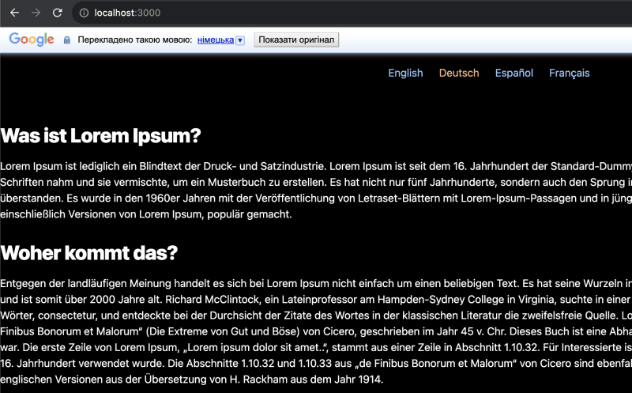
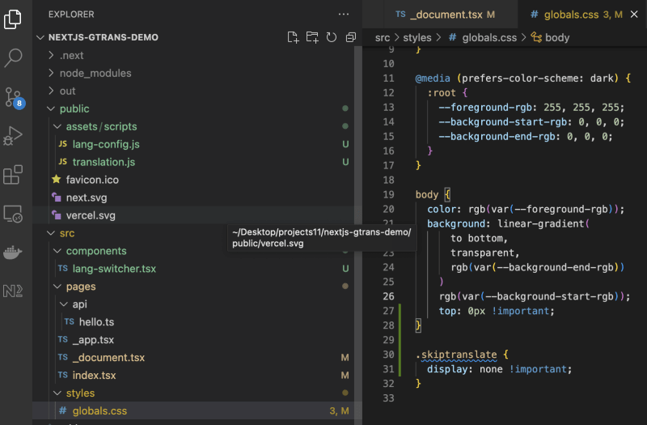
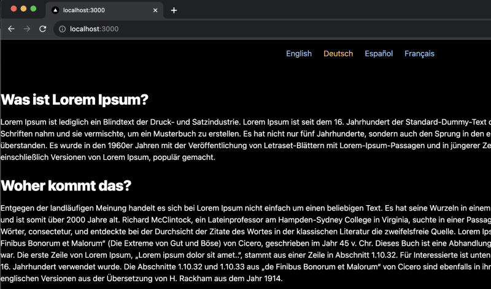
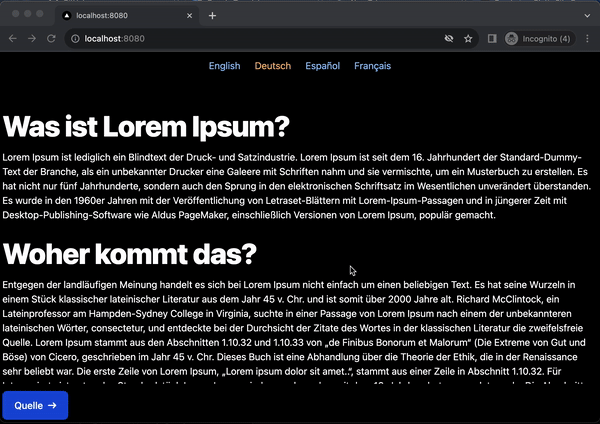

Traditionally, I'd like to start the article with the following. A few months ago, I faced a situation when my customer asked for a multi-language feature on a NextJS-based solution. The issue is that providing all local content with its vast volume and limited budget is impossible.

In other words, we have only one local version, say, English, and we need to translate it automatically to some others, say, Italian, Spanish, French, etc. But this isn't over. The future language switcher should be friendly with the current UI and 100% under the developer's control.

I started thinking and found that only https://stackoverflow.com/questions/12243818/adding-google-translate-to-a-web-site[one approach, window=_blank] was suitable. It doesn't require additional settings on the Google Console side and allows us to translate to any language without pain.

You can https://www.w3schools.com/howto/tryit.asp?filename=tryhow_google_translate[try the solution, window=_blank], by the way.

However, the following problems still need to be solved.

Not the fact that the solution above, as it is, matched with NextJS specific.
The standard dropdown component looks too generic and is not customizable as the customer requested.
I don't want to put my routine of the research process on your plate, but describe the final decision step by step. If you want to face with my final solution now, please look at https://github.com/buchslava/nextjs-gtrans-demo.

Let's get started with the explanation!

== Bootstrapping

Create a new NextJS project.

[, code]
----
npx create-next-app@latest
----

[, bash]
----
What is your project named? -> nextjs-gtrans-demo
Would you like to use TypeScript? -> Yes
Would you like to use ESLint? -> No
Would you like to use Tailwind CSS? -> Yes
Would you like to use `src/` directory? -> Yes
Would you like to use App Router? -> No
Would you like to customize the default import alias? -> No
----

Also, install one extra dependency.

[, code]
----
npm i nookies --save
----

Now we can run the app
[, code]
----
npm run dev
----

It's time to implement the solution into the app. Please don't worry if you don't find some expected components during placing the code. Future steps will resolve it.

=== The main part

Let's change content in https://github.com/buchslava/nextjs-gtrans-demo/blob/main/src/pages/index.tsx[src/pages/index.tsx, window=_blank]

[, code]
----
import { LanguageSwitcher } from "./lang-switcher";

export default function Home() {
  return (
    

      <header className="w-full pt-4">
        <LanguageSwitcher />
      </header>
      

        

        <article>
          <h2 className="mb-4 text-4xl font-extrabold leading-none tracking-tight text-gray-900 md:text-5xl lg:text-3xl dark:text-white">
            What is Lorem Ipsum?
          </h2>
          

            Lorem Ipsum is simply dummy text of the printing and typesetting
            industry....
          

        </article>
        // This is a part of the content. Please take the full version for the original solution!
      

      <footer>
        

          <a
            href="https://www.lipsum.com/"
            target="_blank"
            className="inline-flex items-center justify-center px-5 py-3 text-base font-medium text-center text-white bg-blue-700 rounded-lg hover:bg-blue-800 focus:ring-4 focus:ring-blue-300 dark:focus:ring-blue-900"
          >
            Source
            <svg
              className="w-3.5 h-3.5 ml-2"
              aria-hidden="true"
              xmlns="http://www.w3.org/2000/svg"
              fill="none"
              viewBox="0 0 14 10"
            >
              <path
                stroke="currentColor"
                stroke-linecap="round"
                stroke-linejoin="round"
                stroke-width="2"
                d="M1 5h12m0 0L9 1m4 4L9 9"
              />
            </svg>
          </a>
        

      </footer>
    

  );
}
----

I recommend temporarily forgetting the #LanguageSwitcher# component and focusing on the content mentioned above. The file contains three logical parts.

* The header includes the language switcher component (will be described later)
* The central part includes four paragraphs regarding #Lorem Ipsum# explanation
* The footer contains a button as a link to the source of the content

Let's change https://github.com/buchslava/nextjs-gtrans-demo/blob/main/src/pages/_document.tsx[src/pages/_document.tsx, window=_blank]

[, code]
----
import { Html, Head, Main, NextScript } from "next/document";
import Script from "next/script";

export default function Document() {
  return (
    <Html>
      <Head>
        <Script
          src="/assets/scripts/lang-config.js"
          strategy="beforeInteractive"
        />
        <Script
          src="/assets/scripts/translation.js"
          strategy="beforeInteractive"
        />
        <Script
          src="//translate.google.com/translate_a/element.js?cb=TranslateInit"
          strategy="afterInteractive"
        />
      </Head>
      <body>
        <Main />
        <NextScript />
      </body>
    </Html>
  );
}
----

The main difference between this file and the default one is a set of three scripts below.

* https://github.com/buchslava/nextjs-gtrans-demo/blob/main/public/assets/scripts/lang-config.js[public/assets/scripts/lang-config.js, window=_blank] contains custom languages settings
* https://github.com/buchslava/nextjs-gtrans-demo/blob/main/public/assets/scripts/translation.js[public/assets/scripts/translation.js, window=_blank] contains #TranslateInit# callback function definition that will be used as a parameter to the main translation script
* #//translate.google.com/translate_a/element.js?cb=TranslateInit# - the main translation script by Google. Pay attention on #cb=TranslateInit#. The callback function must be passed here.

=== The scripts
It's time to provide the code of the scripts mentioned above.

https://github.com/buchslava/nextjs-gtrans-demo/blob/main/public/assets/scripts/lang-config.js[public/assets/scripts/lang-config.js, window=_blank]

[, code]
----
window.__GOOGLE_TRANSLATION_CONFIG__ = {
  languages: [
    { title: "English", name: "en" },
    { title: "Deutsch", name: "de" },
    { title: "Español", name: "es" },
    { title: "Français", name: "fr" },
  ],
  defaultLanguage: "en",
};
----

In this example, we declared four languages to use.
https://github.com/buchslava/nextjs-gtrans-demo/blob/main/public/assets/scripts/translation.js[public/assets/scripts/translation.js, window=_blank]

[, code]
----
function TranslateInit() {
  if (!window.__GOOGLE_TRANSLATION_CONFIG__) {
    return;
  }
  new google.translate.TranslateElement({
    pageLanguage: window.__GOOGLE_TRANSLATION_CONFIG__.defaultLanguage,
  });
}
----

Here is a callback definition that includes #google.translate.TranslateElement# call. If we don't have the configuration, we pass it to Google's script nothing i.e. an empty callback. Otherwise, we call #google.translate.TranslateElement# and pass the original content language.

And it's finally time to provide and explain the most critical part of the solution. I'm talking about the #LanguageSwitcher# mentioned before.

=== The LanguageSwitcher component
https://github.com/buchslava/nextjs-gtrans-demo/blob/main/src/components/lang-switcher.tsx[src/components/lang-switcher.tsx, window=_blank]
Please, pay attention to the comments inside the code below.

[, code]
----
import { useEffect, useState } from "react";
import { parseCookies, setCookie } from "nookies";

// The following cookie name is important because it's Google-predefined for the translation engine purpose
const COOKIE_NAME = "googtrans";

// We should know a predefined nickname of a language and provide its title (the name for displaying)
interface LanguageDescriptor {
  name: string;
  title: string;
}

// The following definition describes typings for JS-based declarations in public/assets/scripts/lang-config.js
declare global {
  namespace globalThis {
    var __GOOGLE_TRANSLATION_CONFIG__: {
      languages: LanguageDescriptor[];
      defaultLanguage: string;
    };
  }
}

const LanguageSwitcher = () => {
  const [currentLanguage, setCurrentLanguage] = useState<string>();
  const [languageConfig, setLanguageConfig] = useState<any>();

  // When the component has initialized, we must activate the translation engine the following way.
  useEffect(() => {
    // 1. Read the cookie
    const cookies = parseCookies()
    const existingLanguageCookieValue = cookies[COOKIE_NAME];

    let languageValue;
    if (existingLanguageCookieValue) {
      // 2. If the cookie is defined, extract a language nickname from there.
      const sp = existingLanguageCookieValue.split("/");
      if (sp.length > 2) {
        languageValue = sp[2];
      }
    }
    // 3. If __GOOGLE_TRANSLATION_CONFIG__ is defined and we still not decided about languageValue, let's take a current language from the predefined defaultLanguage below.
    if (global.__GOOGLE_TRANSLATION_CONFIG__ && !languageValue) {
      languageValue = global.__GOOGLE_TRANSLATION_CONFIG__.defaultLanguage;
    }
    if (languageValue) {
      // 4. Set the current language if we have a related decision.
      setCurrentLanguage(languageValue);
    }
    // 5. Set the language config.
    if (global.__GOOGLE_TRANSLATION_CONFIG__) {
      setLanguageConfig(global.__GOOGLE_TRANSLATION_CONFIG__);
    }
  }, []);

  // Don't display anything if current language information is unavailable.
  if (!currentLanguage || !languageConfig) {
    return null;
  }

  // The following function switches the current language
  const switchLanguage = (lang: string) => () => {
    // We just need to set the related cookie and reload the page
    // "/auto/" prefix is Google's definition as far as a cookie name
    setCookie(null, COOKIE_NAME, "/auto/" + lang)
    window.location.reload();
  };

  return (
    

      {languageConfig.languages.map((ld: LanguageDescriptor, i: number) => (
        <>
          {currentLanguage === ld.name ||
          (currentLanguage === "auto" &&
            languageConfig.defaultLanguage === ld) ? (
            
              {ld.title}
            
          ) : (
            <a
              key={`l_s_${ld}`}
              onClick={switchLanguage(ld.name)}
              className="mx-3 text-blue-300 cursor-pointer hover:underline"
            >
              {ld.title}
            </a>
          )}
        </>
      ))}
    

  );
};

export { LanguageSwitcher, COOKIE_NAME };
----

Pay attention to #notranslate# class in the root div before. This is also Google's definition. It means that all of the content inside should not be translated. It's crucial because language titles should stay untouched, i.e., as they are.

=== Working principles
It's time to gather all the information above and explain how the solution works.

*The start point is placed in https://github.com/buchslava/nextjs-gtrans-demo/blob/main/src/pages/_document.tsx[src/pages/_document.tsx, window=_blank]*

[, code]
----
import { Html, Head, Main, NextScript } from "next/document";
import Script from "next/script";

export default function Document() {
  return (
    <Html>
      <Head>
        <Script
          src="/assets/scripts/lang-config.js"
          strategy="beforeInteractive"
        />
        <Script
          src="/assets/scripts/translation.js"
          strategy="beforeInteractive"
        />
        <Script
          src="//translate.google.com/translate_a/element.js?cb=TranslateInit"
          strategy="afterInteractive"
        />
      </Head>
      <body>
        <Main />
        <NextScript />
      </body>
    </Html>
  );
}
----

=== There are three scripts there

1. The first one contains language configuration
2. The second one contains a callback with the translation logic runner
3. Standard Google's script gets the callback described before and runs it.

Pay attention to the following facts.

* We use Script tag from #next/script# because of NextJS ;)
* We use #strategy="beforeInteractive"# for a couple of first scripts
* We use #strategy="afterInteractive"# for the last one

It's important. More information regarding the above you can find https://nextjs.org/docs/pages/building-your-application/optimizing/scripts[here, window=_blank]. Let me provide you some related theory.

*beforeInteractive: Load the script before any Next.js code and before any page hydration occurs.*

*afterInteractive: (default) Load the script early but after some hydration on the page occurs.*

=== What happens if the user presses a language on #LanguageSwitcher#?
It's very easy. When the user presses a new language link, say, for Spanish language, #switchLanguage# function described above sets #/auto/es# value for #googtrans# cookie. This is a message to the translation engine that Spain-translated content is expected. After that #switchLanguage# reloads the page, and we will see the Spanish content. Google Translate did this job!

That's it regarding the main flow. But let me focus on some additional important stuff.

=== Conclusion
Let's run the solution

[, code]
----
npm run dev
----

and switch the language, say, Deutsch. However, the issue is that the standard Google Translate bar is still on top.

[.img]

We definitely ought to fix it. Let's add a couple of the following changes to https://github.com/buchslava/nextjs-gtrans-demo/blob/main/src/styles/globals.css[src/styles/globals.css, window=_blank]

[.img]

Much better now!

[.img]

One of the tastiest features of NextJS is https://nextjs.org/docs/pages/building-your-application/rendering/static-site-generation[Static Site Generation (SSG), window=_blank]. Let's test SSG on this solution.

We need to add #ssg# script into #package.json#

[, code]
----
 "scripts": {
    "dev": "next dev",
    "build": "next build",
    "ssg": "next build && next export",
    "start": "next start",
    "lint": "next lint"
  },
----

Let's build a static version.

[, code]
----
npm run ssg

> nextjs-gtrans-demo@0.1.0 ssg
> next build && next export

 ✓ Linting and checking validity of types
 ✓ Creating an optimized production build
 ✓ Compiled successfully
 ✓ Collecting page data
 ✓ Generating static pages (3/3)
 ✓ Finalizing page optimization

Route (pages)                              Size     First Load JS
┌ ○ /                                      4.24 kB        82.1 kB
├   /_app                                  0 B            77.9 kB
├ ○ /404                                   181 B            78 kB
└ λ /api/hello                             0 B            77.9 kB
+ First Load JS shared by all              80.1 kB
  ├ chunks/framework-66d32731bdd20e83.js   45.2 kB
  ├ chunks/main-12e9c77dbbe57e7c.js        31.5 kB
  ├ chunks/pages/_app-3cfebadf4e2e7ae1.js  298 B
  ├ chunks/webpack-5c046346608af636.js     807 B
  └ css/24fee595fee43abd.css               2.29 kB

λ  (Server)  server-side renders at runtime (uses getInitialProps or getServerSideProps)
○  (Static)  automatically rendered as static HTML (uses no initial props)
...........
   Copying "public" directory
 ✓ Exporting (3/3)
Export successful. Files written to /Users/slava/Desktop/projects11/nextjs-gtrans-demo/out
----

You can find the static version in #out# folder.

Let's test it. If don't have #http-server# installed, please install it.

[, code]
----
npm i -g http-server
----

[, code]
----
cd ./out
http-server
----

[.img]

The final solution is https://github.com/buchslava/nextjs-gtrans-demo[here, window=_blank].

== May the Google Translate, NextJS, and Force be with you!