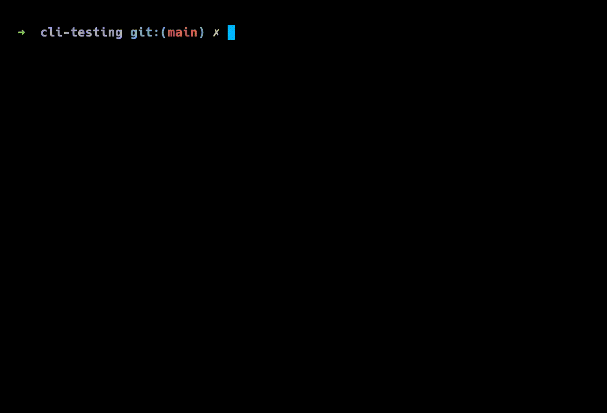

== Introduction 
Most of my articles describe stories from my routine software development. This particular article continues that pattern. Some time ago, I was given a task that forced me to think conceptually. Apart from that, the task contained some challenging aspects that I hadn't faced before. That's why I have decided to share my knowledge after completing the task.

There is a https://www.w3schools.com/whatis/whatis_cli.asp[CLI, window=_blank] application based on https://www.npmjs.com/package/inquirer[Inquirer, window=_blank]. Potentially, it could be another CLI library, say something from the https://byby.dev/node-command-line-libraries[following list, window=_blank]. Our goal is to provide integration tests. But before that, let's look at the related terminology.

According to https://katalon.com/resources-center/blog/integration-testing[Integration Testing, window=_blank]

* Integration testing is a type of software testing where components of the software are gradually integrated and then tested as a unified group. Usually, these components are already working well individually, but they may break when integrated with other components. With integration testing, testers want to find defects that surface due to code conflicts between software modules when they are integrated with each other.

I like integration testing because it's always about balance between something small and something big. https://mike-bland.com/2011/11/01/small-medium-large.html[Google terminology, window=_blank] defines it as 'medium' for a reason.

In short, we need to test the user's input from one hand simultaneously and the result of the input processing on the other.

The second question is quite the opposite. What we shouldn't test? We can answer it only considering the solution because our code is not a black box in the case of integration tests.

=== The original solution
https://github.com/buchslava/cli-testing/blob/main/original.ts[original.ts, window=_blank]

[, code]
----
import { prompt, Answers } from "inquirer";
import { writeFile } from "fs";

async function sleep(time: number) {
  return new Promise((resolve) => setTimeout(resolve, time));
}

prompt([
  {
    name: "name",
    type: "input",
    message: "What's your name?",
    validate: async function (input: string) {
      await sleep(1500);
      if (input === "wrong") {
        return "Incorrect user!";
      }
      return true;
    },
  },
  {
    name: "iceCream",
    type: "list",
    message: "Which is your favorite of the following ice cream flavors?",
    choices: ["Green tea", "Strawberry", "Blackberry", "Chile", "Vanilla"],
  },
  {
    name: "programmingLanguage",
    type: "list",
    message: "What programming language do you prefer?",
    choices: ["Basic", "Golang", "Javascript", "Cobol", "Java", "Rust", "C++"],
  },
]).then((answers: Answers) => {
  writeFile(
    `result-${new Date().toISOString()}.json`,
    JSON.stringify(answers, null, 2),
    (err) => {
      if (err) {
        console.log(err);
        return;
      }
      console.log("Done...");
    }
  );
});
----

I intentionally skipped some apparent technological aspects because it's off-topic. Despite that, I'll provide you with some mandatory thoughts and commands. First, you can find the solution https://github.com/buchslava/cli-testing[here, window=_blank].

Please download and #npm ci#, and #npm start# or #npm test# it.

Let's run and test the solution manually.

[, code]
----
➜  cli-testing git:(main) ✗ npm start

> cli-testing@1.0.0 start
> ts-node app.ts

? What's your name? Test name
? Which is your favorite of the following ice cream flavors? Blackberry
? What programming language do you prefer? Javascript
Done...
➜  cli-testing git:(main) ✗ ls
README.md                            eslintrc.js                          node_modules                         package.json
app.spec.ts                          jest.config.ts                       original.ts                          result-2023-12-19T11:02:52.815Z.json
app.ts                               lib.ts                               package-lock.json                    tsconfig.json
➜  cli-testing git:(main) ✗ cat result-2023-12-19T11:02:52.815Z.json
{
  "name": "Test name",
  "iceCream": "Blackberry",
  "programmingLanguage": "Javascript"
}
----

It proposes three questions, and after answering, it writes the answers into a separate file containing a JSON-based result. Also, pay attention to the #validate# function in the code above. It's a powerful mechanism to make additional checks before the answer is accepted. I put a delay there.

[, code]
----
    validate: async function (input: string) {
      await sleep(1500);
      if (input === "wrong") {
        return "Incorrect user!";
      }
      return true;
    },
  },
----

But it could be an API call or tricky logic in real life. There are no prizes for guessing that we don't need to test this functionality in case of integration tests. Also, we shouldn't test external file writing functionality.

The solution above looks like a monolith. That's why integration testing testing is impossible here. To reach our goal, we must split the following logic into separate external modules or functionalities.

1. Validator's logic.
2. Result writing.
3. The rest. It means the central part, including the user's input.
Based on the following, we need to refactor the code above. Let's do our solution in a test-friendly way.

=== Make the solution test-friendly

Please don't hesitate to read the comments in the code below. It will be helpful.

https://github.com/buchslava/cli-testing/blob/main/lib.ts[lib.ts, window=_blank]

[, code]
----
import { prompt, Answers } from "inquirer";

async function sleep(time: number) {
  return new Promise((resolve) => setTimeout(resolve, time));
}

// Validator's logic.
export const nameValidator = async (input: string) => {
  await sleep(1500);
  if (input === "wrong") {
    return "Incorrect user!";
  }
  return true;
};

// The central part, including the user's input.
export default function cli(resultHandler: (answers: Answers) => void) {
  prompt([
    {
      name: "name",
      type: "input",
      message: "What's your name?",
      validate: nameValidator,
    },
    {
      name: "iceCream",
      type: "list",
      message: "Which is your favorite of the following ice cream flavors?",
      choices: ["Green tea", "Strawberry", "Blackberry", "Chile", "Vanilla"],
    },
    {
      name: "programmingLanguage",
      type: "list",
      message: "What programming language do you prefer?",
      choices: [
        "Basic",
        "Golang",
        "Javascript",
        "Cobol",
        "Java",
        "Rust",
        "C++",
      ],
    },
  ]).then(resultHandler);
}
----

and use it as

https://github.com/buchslava/cli-testing/blob/main/app.ts[app.ts, window=_blank]

[, code]
----
import { Answers } from "inquirer";
import { writeFile } from "fs";
import cli from "./lib";

cli((answers: Answers) => {
  // Result writing
  writeFile(
    `result-${new Date().toISOString()}.json`,
    JSON.stringify(answers, null, 2),
    (err) => {
      if (err) {
        console.log(err);
        return;
      }
      console.log("Done...");
      process.exit(0);
    }
  );
});
----

As a result of the above, we have the essential decisions below.

1. Now, #nameValidator# is external, and we can mock it.
2. The main #cli# part is encapsulated in the external function, and we can use it in both the app and tests.
3. We separated the main logic from file writing functionality.
The points above give us the opportunity to test the solution as easily as possible.

Before test writing, I want to focus on the central moment of the article. There are the following main conceptual approaches to test the CLI.

1. Run the CLI as a separate process and intercommunicate with them.
2. Run the CLI functionality inside the tests.

I chose the second one because it's more suitable for integration testing. The first is mostly regarding e2e or Big (Google definitions) tests. Also, the second approach is much more straightforward in implementation. But there is one critical answer here. We must pass the input data (key presses) to the CLI.

If we talk about the first approach, the following approaches will be useful: https://stackoverflow.com/questions/13230370/nodejs-child-process-write-to-stdin-from-an-already-initialised-process[Nodejs Child Process: write to stdin from an already initialised process, RobotJS, window=_blank]. It makes sense to note here that the approaches above are rather for e2e testing than integration.

If we work with the integration tests, https://github.com/caitp/node-mock-stdin[node-mock-stdin, window=_blank] is mandatory! It provides a mock readable stream, useful for testing interactive CLI applications. It allows to put the different data to the stdin the following way.

[, code]
----
var stdin = require('mock-stdin').stdin();
stdin.send("Some text", "ascii");
stdin.send(Buffer("Some text", "Some optional encoding"));
stdin.send([
  "Array of lines",
  "  which are joined with a linefeed."
]);

// sending a null will trigger EOF and dispatch an 'end' event.
stdin.send(null);
----

=== Testing

We use https://jestjs.io/[Jest Framework, window=_blank] for testing. Jest is not a dogma, and, of course, in its place can be any other test runner, such as https://mochajs.org/[Mocha, window=_blank] or https://github.com/avajs/ava[Ava, window=_blank]. Let's focus on tests. I'll provide a short example because I don’t want to waste your time. You can find the full version https://github.com/buchslava/cli-testing/blob/main/app.spec.ts[here, window=_blank]. It's crucial to read the comments in the code below. Let's go!

[, code]
----
import {
  describe,
  it,
  expect,
  beforeEach,
  afterEach,
  jest,
} from "@jest/globals";

import { Answers } from "inquirer";
import { stdin } from "mock-stdin";

import cli from "./lib";

// We need to import the whole lib module for future mocking.
import * as funcModule from "./lib";

// There are key press code sequences to pass them to mocked stdin.
const DOWN = "\x1B\x5B\x42";
const ENTER = "\x0D";

describe("Cli", () => {
  let mockStdin: any;
  let validatorSpy: any;

  // Let's spy nameValidator function.
  const getValidatorSpy = () => jest.spyOn(funcModule, "nameValidator");

  // This is a util function 
  const pauseAndSend = async (data: string): Promise<void> =>
    new Promise((resolve) => {
      process.nextTick(() => {
        mockStdin.send(data);
        resolve();
      });
    });

  beforeEach(async () => {
    // According to https://github.com/caitp/node-mock-stdin?tab=readme-ov-file#modulestdin
    mockStdin = stdin();
  });

  afterEach(async () => {
    // According to https://github.com/caitp/node-mock-stdin?tab=readme-ov-file#mockstdinrestore
    mockStdin.restore();
    validatorSpy.mockRestore();
  });

  it("should get the correct data on happy flow 1", (done: () => void) => {
    // The mocked implementation returns valid. It means the validator has been passed the imagined input data.
    validatorSpy = getValidatorSpy().mockImplementationOnce(() =>
      Promise.resolve(true)
    );

    // Call the main functionality. It expects keyboard input, in this case, from mockStdin's side.
    // It waits for the input provided in the next block of code. That's why, without this block, the "cli" call below never ends.
    cli((answers: Answers) => {
      expect(answers).toStrictEqual({
        // The expected result should match with the input below.
        name: "Foo Bar",
        iceCream: "Chile",
        programmingLanguage: "Javascript",
      });
      done();
    });

    // This block pushes the keyboard input to mocked stdin and allows to finish the block above.
    (async () => {
      // Pass
      for (const command of [
        // Enter "Foo Bar" text and press Enter as an answer to the "name" question.
        "Foo Bar",
        ENTER,
        // DOWNx3 and press Enter means "Chile" option for the "iceCream" question.
        DOWN,
        DOWN,
        DOWN,
        ENTER,
        // DOWNx2 and press Enter means "Javascript" option for the "programmingLanguage" question
        DOWN,
        DOWN,
        ENTER,
      ]) {
        await pauseAndSend(command);
      }
    })();
  });
});
----

You can understand the comments above much better if you run and test manually the app.

[, code]
---- 
npm start
----

The video below will be helpful, too.

Let's summarize crucial points regarding the code above.

* Test only #cli# function, not file writing.

[, code]
----
import cli from "./lib";
----

* Mock the #nameValidator# the following way. We don't need to count it in integration tests. At least we can provide related unit tests.

[, code]
----
const getValidatorSpy = () => jest.spyOn(funcModule, "nameValidator");
----

and

[, code]
----
validatorSpy = getValidatorSpy().mockImplementationOnce(() =>
  Promise.resolve(true)
);
----

* Call the main functionality to test. It is worth noting that the callback in the code below will be called after all the questions have been answered, i.e., all data has been entered. That's why if we don't enter the data into #stdin#, the #cli# call will wait infinitely or break after the timeout if we talk about Jest.

[, code]
----
cli((answers: Answers) => {
  expect(answers).toStrictEqual({
    name: "Foo Bar",
    iceCream: "Chile",
    programmingLanguage: "Javascript",
  });
  done();
});
----

* According to the thoughts above, we need to push the whole expected data into mocked stdin. After the data has been accepted the test can compare the actual result with the expected one.

[, code]
----
(async () => {
  for (const command of [
    "Foo Bar",
    ENTER,
    DOWN,
    DOWN,
    DOWN,
    ENTER,
    DOWN,
    DOWN,
    ENTER,
  ]) {
    await pauseAndSend(command);
  }
})();
----

* Pay attention to the #pauseAndSend# call, especially on the #process.nextTick# inside the function. 

[, code]
----
const pauseAndSend = async (data: string): Promise<void> =>
  new Promise((resolve) => {
    process.nextTick(() => {
      mockStdin.send(data);
      resolve();
    });
  });
----

We need to interrupt the current tick because the Inquirer needs some time for input processing. It could turn out that #process.nextTick# is not enough for the proper pause; that's why in other cases, say, we use another library instead of Inquirer, I'd like to recommend using #setTimeout# instead of #process.nextTick#.

The best illustration of the boring points above is the video below. Enjoy :)

[.img]

=== Geeks' Post Scriptum
Now, I want to provide some knowledge related to real geeks. I'm fond of libraries like https://github.com/caitp/node-mock-stdin[node-mock-stdin, window=_blank]. And so, I firmly intend to share some exciting points regarding the amazing library above. But first, I'd like to remind you of some knowledge regarding https://nodejs.org/api/process.html[process.stdin, window=_blank]. So, #node-mock-stdin# substitutes #process.stdin# the https://github.com/caitp/node-mock-stdin/blob/dev/lib/mock/stdin.js[following way, window=_blank].

[, code]
----
function mock() {
  var mock = new MockSTDIN(process.stdin);
  Object.defineProperty(process, 'stdin', {
    value: mock,
    configurable: true,
    writable: false
  });
  return mock;
}

mock.Class = MockSTDIN;

module.exports = mock;
----

The approach above allows us to automate the https://github.com/caitp/node-mock-stdin/blob/dev/lib/mock/stdin.js[data input, window=_blank].

I hope it helps you to understand the CLI testing concept under the hood. Happy testing!