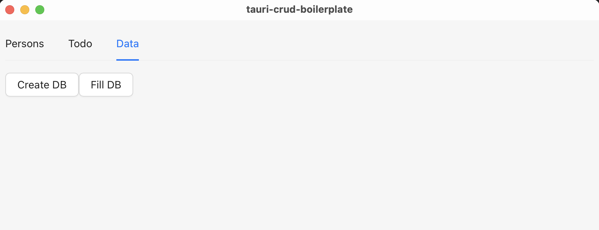
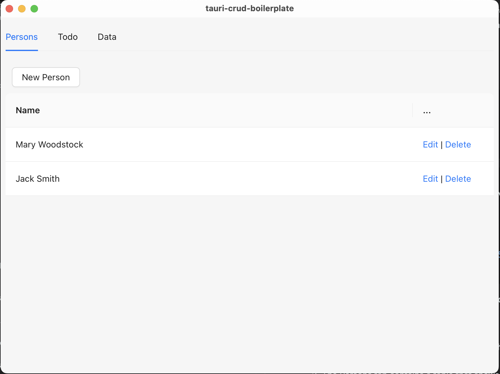
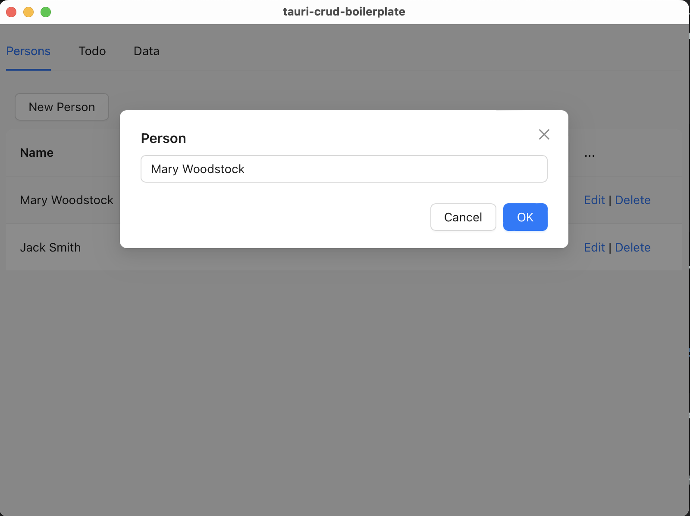
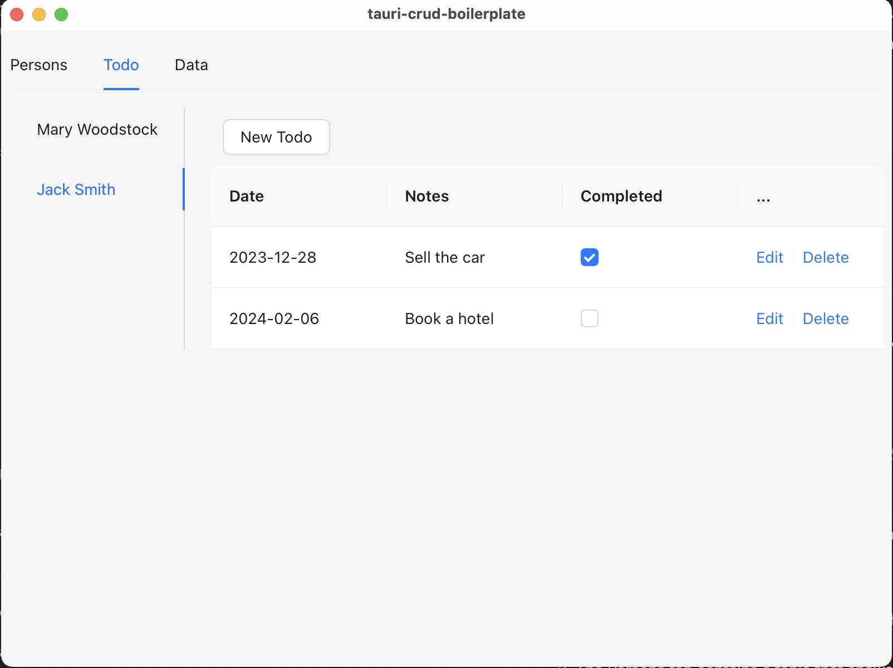
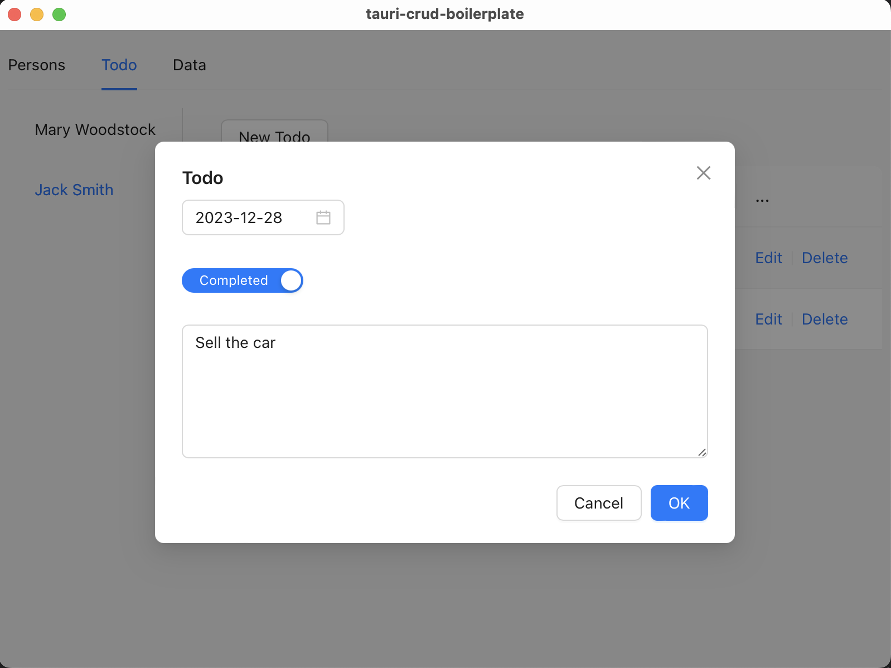
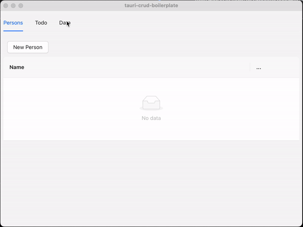
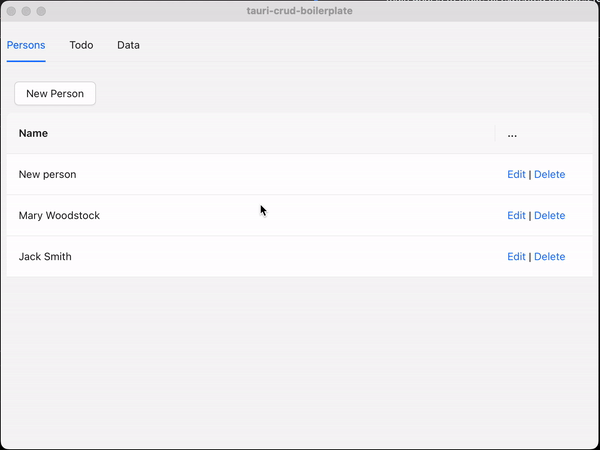

== Introduction 
Hi, dear https://tauri.app[Tauri, window=_blank]! Long time no see. I published my first post, https://valor-software.com/articles/developing-a-desktop-application-via-rust-and-nextjs-the-tauri-way[Developing a Desktop Application via Rust and NextJS. The Tauri Way, window=_blank] almost a year ago. Since then, Tauri has become stronger. I'm happy about that! And now, I am very pleased to make a useful contribution to the Tauri community. As a full-stack developer, I frequently face situations where I need to start a DB-based UI project as fast as possible. It's stressful if I need to start the project from 100% scratch. I prefer to keep some boilerplates on hand, which will save me time and nerves and will be the subject of this article.

I want to present you with my first version of the https://github.com/buchslava/tauri-crud-boilerplate[Tauri CRUD Boilerplate, window=_blank], which will help you bootstrap and prototype a new Tauri project from scratch. Let me focus on explanations in a What-Where-When style.

My #Tauri CRUD Boilerplate# is not a silver bullet; it's just a set of valuable scratches that help you build and connect the DB and UI parts via Tauri. Also, the Tauri CRUD Boilerplate is useful primarily for fast prototyping because it contains React and Ant Design as UI players inside, and, of course, you can substitute them with another library or framework or even provide your custom solution instead. If we focus on the DB part, I use SQLite due to its simplicity and portability. In the future, you can change SQLite. As a roadmap, I'll think about the second version of the bootstrap when DB will be substituted with the equivalent REST API plus authentication.

Let's get started.

There are a couple of https://github.com/buchslava/tauri-crud-boilerplate/blob/devto-article/src-tauri/src/crud/data.rs[tables, window=_blank], #person# and #todo#.

[, code]
----
CREATE TABLE IF NOT EXISTS person (
    id INTEGER PRIMARY KEY NOT NULL,
    name VARCHAR(250) NOT NULL
);
----
[, code]
----
CREATE TABLE IF NOT EXISTS todo (
    id INTEGER PRIMARY KEY NOT NULL,
    date VARCHAR(20) NOT NULL,
    notes TEXT,
    person_id INTEGER NOT NULL,
    completed INTEGER NOT NULL,
    FOREIGN KEY(person_id) REFERENCES person(id)
);
----

As we can see, each person can contain a set of todos. #person_id# is a foreign key here.

I implemented the following functionality.

1. Data management (see #Data# tab below). The main aim is to create an empty SQLite DB (according to the definitions above) and fill it with the test data.

2. The Persons tab contains a table that shows a set of persons and provides functionality for adding, editing, and deleting them.

3. The Todos tab contains two related widgets: Persons as a read-only list and a table that shows a set of person-related todos. It provides functionality for adding, editing, and deleting them.

=== Data
[.img]

Let me highlight some essential points in the #Data# tab code.

* You can find #Create DB#-related DB code https://github.com/buchslava/tauri-crud-boilerplate/blob/devto-article/src-tauri/src/crud/data.rs[here(#L6-L38), window=_blank] and UI code https://github.com/buchslava/tauri-crud-boilerplate/blob/devto-article/src/Data.tsx[here(#L25), window=_blank].
* You can find #Fill DB#-related DB code https://github.com/buchslava/tauri-crud-boilerplate/blob/devto-article/src/Data.tsx[here(#L26), window=_blank] and UI code https://github.com/buchslava/tauri-crud-boilerplate/blob/devto-article/src/Data.tsx[here(#L26), window=_blank].

It's important to have test data and the ability to recreate it when needed (via #Create DB#). If you want to remove the DB, you can just delete a related file.

=== DB connect

It's time to know how the connection with the DB works. First, we need to get the https://github.com/buchslava/tauri-crud-boilerplate/blob/devto-article/src-tauri/src/util/db.rs[SQLite DB path(#L7), window=_blank]

[, code]
----
fn get_database_path() -> io::Result<PathBuf> {
    let mut exe = env::current_exe()?;
    exe.set_file_name("./db");
    #[cfg(dev)]
    exe.set_file_name("../../../db");
    Ok(exe)
}
----

In production mode, we use the current folder to keep the DB, and the DB will be kept in the same folder as the executable file. But in the case of the debug mode, I prefer to keep the database file at the root of the project. Because the executable file in debug mode is placed in #[project folder]/src-tauri/target/debug#, we conditionally use the #../../../# path that's equal to the project folder in debug mode. Fortunately, the https://doc.rust-lang.org/rust-by-example/attribute/cfg.html[cfg, window=_blank] attribute helps us to do that. BTW, you can change this logic if needed.

After we have a DB part, we need to get a https://github.com/buchslava/tauri-crud-boilerplate/blob/devto-article/src-tauri/src/util/db.rs[path as a string, window=_blank]

[, code]
----
pub fn get_database() -> String {
    let db_url = match get_database_path() {
        Ok(path) => path.into_os_string().into_string().unwrap(),
        Err(e) => e.to_string(),
    };
    return db_url;
}
----

We use the util function above in other functions the following way. For example, when we need to https://github.com/buchslava/tauri-crud-boilerplate/blob/devto-article/src-tauri/src/crud/person.rs[insert a new record into the person table(#L14), window=_blank].

[, code]
----
#[tauri::command]
pub async fn person_insert(name: &str) -> Result<i64, String> {
    // get DB url as a string
    let db_url = util::db::get_database();
    // Connect with the DB; get connection from the pool
    let db = SqlitePool::connect(&db_url).await.unwrap();
    // Do all needed DB stuff
    let query_result = sqlx
        ::query("INSERT INTO person (name) VALUES (?)")
        .bind(name)
        .execute(&db).await;
    if query_result.is_err() {
        db.close().await;
        return Err(format!("{:?}", query_result.err()));
    }

    let id = query_result.unwrap().last_insert_rowid();
    // Close the connection
    db.close().await;
    Ok(id)
}
----

=== Persons

It's time to understand how our first CRUD works on the example of #Persons#.

Let's dig into the UI part. You can read full text of the component https://github.com/buchslava/tauri-crud-boilerplate/blob/devto-article/src/Person.tsx[here, window=_blank].

Also, let's dig into the https://github.com/buchslava/tauri-crud-boilerplate/blob/devto-article/src/Person.tsx[data loading(#L41-L58), window=_blank]. Please, read comment in the following code.

[, code]
----
const load = async () => {
    try {
      // get the data
      const result = await apiCall("person_select");
      // make it as a JSON
      const items = JSON.parse(JSON.parse(result as unknown as string));
      // set the related React state variable
      setData(
        items.map((item: any) => ({
          key: item.id,
          ...item,
        }))
      );
    } catch (e) {
      console.error(e);
      errorMessage.open({
        type: "error",
        content: "Can't load the person list",
      });
    }
  };
----

Let's focus on https://github.com/buchslava/tauri-crud-boilerplate/blob/devto-article/src/util.ts[apiCall, window=_blank] function. This function is important because it's a link between React and Rust parts.

[, code]
----
import { InvokeArgs, invoke } from "@tauri-apps/api/tauri";

export const apiCall = async <T>(
  name: string,
  parameters?: InvokeArgs
): Promise<T> =>
  new Promise((resolve, reject) =>
    invoke(name, parameters)
      .then(resolve as (value: unknown) => PromiseLike<T>)
      .catch(reject)
  );
----

We import #invoke# function from #@tauri-apps/api/tauri# and just call the following functionality in Rust part. In this example we are talking about https://github.com/buchslava/tauri-crud-boilerplate/blob/devto-article/src-tauri/src/crud/person.rs[person_select(#L61-L76), window=_blank]

[, code]
----
#[tauri::command]
pub async fn person_select() -> Result<String, String> {
    let db_url = util::db::get_database();
    let db = SqlitePool::connect(&db_url).await.unwrap();
    let query_result = sqlx
        ::query_as::<_, Person>("SELECT id, name FROM person ORDER BY id DESC")
        .fetch_all(&db).await;
    if query_result.is_err() {
        db.close().await;
        return Err(format!("{:?}", query_result.err()));
    }
    let results = query_result.unwrap();
    let encoded_message = serde_json::to_string(&results).unwrap();
    db.close().await;
    Ok(format!("{:?}", encoded_message))
}
----

Also, I'd like to focus your attention on the https://github.com/buchslava/tauri-crud-boilerplate/blob/devto-article/src-tauri/src/crud/person.rs[following data structure(#L7-L11), window=_blank].

[, code]
----
#[derive(Serialize, Clone, FromRow, Debug)]
pub struct Person {
    id: i64,
    name: String,
}
----

[.img]

After that, I intend to be brief because I don't want to waste your time. That's why I am providing you with some significant points regarding the code.

Let's look at #Insert# and #Edit#...

[.img]

1. Press https://github.com/buchslava/tauri-crud-boilerplate/blob/devto-article/src/Person.tsx[New Person(#L140), window=_blank] button or https://github.com/buchslava/tauri-crud-boilerplate/blob/devto-article/src/Person.tsx[Edit(#L80), window=_blank] button on each row of data.

2. Both of https://github.com/buchslava/tauri-crud-boilerplate/blob/devto-article/src/Person.tsx[addNewRow(#L130), window=_blank] and https://github.com/buchslava/tauri-crud-boilerplate/blob/devto-article/src/Person.tsx[doEdit(#L36-L39), window=_blank] works with the modal window https://github.com/buchslava/tauri-crud-boilerplate/blob/devto-article/src/Person.tsx[here(#L36-L39), window=_blank] that use https://github.com/buchslava/tauri-crud-boilerplate/blob/devto-article/src/PersonEdit.tsx[PersonEdit, window=_blank] component.

3. The https://github.com/buchslava/tauri-crud-boilerplate/blob/devto-article/src/Person.tsx[following logic(#L103-L125), window=_blank] works when the form from the component above has been submitted. Its main goal is to make all expected changes (call Rust code), hide the modal window, or show the error if it is not OK.

=== Todos
#Todos# functionality is a bit more complicated than #Persons# because it contains #Persons# and is represented by https://github.com/buchslava/tauri-crud-boilerplate/blob/devto-article/src/TodoContainer.tsx[TodoContainer, window=_blank] component that you see below. Let's focus on how TodoContainer works.

1. It based on a https://github.com/buchslava/tauri-crud-boilerplate/blob/devto-article/src/TodoContainer.tsx[Antd's Tab(#L39), window=_blank] component.

2. Tab's https://github.com/buchslava/tauri-crud-boilerplate/blob/devto-article/src/TodoContainer.tsx[items are persons(#L14), window=_blank].

3. Each Tab-person has its own https://github.com/buchslava/tauri-crud-boilerplate/blob/devto-article/src/TodoContainer.tsx[Todo(#L20), window=_blank] table that also contains adding and editing functionalities.

[.img]

Focusing on the https://github.com/buchslava/tauri-crud-boilerplate/blob/devto-article/src/Todo.tsx[Todo, window=_blank] and https://github.com/buchslava/tauri-crud-boilerplate/blob/devto-article/src/TodoEdit.tsx[TodoEdit, window=_blank] components doesn't matter because their logic is similar to that of Person and PersonEdit.

[.img]

=== How to use

I want to stop discussing the code and focus on some practical aspects. Let's run the app in dev mode.

Traditionally,

[, code]
----
npm ci
----

Run in dev mode

[, code]
----
npm run tauri dev
----

[.img]

[.img]

In production mode:

[, code]
----
npm run tauri build
----

You can found:

An installer-based (dmg) app in #[project root]/src-tauri/target/release/bundle/dmg# if you want to run the installer
Or just the app in #[project root]/src-tauri/target/release/bundle/macos# if you want to run the app directly

=== Components refreshing

The app's most tricky part concerns data synchronization. Imagine we just added a new person to the #Persons# tab and moved them to the #Todo# tab. The person list on the left side should be refreshed, shouldn't it? Let me share some thoughts about data synchronization.

I provided https://github.com/buchslava/tauri-crud-boilerplate/blob/devto-article/src/GlobalContext.tsx[a context, window=_blank] that contains the following data.

*https://github.com/buchslava/tauri-crud-boilerplate/blob/devto-article/src/GlobalContext.tsx[refreshDescriptor(#L9), window=_blank] that contains a couple of fields https://github.com/buchslava/tauri-crud-boilerplate/blob/devto-article/src/GlobalContext.tsx[person(#L4), window=_blank] and https://github.com/buchslava/tauri-crud-boilerplate/blob/devto-article/src/GlobalContext.tsx[todo(#L5), window=_blank].
* A set of methods for the state refreshing: https://github.com/buchslava/tauri-crud-boilerplate/blob/devto-article/src/GlobalContext.tsx[refreshPerson(#L10), window=_blank] and https://github.com/buchslava/tauri-crud-boilerplate/blob/devto-article/src/GlobalContext.tsx[refreshTodo(#L11), window=_blank]

[, code]
----
import React, { createContext, useContext, useState } from "react";

export interface DataRefreshDescriptor {
  person: Date;
  todo: Date;
}

type GlobalContextProps = {
  refreshDescriptor: DataRefreshDescriptor;
  refreshPerson: () => void;
  refreshTodo: () => void;
};

const GlobalContext = createContext({} as GlobalContextProps);

export type TargetKey = React.MouseEvent | React.KeyboardEvent | string;

export const GlobalProvider = ({ children }: { children: React.ReactNode }) => {
  const now = new Date();
  const [refreshDescriptor, setRefreshDescriptor] =
    useState<DataRefreshDescriptor>({
      person: now,
      todo: now,
    });

  const refreshPerson = () => {
    setRefreshDescriptor({ ...refreshDescriptor, person: new Date() });
  };

  const refreshTodo = () => {
    setRefreshDescriptor({ ...refreshDescriptor, todo: new Date() });
  };

  return (
    <GlobalContext.Provider
      value={{
        refreshDescriptor,
        refreshPerson,
        refreshTodo,
      }}
    >
      {children}
    </GlobalContext.Provider>
  );
};

export const useGlobalContext = () => useContext(GlobalContext);
----

The following fragment of code illustrates us how to use the #refreshDescriptor#. Please, read comments there.

[, code]
----
// let's skip imports
export default function TodoContainer() {
  // get the refreshDescriptor
  const { refreshDescriptor } = useGlobalContext();
  const [errorMessage, errorMessageHolder] = message.useMessage();
  const [tabs, setTabs] = useState<TabsProps["items"]>([]);

  const loadPersons = async () => {
    // let's skip the details
  };

  useEffect(() => {
    // if refreshDescriptor.person has been changed, we need to reload the person list
    loadPersons();
  }, [refreshDescriptor.person]);

  return (
    <>
      {errorMessageHolder}
      <Tabs tabPosition={"left"} items={tabs} />
    </>
  );
}
----

Please, look at another example of refreshing. You can find the full version https://github.com/buchslava/tauri-crud-boilerplate/blob/devto-article/src/Person.tsx[here, window=_blank]. Please, read comments.

[, code]
----
// imports ...

export default function Person() {
  const { refreshDescriptor, refreshPerson } = useGlobalContext();
  // skip...

  const doDelete = async (id: number) => {
    try {
      await apiCall("person_delete", { id });
      // change the 'person' field of the descriptor if a new person was deleted
      refreshPerson();
    } catch (e) {
      // skip...
    }
  };

  // skip...

  const load = async () => {
    // skip...
  };

  useEffect(() => {
    load();
    const columns: ColumnsType<DataType> = [
      /// skip...
    ];
    setColumns(columns);
  }, [refreshDescriptor.person]);

  const doEditOk = () => {
    editFormRef.current.submit();
  };

  const handleEditOk = async (formData: DataType) => {
    try {
      if (currentRecord?.id) {
        await apiCall("person_update", {
          name: formData.name,
          id: currentRecord.id,
        });
      } else {
        await apiCall("person_insert", {
          name: formData.name,
        });
      }
      setEditVisible(false);
      // change the 'person' field of the descriptor if a new person was added or changed
      refreshPerson();
    } catch (e) {
      setEditVisible(false);
      // skip...
    }
  };

  // skip...

  return !columns ? (
    <></>
  ) : (
    

      {errorMessageHolder}
      <Button onClick={addNewRow} style={{ margin: 10 }}>
        New Person
      </Button>
      <Table
        columns={columns}
        dataSource={data}
        pagination={false}
        scroll={{ y: "calc(100vh - 200px)" }}
      />
      <Modal
        title="Person"
        open={editVisible}
        onOk={doEditOk}
        onCancel={handleEditCancel}
      >
        <PersonEdit
          ref={editFormRef}
          currentRecord={currentRecord}
          handleEditOk={handleEditOk}
        ></PersonEdit>
      </Modal>
    

  );
}
----

We call #refreshPerson# if we expect another or the current widget refreshing. If you add some new functionality in the future, you need to:

* add new fields to #refreshDescriptor#
* provide the related functions and add them to the context
* use them the way described above

=== The App component
I suppose it's the simplest part of the solution.

[, code]
----
import { Tabs, TabsProps } from "antd";
import "./App.css";
import Person from "./Person";
import TodoContainer from "./TodoContainer";
import Data from "./Data";
import { useGlobalContext } from "./GlobalContext";

const tabs: TabsProps["items"] = [
  {
    key: "persons",
    label: "Persons",
    children: <Person />,
  },
  {
    key: "todo",
    label: "Todo",
    children: <TodoContainer />,
  },
  {
    key: "data",
    label: "Data",
    children: <Data />,
  },
];

function App() {
  const { refreshPerson, refreshTodo } = useGlobalContext();

  return (
    <Tabs
      items={tabs}
      onTabClick={(key: string) => {
        if (key === "persons") {
          refreshPerson();
        }
        if (key === "todo") {
          refreshTodo();
        }
      }}
    />
  );
}

export default App;
----

Please pay attention to the #onTabClick# handler. We change the related fields of #refreshDescriptor# every time we open a related tab.

=== The recommendations

This part is essential because all that I just told you should be continued with your, my dear reader, part. I aim to summarize and guide you regarding your future steps with the boilerplate. Of course, all that I intend to share with you is not dogma; it's just my subjective opinion that I hope will help you.

1. I recommend starting with the Rust part.

2. You could create a separate rs-file. This is a good https://github.com/buchslava/tauri-crud-boilerplate/blob/devto-article/src-tauri/src/crud/person.rs[example, window=_blank]. Also, don't forget to add it to https://github.com/buchslava/tauri-crud-boilerplate/blob/devto-article/src-tauri/src/crud/mod.rs[mod.rs, window=_blank]

3. After you need to make the following changes in https://github.com/buchslava/tauri-crud-boilerplate/blob/devto-article/src-tauri/src/main.rs[main.rs, window=_blank]: https://github.com/buchslava/tauri-crud-boilerplate/blob/devto-article/src-tauri/src/main.rs[use the module(#L6), window=_blank] and https://github.com/buchslava/tauri-crud-boilerplate/blob/devto-article/src-tauri/src/main.rs[tell Tauri about the new functionality(#L16-L19), window=_blank]. That's it regarding Rust-part. It's time to code in React.

4. Create a table-based component like the https://github.com/buchslava/tauri-crud-boilerplate/blob/devto-article/src/Person.tsx[following, window=_blank]

5. Create a form-based component like the https://github.com/buchslava/tauri-crud-boilerplate/blob/devto-article/src/PersonEdit.tsx[following, window=_blank]

6. Use the table-based component in the https://github.com/buchslava/tauri-crud-boilerplate/blob/devto-article/src/App.tsx[following way(#L12), window=_blank]

PS: It's important to note that the solution above is just one of my first attempts at the topic; therefore, do not judge strictly. Also, I'd like to know how this solution works under Windows. Anyway, happy hacking, guys ;)