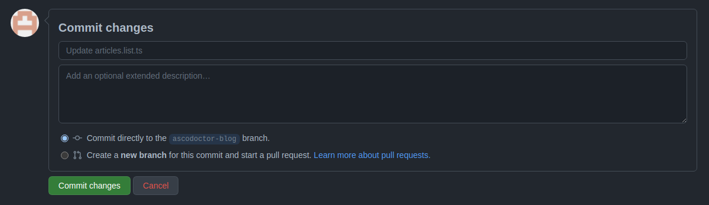
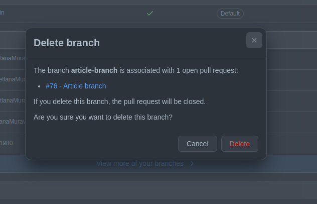

# Add new article

From the start you should create a copy of development branch (default branch). Steps to it are: 

1. Be sure the development branch is already set up

2. In the field 'Find or create a branch ...' put the name of your new branch.
3. Click 'create branch: name of your branch'

Now your own branch is ready for work.

Firstly for adding new article we need to add article's title to the general list. We need it for scully routes. To achieve it you should visit file articles.list.ts.
 
- Path for this file is:  /apps/valor-software-site/src/assets/blog

when you found such file in our github repository you should flow the [steps for editing github document](#File-editing-in-github). These steps are described downer.

In this file you can see an array of all articles on our site, you need to add a new one on the first position.

As ex. title of new site is 'test title for new article'. So you open document articles.list.ts and add your title
The result will be

    export const articleIdList = ['test title for new article','Announcing strategic partnership with Zack Jackson, the Module Federation inventor', 'Implementing WebSockets plugin for NativeScript using React Native', 'TagTide library: make your HTML editor-friendly and more', 'Diving into seeking issue with MP3 files', 'Performance Testing via Artillery.io', 'ARC – a new weapon against accessibility bugs', 'Setting up your project on GCP fast using Terraform and Kubernetes', 'ngx-bootstrap v7.0.0 is officially released!', 'How to deploy Firebase Preview Channels on Travis CI', 'Scully Helped us Reach a 99 Lighthouse Score for a B2C Platform', 'Designing Aggregator App from A to Z – Part 2', '_Designing Aggregator App from A to Z — Part 1', 'Multi-highlighting for DraftJS', 'New year, new Valor, new you', 'Incorporating user research on live projects — Part 4', 'Incorporating user research on live projects — Part 3', 'Incorporating user research on live projects — Part 2', 'Incorporating user research on live projects — Part 1', 'Why you might want to switch to Time and Material from Fixed Price', "Cross-Site Scripting (XSS): a QA Engineer's Guide", 'Career Path for a Flat-structured company', 'JSON Web Token Authorization with Access and Refresh Tokens in Angular Application with Node.js Server', 'Testing iOS App Vulnerabilities with Jailbreaking. Part 1.', 'Benefits of Agile to Business and Team', 'Valor Software Named Top Development Company in Ukraine by Clutch', 'Testing with Protractor: how to fix synchronization issues', 'Hacktoberfest 2019 is coming, and ngx-bootstrap strives for your attention!', 'The 4 biggest lessons we learned while building a startup product as an outsource company', 'Angular and SEO: Structured Data for Rich Snippets', 'ngx-bootstrap: Angular Ivy is here', 'Webflow custom code snippets you would use. Episode 1', 'Testing Canvas could be easier', 'Case study of Applitools or not only Cypress cross-browser testing', 'Figma as a presentation tool: Unifying templates', 'Cypress testing: Running tests in parallel', 'Quality Assured: What It Really Takes To Test Open Source Libraries', 'Figma Vs Sketch: Text alignment comparison', 'Como o Scully nos ajudou a atingir 99 pontos no Lighthouse para uma plataforma B2C'];

For displaying one article we need two files.  One file contains technical characters of article and article's author. This file should be with .json extension. It should be located in folder by path /apps/valor-software-site/src/assets/blog/articles. 
The second file contains content of the article in adoc format. This file should be with .adoc extension. It should be located in folder by path apps/valor-software-site/src/assets/blog/adoc. 
Both these files should have the same filename and different extensions.

Information how to create new files in github you can find in [steps for creating github document](#File-creating-in-github).

### File naming

Naming of articles files depends on amount of articles. The oldest article start from 1. So when we are adding a new article we should dedicate tha last number in the folder adoc or articles and add 1 point.

Ex. the last article is 38, so the new article will have filename 39 (38 + 1). As a result we should have two new files:
 
- in folder /apps/valor-software-site/src/assets/blog/articles file <strong>39.json</strong>
- in folder /apps/valor-software-site/src/assets/blog/adoc file <strong>39.adoc</strong>

### Structure of file with technical characters of article and article's author
Theses files can contains such fields: 

- **author** (the field is required, the format of field is simple string);
- **domains** (the field is required, the format of field is array of string. This field is used for articles sorting on blog page);
- **language** (the field is required, available values are 'en' or 'pt'. The value depends on the language of article);
- **bgImg** (the field is required, it should contain the string with url path of background image for article);
- **title** (the field is required, the format of field is simple string);
- **date** (the field is required, the format of field is string. There should be value as ex. Fri Apr 1 2022, so weekday month date year. The correct names of months and week days you can find downer);
- **authorImg** (the field is optional, it should contain the string with url path of author's image);
- **position** (the field is optional, it should contain the author's position in company as ex. 'Marketing Content Manager
');
- **seoDescription** (the field is optional, it should contain the small description of article for seo service);

---
#### Available domains

    business_analysis: 'Business Analysis',
    user_research_design: 'User Research & Design',
    dev_quality_assurance: 'Development & Quality Assurance',
    devops_cloud: 'DevOps & Cloud',
    recruitment_pm: 'Recruitment & Project Mgmt.',
    sales_marketing: 'Sales & Marketing',
    other: 'Other'

--- 

#### Available date formats

you can use such date format: Fri Apr 1 2022
Firstly - weekday, then month, date and year

**Available weekdays**:
Mon, Tue, Wed, Thu, Fri, Sat, Sun

**Available months**:
Jan, Feb, Mar, Apr, May, Jun, Jul, Aug, Sep, Oct, Nov, Dec.

---
as ex.

    {
    "title": "Como o Scully nos ajudou a atingir 99 pontos no Lighthouse para uma plataforma B2C",
    "domains": ["recruitment_pm", "user_research_design", "sales_marketing"],
    "authorImg": "https://assets.website-files.com/5c4c30d0c49ea6746fafc90c/5ca74cfb04fdce15ea9266e2_ava-Ruslan%20Ponuzhdayev.jpg",
    "language": "pt",
    "bgImg": "https://assets.website-files.com/5c4c30d0c49ea6746fafc90c/60d445d24897dc4086b2c80f_Blog-Scully.png",
    "author": "Ruslan Ponuzhdayev",
    "position": "JS Developer",
    "date": "Fri Jul 16 2021 10:45:55 GMT+0000 (Coordinated Universal Time)",
    "seoDescription": "Aceleramos o carregamento geral da página e aumentamos a pontuação do farol da plataforma para 99-100. Além disso, conectar o Google eCommerce Marketing nos ajudou a ver várias áreas de melhoria no site e em aplicativos móveis para agilizar a jornada do usuário. Aprenda com nossa experiência como você pode aumentar o desempenho do site e a visibilidade do seu projeto usando o Scully e o Google Analytics. Além disso, vou ajudá-lo a superar possíveis dificuldades com integrações, uma vez que já passamos por isso :)"
    }

----

### Get content in .adoc

The next step is getting article content in adoc extension. To get such content you need to have finished article in your google document. 

*NOTE: all links, which are used in articles, should be remote and available from different websites. If you need to add some media to repository look at the [steps for adding media in github](#Add-media-in-github)

To convert content in adoc extension you need plugin https://workspace.google.com/marketplace/app/asciidoc_processor/1023004302050

Firstly, you should install it for your browser. Instruction of using google plugin is here
https://support.google.com/docs/answer/2942256?hl=en&co=GENIE.Platform%3DAndroid#zippy=%2Cuse-add-ons

as a result you will get the converted content

Then you copy all content from nodal window and paste it into your file with adoc extension (in our example it is 39.adoc).

### Creating of pull request

When you finish all work with new article you need to create a pull request. For it you need visit link of pull requests https://github.com/valor-software/valor-software.github.io/pulls

1. Click green button 'New pull request'.
2. The first branch should be 'development' the second one your. If branches are correct then press button 'Create pull request'.

Ex.

3. When pull request is created you should wait for passing all check according github actions and as result you will get link of preview channel. You can share with it and show as result for approving.

## Github steps

### File editing in github
- click the button edite file, it looks like

- when editing is finished you should commit the changes into your branch. For it you should click button 'Commit changes' in the end of the page

### File creating in github
 - Open the folder where you need to create a new file
 - In the right side press the button 'add file' and select 'Create new file'

- Put the name of your new file in field 'Name your file ...' and add needed content.
  

- Save changes with button 'Commit changes' in the end of the page
  

### Add media in github
All media of such repository is situated in folder assets. So if you need to add image or gif you should folow such path:

/apps/valor-software-site/src/assets/images

- Open the folder where you need to create a new file (for media use path /apps/valor-software-site/src/assets/images)
- In the right side press the button 'add file' and select 'Upload files'

- Drag needed file to the field or choose your files
- Save changes with button 'Commit changes' in the end of the page
  

For getting remote link of file which you added, you need to open added media file, then click with the right button of mouse on it and choose 'open image in new tab'. Then you can use this url as remote.

### Delete created branch on github

- Visit link with all branches of repository https://github.com/valor-software/valor-software.github.io/branches
- in the list of all branches you should find your branch and click delete branch 

After you can see such confirm modal, choose 'Delete'

# Adoc refactoring

### Advices:

 - **Links**. More details https://docs.asciidoctor.org/asciidoc/latest/macros/links/  
Link contains two parts, the first one it is link (https://...) and the second one it is the name for displaying (how customer will see it).

Ex. 
  https://...bla.com[the name for customer]

Open links in new tab. Add character '^' in the end of link name.
Ex. 

   https://github.com/valor-software/valor-software.github.io[repository^]

- **Titles**. More details https://docs.asciidoctor.org/asciidoc/latest/document/title/
  
To create titles use character =

Ex.  
  == Test title
 
Result: 
<h2>Test title </h2>

Ex.  
==== Test title
 
Result: 
<h4>Test title </h4>

- **Line cutting**

If you need to cut the line as separate paragraph yse double enter. 
If you need to cut the line as a separate paragraph without additional space use  character '+'

Ex. 

  First test line. +
  Second test line.

- **Code displaying**. More information https://docs.asciidoctor.org/asciidoc/latest/verbatim/source-blocks/

